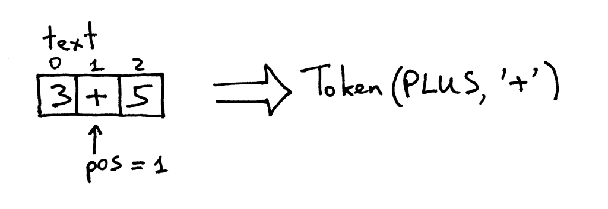

# 二元加法器

> **“如果不知道编译器是如何工作的，那你就不知道电脑是如何工作的；如果不能百分之百地确定自己了解编译器的工作原理，那就相当于一无所知”**  —— Steve Yegge  

正是如此，想象一下。不管是初出茅庐新手还是久经沙场的老鸟：如果你不知道`编译器`和`解释器`的工作原理，那就相当于你不知道计算机到底如何工作的。就这么简单。  

所以，你知道编译器和解释器的工作原理吗？我是指：**你确定你完全清楚它们的工作原理吗？** 如果你不确定...
  

亦或者对此感到有些焦虑的话...  
  

别担心，如果你能坚持和我一起学习完这个系列，并做出一个编译器和解释器的话。你就会明白他们的工作原理了，变得胸有成竹。至少我希望如此:)  
  

**为什么(why)** 要学习编译器和解释器，原因有三：  

1. 完成一个编译器或解释器，需要综合运用大量的技术知识。它会帮助你成为一个更优秀的开发者。而且这些技术在开发任何其他软件时也会非常有用。  
2. 如果你真的渴望理解计算机的工作原理。编译器和解释器通常看起来非常神奇，但是学习起来却无从下手。通过构建编译器和解释器的过程，更好的掌握其工作原理。  
3. 你想创造自己的，或者是特定领域的编程语言。在发明了一种语言后，自然要有与之配套的编译器或解释器。近些年来，人们对新语言（开发）又重新燃兴趣，几乎每天都会有新语言的产生：`Elixir`、`Go`、`Rust` 等等  

言归正传，编译器和解释器究竟 **是什么(what)** 呢？  

编译器或解释器的目的是将一种高级语言的程序代码翻译成另外的一种语言形式。有点绕对吧？暂且这样，在后面的部分，你就会看到源代码究竟被翻译成了什么。 

现在你也许会好奇：编译器和解释器的 **区别(difference)** 是什么？在本系列中，我们提前约定：将程序源码翻译成机器码的叫做编译器；而直接处理并执行源码的叫做解释器。如下图所示：  
  

到这里，我希望你确信真的想学习并动手构建一个编译器和解释器。你对这个系列的文章还有其他的期待吗？  

一言为定！在这个系列中，我们将为`Pascal`语言的一个子集编写一个简单的解释器，最后你将拥有一个使用的`Pascal`解释器和一个源码级的调试器，就像`Python`的`pdb`一样。  

你也许想问，为什么是`Pascal`？一者它不是一门虚构的语言，而且拥有很多重要的语言结构。再者一些经典的计算机教材通常用`Pascal`语言作为例子讲解(虽然这个理由有点牵强，但是我私下里认为尝试学习一门非主流语言，也许是一次不错的选择):)  

下面是一个`Pascal`语言`阶乘(factorial)`函数的例子，在后面你可以通过我们构建的解释器执行并调试它。  

```pascal
program factorial;

function factorial(n: integer): lonint;
begin
    if n = 0 then
        factorial := 1
    else
        factorial := n * factorial(n-1)
end;

var n: integer;
begin
    for n := 0 to 16 do
        writeln(n, '! = ',factorial(n));
end.
```

本系列中，我们采用`Python`来实现`Pascal`解释器，但实际上你可以通过任何想用的语言，因为思想不依赖任何特定的语言。言归正传。准备出发吧！

骐骥一跃，不能十步。在此之前，我们先写一个算数表达式的解释器(计算器)。有点失望对吧，更绝望的是我们今天只会让这个计算器做两个个位数之间的加法，例如：3+5。但是麻雀虽小五脏俱全，希望你能仔细看下源码，你就会发现即使是简单的二元加法器，也未必就是那么简单：

```python
# 声明词(Token)类：相当于Java 中的class
# EOF(end-of-file) ：表示对于词法分析来说，已经没有剩余的输入信息了，也就是文件结束标志
# 如果学习过C语言，可能更好理解。
# EOF 被称之为词素(lexemer)：相当于Token 类的实例对象(instance)

# 定义词素的类型：整型操作数，加号，输入结束符
INTEGER,PLUS,EOF = 'INTEGER','PLUS','EOF'

class Token(object):
    def __init__(self,type,value):
        # token 对象的类型：看上面👆
        self.type = type
        # token 的值：[0-9]、'+'、None
        self.value = value

    def __str__(self):
        # 实例对象的字符串表示，类似于Java 中的toString() 方法
        # 例如：
        #   Token(INTEGER,3)
        #   Token(PLUS,'+')
        return 'Token({type},{value})'.format(
            type = self.type,
            value = repr(self.value)
        )

    def __repr__(self):
        return self.__str__()

class Interpreter(onject):
    def __init__(self,text):
        # 客户端的输入字符串，例如："3+5"
        self.text = text
        # self.pos 表示输入字符串self.text 中字符的索引
        self.pos = 0
        # 当前的token 实例
        self.current_token = None

    def error(self):
        raise Exception('解析输入时出错')

    def get_next_token(self):
        # 词法分析器，也叫扫描器或分词器
        #
        # 此方法会将输入的句子依次分成若干个token 实例
        # 每次调用分出一个token
        text = self.text

        # 如果self.pos 已经到达输入字符串的尾部
        # 则返回一个EOF token
        if self.pos > len(text) -1:
            return Token(EOF,None)

        # 从当前位置self.pos 获取一个字符
        current_char = text[self.pos]

        # 如果当前字符是数字、加号、其他，做相应的处理
        # 获取合法输入后，当前字符的索引后移一位
        if current_char.isdigit():
            token = Token(INTEGER,int(current_char))
            self.pos += 1
            return token
        if current_char == '+':
            token = Token(PLUS,current_char)
            self.pos += 1
            return token
        # 非法输入，报异常
        self.error()

    def eat(self,token_type):
        # 验证当前token 是否合法
        # 合法的话获取下一个token
        if self.current_token.type == token_type:
            self.current_token = self.get_next_token()
        else:
            self.error()

    def expr(self):
        """expr -> INTEGER PLUS INTEGER"""
        # 获取第一个token 为左值
        self.current_token = self.get_next_token()
        #验证左值
        left = self.current_token
        self.eat(INTEGER)

        # 验证加号
        op = self.current_token
        self.eat(PLUS)

        # 验证右值
        right = self.current_token
        self.eat(INTEGER)
        # 此时self.current_token 为EOF token

        # 验证通过，并返回计算结果
        result = left.value + right.value
        return result

def main():
    while True:
        try:
            # Python3 使用input() 代替raw_input()
            text = raw_input('calc> ')
        except EOFError:
            break
        if not text:
            continue
        interpreter = Interpreter(text)
        result = interpreter.expr()
        print(result)


if __name__ == '__main__':
    main()
```

将以上代码保存为`calc1.py`，也可以从[GitHub](https://github.com/rspivak/lsbasi/blob/master/part1/calc1.py)上直接下载。在深入分析之前，先运行几次，观察一下现象。下面是在我笔记本上的运行结果(`Python3`的话须用input() 代替raw_input())：

```shell
$ python calc1.py
calc> 3+4
7
calc> 3+5
8
calc> 3+9
12
calc>
```  

**程序越简单，对人的要求就越严格。** 如果不按照以下规则输入，程序就会报错：  

- 程序只能计算一位整数  
- 目前仅支持加法运算  
- 输入字符串中不允许包含空格  

但是别担心，我们很快就会让程序变得复杂(完备)起来。

好了，让我们分析下程序是 **如何(how)** 运行，并做加法运算的。  

当我们输入`3+5`之后，解释器首先会将其作为字符串`"3+5"`缓存起来。为了能正确理解表达式的含义，解释器会将该字符串分解成3个`词(token)`，每个词对象包含有它的类型和值，例如：`"3"`被转化成`整型(INTEGER)`对应的值就是整数3.  
这个过程被称作`词法分析(lexical analysis)`。所以，解释器首先需要读取输入字符，并将其转化为一串词对象。实现词法分析的部分被称为`词法分析器(lexical analyzer或者lexer)`，也称作`扫描器(scanner)`或`分词器(tokenizer)`。殊途同归：都是**将输入字符转化为一串词对象**  
`get_next_token()`就是解释器的词法分析器。每次调用都会从输入字符串中获取一个`词(token)`并返回。让我们来看一下它具体是如何工作的。该方法的输入是储存在`text`变量中的输入字符串和字符位置`pos`。初始位置是0，也就是字符`'3'`。该方法首先检查`'3'`是不是整型，如果是，`pos`后移一位，并返回一个值为3的整型token。  
  

现在`pos` 指向`'+'`，再次调用此方法，检查`'+'`是否是整数(否)，是否为`'+'`(是)。，`pos`后移一位，并返回一个加号token。  
  

随后`pos` 指向`'5'`。如法炮制，并返回一个值为5的整型token。  

  

此时，`pos` 到达字符串尾，所以`get_next_token()`返回EOF。  

  

可以通过以下代码验证一下：  

```python
>>> from calc1 import Interpreter
>>>
>>> interpreter = Interpreter('3+5')
>>> interpreter.get_next_token()
Token(INTEGER, 3)
>>>
>>> interpreter.get_next_token()
Token(PLUS, '+')
>>>
>>> interpreter.get_next_token()
Token(INTEGER, 5)
>>>
>>> interpreter.get_next_token()
Token(EOF, None)
>>>
```  

现在你的解释器可以访问token 流，根据token 流，解释器需要做以下工作：解释器需要从平坦的token 流中寻找一定的语法结构。解释器需要`INTEGER -> PLUS -> INTEGER`的token 序列，所以它会以一定的顺序去验证词法分析生成的token：整数后跟着一个加号，后面再跟着一个整数。  
负责此功能的方法是`expr()`。**此方法会按一定顺序验证token，** 例如：`INTEGER -> PLUS -> INTEGER`，验证通过后，对token 的值进行加法运算，由此，才算是成功的解释了输入的数学运算。  
`expr()`会调用实例方法`eat()`进行当前token的校验，校验通过后会将`currnt_token`自动指向到下一个token，否则就会抛出异常`error()`。如果token的顺序不符合`INTEGER -> PLUS -> INTEGER`，`expr()`最后也会抛出一个异常`error()`。  

重新走一遍这个流程：  

- 解释器获取输入字符串：`"3+5"`  
- 解释器调用`expr()`获取token 序列(由get_next_token()得到)。验证token顺序符合`INTEGER -> PLUS -> INTEGER`。执行加法运算`3+5` ，并返回结果。  

恭喜你。至此你已经学会了如何构建一个最简单的解释器！  

现在可以做一些练习了。  
  

纸上得来终觉浅，不是吗？所以来亲自动手完成下面的练习吧：  

1. 修改程序，使之能够完成多位整数的加法运算(例如："12+3")  
2. 给程序添加一个可以跳过空格的方法(例如："12 + 3")  
3. 修改程序，使之可以同时完成减法操作(例如："7 - 5")  

## 小检测  

1. 什么是解释器  
2. 什么是编译器  
3. 解释器和编译器的区别是什么  
4. 什么是词(Token)  
5. 将输入字符串分解成一系列token 的过程叫什么  
6. 解释器做词法分析的部分是什么  
7. 词法分析器一般还被称做什么  

在结束之前，我衷心希望你致力于学习编译器和解释器，而不是放进收藏夹。如果你只是大致浏览了本文，那请你从头开始；如果你仔细阅读了文章却没有做练习，那请你现在就动手试一试；如果你只完成了一部份练习，那请你将剩下的部分也完成。你懂我意思吧，从今天起，签下学习的承诺书！  

*本人，____，作为一个头脑和身体健全的人，在此承诺，从今天起致力于学习解释器和编译器，直至完全掌握它们的工作原理为止！*  
*签名：*  
*日期：*  
  

签上大名，放在每天都可以看到的地方，以确保你记得自己的承诺，坚持履行自己的承诺：  
> "承诺就是做你所说的事情，即使当时的激情已经不在了也还是要做" ——Darren Hardy  

好了，今天就到这儿了。下一篇文章我们将着手扩展我们的计算器，使之能够处理更多、更复杂的数学表达式，加油！  

如果你已经迫不及待想要了解更多，下面这些参考资料可能会大有裨益：  

1. [Language Implementation Patterns: Create Your Own Domain-Specific and General Programming Languages (Pragmatic Programmers)](http://www.amazon.com/gp/product/193435645X/ref=as_li_tl?ie=UTF8&camp=1789&creative=9325&creativeASIN=193435645X&linkCode=as2&tag=russblo0b-20&linkId=MP4DCXDV6DJMEJBL)  
2. [Writing Compilers and Interpreters: A Software Engineering Approach](http://www.amazon.com/gp/product/0470177071/ref=as_li_tl?ie=UTF8&camp=1789&creative=9325&creativeASIN=0470177071&linkCode=as2&tag=russblo0b-20&linkId=UCLGQTPIYSWYKRRM)  
3. [Modern Compiler Implementation in Java](http://www.amazon.com/gp/product/052182060X/ref=as_li_tl?ie=UTF8&camp=1789&creative=9325&creativeASIN=052182060X&linkCode=as2&tag=russblo0b-20&linkId=ZSKKZMV7YWR22NMW)  
4. [Modern Compiler Design](http://www.amazon.com/gp/product/1461446988/ref=as_li_tl?ie=UTF8&camp=1789&creative=9325&creativeASIN=1461446988&linkCode=as2&tag=russblo0b-20&linkId=PAXWJP5WCPZ7RKRD)  
5. [Compilers: Principles, Techniques, and Tools (2nd Edition)](http://www.amazon.com/gp/product/0321486811/ref=as_li_tl?ie=UTF8&camp=1789&creative=9325&creativeASIN=0321486811&linkCode=as2&tag=russblo0b-20&linkId=GOEGDQG4HIHU56FQ)  

-----  
[阅读原文](https://ruslanspivak.com/lsbasi-part1/)  
[Java 源码](src/Calc01.java)  

原本以为很快的翻译工作，居然花了4个小时才勉强完成，任重而道远啊，加油(ง •_•)ง  

2020-06-08 第一次返工
