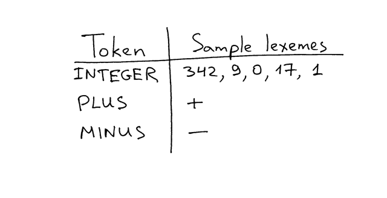

## 加减法运算  

在《The 5 Elements of Effective Thinking》一书中，作者Burger和Starbird分享了他们如何观察国际知名小号演奏家Tony Plog为有成就的演奏者组织大师班的故事。学员们首先熟练地演奏复杂的曲子。但是当要求他们演奏基础、简单的音符时，他们的演奏却显得十分生涩。之后，Tony Plog亲自演奏了一遍那些基本的音符，却一点儿也听不出生涩。差别是惊人的。Tony解释说，掌握简单音符的演奏可以让人更好地掌控力复杂的旋律。道理很明白：要培养真正的技巧，必须专注于掌握简单、基本的思想[^1]。  
这个道理在软件开发中也同样适用。要时刻谨记不要小瞧基本功的练习，即便是有时候觉得不进反退。熟悉一个工具或者框架固然重要，但了解其工作原理的重要性则有过之而无不及。正如艾默生所说：  

> "如果你只掌握了工具(方法)，那你将被工具所束缚；但如果你知晓了原理，那你将会发明工具。"  

说到这儿，让我们再深入了解一下编译器和解释器吧。  

较之于[第一章](01_二元加法器.md)，今天我们会构造一个稍复杂的计算器：  

1. 处理输入字符串中的空格  
2. 能够计算多位整数(>=10)  
3. 能够完成减法运算(上个版本只能做加法)  

下面就是新版本计算器的源码，能够实现以上所说的功能：  

```python
# Token 类
# EOF (end-of-file) 表示输入结束
INTEGER, PLUS, MINUS, EOF = 'INTEGER', 'PLUS', 'MINUS', 'EOF'


class Token(object):
    def __init__(self, type, value):
        # token 类型
        self.type = type
        # token 值
        self.value = value

    def __str__(self):
        """实例对象的字符串表示

        例如:
            Token(INTEGER, 3)
            Token(PLUS '+')
        """
        return 'Token({type}, {value})'.format(
            type=self.type,
            value=repr(self.value)
        )

    def __repr__(self):
        return self.__str__()


class Interpreter(object):
    def __init__(self, text):
        # 输入字符串, 例如： "3 + 5", "12 - 5", etc
        self.text = text
        # self.pos 指向 self.text 具体字符的位置
        self.pos = 0
        # 当前token 实例
        self.current_token = None
        self.current_char = self.text[self.pos]

    def error(self):
        raise Exception('解析输入字符串时出错')

    def advance(self):
        """self.pos 后移一位，同时设置current_char"""
        self.pos += 1
        if self.pos > len(self.text) - 1:
            self.current_char = None  # 字符串结束
        else:
            self.current_char = self.text[self.pos]

    def skip_whitespace(self):
        while self.current_char is not None and self.current_char.isspace():
            self.advance()

    def integer(self):
        """读取输入字符串，返回一个(多位)整数"""
        result = ''
        while self.current_char is not None and self.current_char.isdigit():
            result += self.current_char
            self.advance()
        return int(result)

    def get_next_token(self):
        """词法分析器 (扫描器、分词器)

        此方法将句子分解成一系列的词
        """
        while self.current_char is not None:

            if self.current_char.isspace():
                self.skip_whitespace()
                continue

            if self.current_char.isdigit():
                return Token(INTEGER, self.integer())

            if self.current_char == '+':
                self.advance()
                return Token(PLUS, '+')

            if self.current_char == '-':
                self.advance()
                return Token(MINUS, '-')

            self.error()

        return Token(EOF, None)

    def eat(self, token_type):
        # 验证token 类型是否合法，如果是则设置current_token为分词器
        # 生成的下一个token，否则就会抛出异常
        if self.current_token.type == token_type:
            self.current_token = self.get_next_token()
        else:
            self.error()

    def expr(self):
        """解析器 / 解释器

        表达式 -> 整数 +/- 整数
        expr -> INTEGER PLUS INTEGER
        expr -> INTEGER MINUS INTEGER
        """
        # 设置当前token为输入的第一个token
        self.current_token = self.get_next_token()

        # 需要的token是整型
        left = self.current_token
        self.eat(INTEGER)

        # 随后的应该是加号或者减号
        op = self.current_token
        if op.type == PLUS:
            self.eat(PLUS)
        else:
            self.eat(MINUS)

        # 最后还是一个整数
        right = self.current_token
        self.eat(INTEGER)
        # 最后以EOF 结束

        # 不管token顺序是 INTEGER PLUS INTEGER 还是
        # INTEGER MINUS INTEGER，该方法都能正确识别，
        # 并完成运算，返回结果
        if op.type == PLUS:
            result = left.value + right.value
        else:
            result = left.value - right.value
        return result


def main():
    while True:
        try:
            # Python3 下记得将'raw_input' 替换为'input'
            text = raw_input('calc> ')
        except EOFError:
            break
        if not text:
            continue
        interpreter = Interpreter(text)
        result = interpreter.expr()
        print(result)


if __name__ == '__main__':
    main()
```

将以上代码保存为*calc2.py*或者直接从[GitHub](https://github.com/rspivak/lsbasi/blob/master/part2/calc2.py)下载。亲手试一试看是否能正常运行：处理空格，计算多位数的加减法。  
下面是在作者笔记本电脑上的运行结果：  

```shell
$ python calc2.py
calc> 27 + 3
30
calc> 27 - 7
20
calc>
```

较之于[第一章](01_二元加法器.md)，主程序主要有以下几点改动：  

1. `get_next_token()` 方法部分重构，`pos` 自增语句被独立函数`advance()` 替代  
2. 新增了两个方法：`skip_whitespace()` 用于忽略空格；`integer()` 用于获取多位整数值  
3. `expr()` 方法扩展，识别`INTEGER -> MINUS/PLUS -> INTEGER`词组  

在[第一章](01_二元加法器.md)，我们学习了两个重要的概念：`词(token)`和`词法分析器(lexical analyzer)`。今天我们来学习`词素(lexemes)`、`解析(parsing)`和`解析器(parsers)`。  

前面已经讲过`token`，为了更全面的理解`token`，我们再来学习一下`词素(lexemer)`。什么是词素？词素就是构成词(的值)的一串字符序列。下图是一些词与词素之间的关系图，希望能帮助理解：  
  

现在，还记得`expr()` 方法吗？之前说过`expr()`才是解释器开始解析表达式的地方。在解释一个表达式之前，首先要明白这个表达式是什么类型的phrase(可以理解为是token 结构)，是加法还是减法。所以`expr()`最核心的任务是：**从`get_next_token()`获取的token 中，识别出具体的语法结构，对于能正确识别的短语就会计算结果**。  
识别词结构(短语、语法？)的过程就叫做`解析(parsing)`，编译器/解释器实现解析功能的部分就叫做`解析器(parser)`。【译注：分词器，解析器，目前看来都是函数(method)】  
现在就很清晰了。`expr()` 是解释器解析和解释表达式的方法：首先在表达式的token序列中识别(解析为)`INTEGER -> PLUS -> INTEGER`或`the INTEGER -> MINUS -> INTEGER`短语；识别成功后就会对其进行解释(计算)，然后返回计算结果。  

### 小测验  
  
  

1. 扩展计算器，使之支持乘法  
2. 识别token流结构(特定的短语结构)的过程叫什么  
3. 解释器(编译器)执行解析工作的部分叫什么  

希望你喜欢今天的材料，下一篇我们会扩展计算器使之可以完成更复杂的工作。加油！  

下面是一些有用的参考资料：   

1. [Language Implementation Patterns: Create Your Own Domain-Specific and General Programming Languages (Pragmatic Programmers)](http://www.amazon.com/gp/product/193435645X/ref=as_li_tl?ie=UTF8&camp=1789&creative=9325&creativeASIN=193435645X&linkCode=as2&tag=russblo0b-20&linkId=MP4DCXDV6DJMEJBL)  
2. [Writing Compilers and Interpreters: A Software Engineering Approach](http://www.amazon.com/gp/product/0470177071/ref=as_li_tl?ie=UTF8&camp=1789&creative=9325&creativeASIN=0470177071&linkCode=as2&tag=russblo0b-20&linkId=UCLGQTPIYSWYKRRM)  
3. [Modern Compiler Implementation in Java](http://www.amazon.com/gp/product/052182060X/ref=as_li_tl?ie=UTF8&camp=1789&creative=9325&creativeASIN=052182060X&linkCode=as2&tag=russblo0b-20&linkId=ZSKKZMV7YWR22NMW)  
4. [Modern Compiler Design](http://www.amazon.com/gp/product/1461446988/ref=as_li_tl?ie=UTF8&camp=1789&creative=9325&creativeASIN=1461446988&linkCode=as2&tag=russblo0b-20&linkId=PAXWJP5WCPZ7RKRD)  
5. [Compilers: Principles, Techniques, and Tools (2nd Edition)](http://www.amazon.com/gp/product/0321486811/ref=as_li_tl?ie=UTF8&camp=1789&creative=9325&creativeASIN=0321486811&linkCode=as2&tag=russblo0b-20&linkId=GOEGDQG4HIHU56FQ)  
-----
[^1]. [The 5 Elements of Effective Thinking](http://www.amazon.com/gp/product/0691156662/ref=as_li_tl?ie=UTF8&camp=1789&creative=9325&creativeASIN=0691156662&linkCode=as2&tag=russblo0b-20&linkId=B7GSVLONUPCIBIVY)

-----  

[阅读原文](https://ruslanspivak.com/lsbasi-part2/)  
第二章要简单许多，(ง •_•)ง