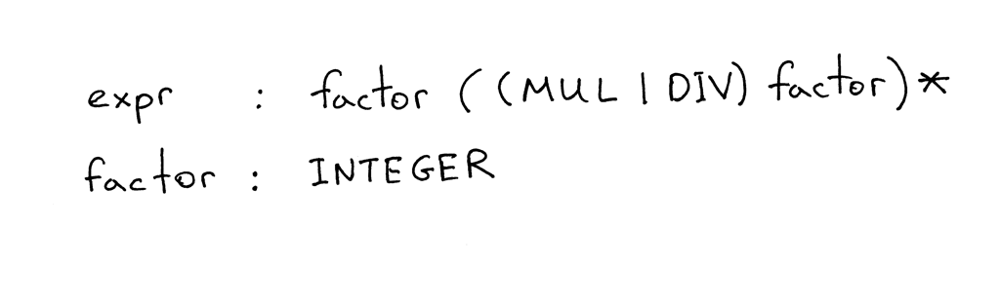
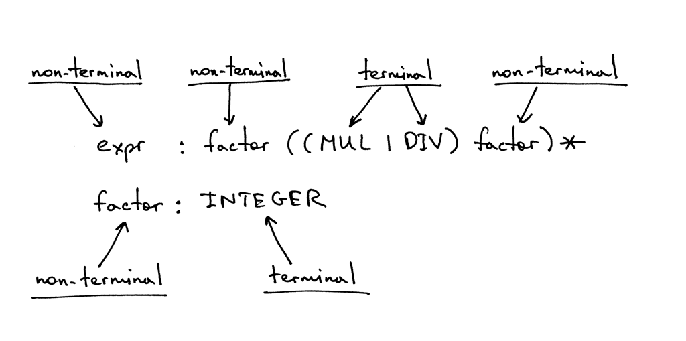
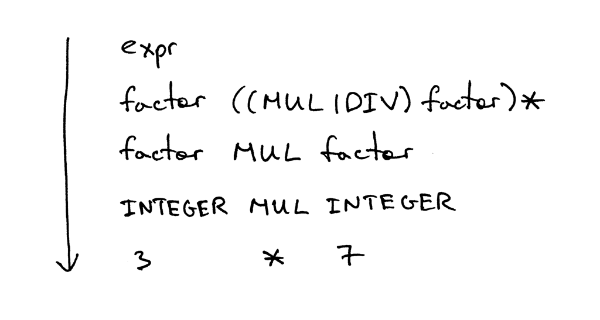
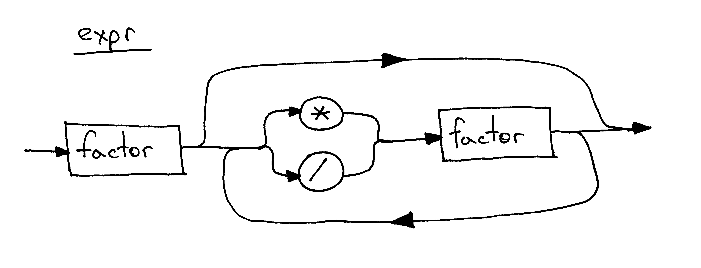

# 上下文无关语法  

这些日子你是被动的接受这些知识还是积极的投入实战？我希望你一直是积极主动地在练习。I really do:)  

还记得孔子说过的吗？(学而时习之，不亦说乎)  
"I hear and I forget"(听过，忘了)  
  
"I see and I remember"(见过，知道)  
  
"I do and I understand"(做过，如数家珍)  
  

在前面的系列中，我们学习到了如何解析(识别)、解释任意项数的加减运算，像是"7 - 3 + 2 - 1"。同时也学习了什么是语法图，以及如何识别编程语言的语法。  
今天我们就来学习如何解析、解释执行多项乘除法运算，例如"7 * 4 / 2 * 3"。这里的除法是指整数的除法："9 / 4 = 2"(*译注：译者在Python 3.7 里面实际上得到的结果是2.25*)  

今天我们也会多花一点精力来讨论一个在语法分析中广泛应用的知识点： **上下文无关语法**(context-free grammars, 简称grammars) 或者 **巴科斯范式**(Backus-Naur Form, BNF)。本文中使用的更像是 **扩展巴科斯范式**(EBNF) 而不是纯粹的BNF。  
之所以选择上下文无关语法，原因如下：  

1. 上下文无关语法能以非常简洁的方式来表示编程语言。与语法图不同，上下文无关语法结构非常紧凑，在以后的文章中的应用会非常频繁。  
2. 上下文无关语法可以作为很好的文档(*原文：A grammar can serve as great documentation.*)  
3. 如果我们要从头开始构建解析器的话，上下文无关语法会是一个很好的起点。通常，我们可以通过一组非常简洁的规则将语法转化为代码。  
4. 现在有很多`解析器生成器(parser generators)`可以很方便的将输入的语法生成为一个解析器。我们后面会讲到。  

现在，就让我们从机器方面来讨论一下上下文无关语法吧：  
下面算术表达式"7 * 4 / 2 * 3(*请忽略空格*)"(通过下面的语法可以生成无数条表达式，这只是其中一个)：  
  

`上下文无关文法(grammar)`可以由一系列的`规则(rule, production)`组成，在上面的语法中，共有两条规则：  
  

一条规则由三部分组成：`规则头(header)`、`分号(colon)`、`规则体(body)`。其中规则头也叫规则的左边，是一个`非终结符(non-terminal)`；规则体也称作规则的右边，是由一系列的非终结符和`终结符(terminal)`组成的混合体。  
  

在上图所示的语法中，像DIV、MUL、INTEGER 这类的`词(token)`被称为`终结符(terminal)`(*译注：具有意义的最小单位，无法再继续细分*)，而像*expr*、*factor* 这种可以分割成一个或多个终结符或非终结符的，被称为`非终结符(non-terminal)`(*有一种递归的意思在里面*)。  
  

自上而下第一条规则的头部被称为`起始符(start symbol)`，上图所示的语法的起始符是*expr*。  
  

关于本文中的语法，我们可以这样解读：  

- 一个`表达式(expr)`可以由一个`因子(factor)`后面跟着0个或多个由MUL或者DIV加另一个因子组成的组  
- 一个`因子(factor)`是表示一个`整数(INTEGER)`  

下面是上下文无关语法里的一些符号的意义：  

- `|` 或。(MUL|DIV) 表示MUL 或者DIV  
- `(...)` 组。括号内的终结符或者非终结符组成一个整体，成为组。  
- `*` 匹配星号前面的内容0此或多次，也叫做`克林闭包(Kleene Closure)`  

如果之前接触过正则表达式，那你对他们肯定不会陌生。  

上下文无关语法通过解析它可以生成的句子来描述语言。这也是本文中如何通过语法来派生算术表达式的方法：首先从起始符`expr` 开始，依次用下一行的规则体替换掉第一条规则体中的非终结符，直至第一条规则体中不再包含有非终结符。由这条规则派生的句子就构成了语法定义的语言。  

下面列举了一些例子，例如表达式`3`：  
  

表达式`3 * 7`：  
  

表达式`3 * 7 / 2`：  
  

嚯，理论有点多了哈！  
在我第一次学习上下文无关语法和相关术语时，就像这样：  
  

反正绝对不是这样：  
  

我花费了好些时间来熟悉上下文无关语法中的符号、它与词法分析器和解释器的关系、以及他是如何工作的。但我要说的是，从长远来看，这些付出都是值得的：鉴于它在实践和相关教材中被广泛应用，再次遇上是迟早的事，所以为什么不早点学习呢？(*是福不是祸，是祸躲不过😄*)  

现在，我们就将上面的语法转化为源码：  

当然，还是有一些规则可循的，只要遵守规则，就可以 **很轻松** 地将语法转化为源码！  

1. 对于每一条规则 **R**：我们需要写一个同名的方法，方法体与规则体结构、顺序都相同  
2. 或运算 **(a1 | a2 | aN)** 替换为`if-elif-else` 语句  
3. **星号(克林闭包)** 对应着`while` 循环  
4. 每一个token，都会对应个一个方法`eat(token)`:eat 方法用来消费词法分析产生的token，如果当前的token 符合语法规则，就会从语法分析器获取下一个token 并设置为解析器的当前token `current_token`  

看起来就像下面这样：  
  

下面我们根据这些准则，来试着手工转化一下。  

我们的语法中有两条规则：expr 和factor。我们先从factor 开始：根据准则1，我们需要创建一个`factor()` 方法；根据准则4，该方法只需要调用`eat(token)` 就好了。(*译注：有没有发现语法的起始符在最复杂的规则，而我们实现语法则是从最简单的规则入手*)  
```python
def factor(self):
    self.eat(INTEGER)
```

很简单，对不对？  
继续！  
由准则1，规则expr 对应着`expr()`，方法体执行一次`factor()`；由准则3，紧跟着一个`while` 循环；由准则2，while 循环先是包含一个`if...else` 然后再执行依次`factor()` 在判断语句中同样也需要调用`eat(token)`校验token。将以上步骤组合在一起，我们就得到了`expr()`方法。  

```python
def expr(self):
    self.factor()

    while self.current_token.type in (MUL, DIV):
        token = self.current_token
        if token.type == MUL:
            self.eat(MUL)
            self.factor()
        elif token.type == DIV:
            self.eat(DIV)
            self.factor()
```

请多花些时间试几次，最好能烂熟于心，稍后就会派上用场。  
为方便起见，我将上面的代码放入*parser.py*文件中，该文件包含词法分析器和不带解释器的解析器。 你也可以直接从[GitHub](https://github.com/rspivak/lsbasi/blob/master/part4/parser.py)下载运行。 它有一个交互式提示符，你可以在其中输入表达式并查看它们是否有效：即，根据语法构建的解析器是否可以识别表达式。  
下面是在作者计算机上执行的会话过程：  

```shell
$ python parser.py
calc> 3
calc> 3 * 7
calc> 3 * 7 / 2
calc> 3 *
Traceback (most recent call last):
  File "parser.py", line 155, in <module>
    main()
  File "parser.py", line 151, in main
    parser.parse()
  File "parser.py", line 136, in parse
    self.expr()
  File "parser.py", line 130, in expr
    self.factor()
  File "parser.py", line 114, in factor
    self.eat(INTEGER)
  File "parser.py", line 107, in eat
    self.error()
  File "parser.py", line 97, in error
    raise Exception('Invalid syntax')
Exception: Invalid syntax
```
动手试试！  

我忍不住想起了语法图，下图就是本文中上下文无关语法所对应的语法图：  
  

趁热打铁。下面是我们计算器的源码，可以处理任意项整数的乘除法(整数除法)。可以看到我们将词法分析器重构为单独的`Lexer` 类，并且更新了`Interpreter` 接受`Lexer`实例作为参数。  

```python
# 被蚊子咬死了，源码注释后面在翻译

# Token 类型
#
# EOF 表示没有更多输入
INTEGER, MUL, DIV, EOF = 'INTEGER', 'MUL', 'DIV', 'EOF'


class Token(object):
    # token 的构造函数
    def __init__(self, type, value):
        # token 类型: INTEGER, MUL, DIV, EOF
        self.type = type
        # token 值: 非负整数, '*', '/', 或者 None
        self.value = value

    def __str__(self):
        """对象的字符串表示

        例如:
            Token(INTEGER, 3)
            Token(MUL, '*')
        """
        return 'Token({type}, {value})'.format(
            type=self.type,
            value=repr(self.value)
        )

    def __repr__(self):
        return self.__str__()


class Lexer(object):
    # 词法分析器构造函数
    def __init__(self, text):
        # 获取输入字符串, 例如 "3 * 5", "12 / 3 * 4", etc
        self.text = text
        # 输入字符串的当前字符指针
        self.pos = 0
        self.current_char = self.text[self.pos]

    def error(self):
        raise Exception('无效的字符')

    def advance(self):
        """移动`pos` 指针`current_char` 当前字符"""
        self.pos += 1
        if self.pos > len(self.text) - 1:
            self.current_char = None  # 输入字符串结束
        else:
            self.current_char = self.text[self.pos]

    def skip_whitespace(self):
        while self.current_char is not None and self.current_char.isspace():
            self.advance()

    # 解析整数token
    def integer(self):
        """消耗当前字符，生成一个(多位)非负整数"""
        result = ''
        while self.current_char is not None and self.current_char.isdigit():
            result += self.current_char
            self.advance()
        return int(result)

    def get_next_token(self):
        """词法分析器

        每次调用，从输入字符串中获取一个token
        """
        while self.current_char is not None:

            if self.current_char.isspace():
                self.skip_whitespace()
                continue

            if self.current_char.isdigit():
                return Token(INTEGER, self.integer())

            if self.current_char == '*':
                self.advance()
                return Token(MUL, '*')

            if self.current_char == '/':
                self.advance()
                return Token(DIV, '/')

            self.error()

        return Token(EOF, None)


class Interpreter(object):
    # 解释器构造函数
    def __init__(self, lexer):
        self.lexer = lexer
        # 设置当前token 为词法分析产生的第一个token
        self.current_token = self.lexer.get_next_token()

    def error(self):
        raise Exception('无效语法')

    def eat(self, token_type):
        # 校验当前的token，如果符合指定的类型，便将current_token 指向下一个token
        # 否则抛出语法解析异常
        if self.current_token.type == token_type:
            self.current_token = self.lexer.get_next_token()
        else:
            self.error()

    def factor(self):
        """因子：返回一个整型token

        factor : INTEGER
        """
        token = self.current_token
        self.eat(INTEGER)
        return token.value

    def expr(self):
        """算式解析器/解释器

        expr   : factor ((MUL | DIV) factor)*
        factor : INTEGER
        """
        result = self.factor()

        while self.current_token.type in (MUL, DIV):
            token = self.current_token
            if token.type == MUL:
                self.eat(MUL)
                result = result * self.factor()
            elif token.type == DIV:
                self.eat(DIV)
                result = result / self.factor()

        return result


def main():
    while True:
        try:
            # Python3 下运行需要将 'raw_input' 替换为 'input'
            text = raw_input('calc> ')
        except EOFError:
            break
        if not text:
            continue
        lexer = Lexer(text)
        interpreter = Interpreter(lexer)
        result = interpreter.expr()
        print(result)


if __name__ == '__main__':
    main()
```

将上面的文件保存为*calc4.py*或者从[GitHub](https://github.com/rspivak/lsbasi/blob/master/part4/calc4.py)下载，并执行，看是否正常运行。  
下面是作者计算机的运行会话：  

```shell
$ python calc4.py
calc> 7 * 4 / 2
14
calc> 7 * 4 / 2 * 3
42
calc> 10 * 4  * 2 * 3 / 8
30
```

我知道你已经等不及今天的练习部分了:)  
  

- 写出可以识别加减乘除四则运算的上下文无关语法，例如："2 + 7 * 4", "7 - 8 / 4", "14 + 2 * 3 - 6 / 2"(注意优先级)  
- 将写出的转化成代码  
- 如果都完成了，那就放松下吧  


小测验：  
参考下图，完成下面的问题：
  

1. 什么是上下文无关语法  
2. 什么是上下文无关语法的规则  
3. 什么是终结符  
4. 什么是非终结符  
5. 什么是规则头  
6. 什么是规则体  
7. 什么是起始符  

今天就到这里，本文中的理论知识有点多，所以不要担心，你已经很厉害了！  
不要忘记练习：**功不唐捐，玉汝于成**。下次见！

下面是一些有用的参考资料：  

1. [Language Implementation Patterns: Create Your Own Domain-Specific and General Programming Languages (Pragmatic Programmers)](http://www.amazon.com/gp/product/193435645X/ref=as_li_tl?ie=UTF8&camp=1789&creative=9325&creativeASIN=193435645X&linkCode=as2&tag=russblo0b-20&linkId=MP4DCXDV6DJMEJBL)  
2. [Writing Compilers and Interpreters: A Software Engineering Approach](http://www.amazon.com/gp/product/0470177071/ref=as_li_tl?ie=UTF8&camp=1789&creative=9325&creativeASIN=0470177071&linkCode=as2&tag=russblo0b-20&linkId=UCLGQTPIYSWYKRRM)  
3. [Modern Compiler Implementation in Java](http://www.amazon.com/gp/product/052182060X/ref=as_li_tl?ie=UTF8&camp=1789&creative=9325&creativeASIN=052182060X&linkCode=as2&tag=russblo0b-20&linkId=ZSKKZMV7YWR22NMW)  
4. [Modern Compiler Design](http://www.amazon.com/gp/product/1461446988/ref=as_li_tl?ie=UTF8&camp=1789&creative=9325&creativeASIN=1461446988&linkCode=as2&tag=russblo0b-20&linkId=PAXWJP5WCPZ7RKRD)  
5. [Compilers: Principles, Techniques, and Tools (2nd Edition)](http://www.amazon.com/gp/product/0321486811/ref=as_li_tl?ie=UTF8&camp=1789&creative=9325&creativeASIN=0321486811&linkCode=as2&tag=russblo0b-20&linkId=GOEGDQG4HIHU56FQ)  

-----  

[阅读原文](https://ruslanspivak.com/lsbasi-part4/)  
第四章很重要也可能有些绕，作者提供了大量的图示，(ง •_•)ง  
