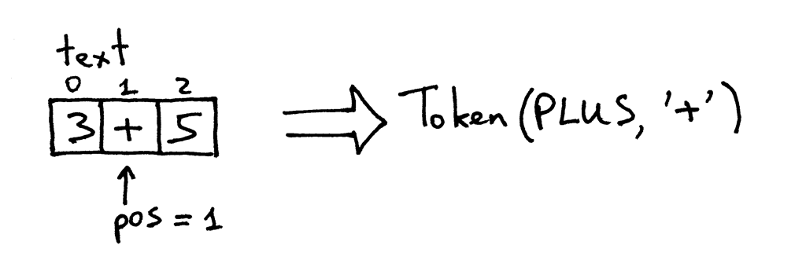

01_初识解释器_构造简单的加法器

📅 2015-05-15  

> ***如果你不知道编译器的原理，你就不知道计算机是如何工作的；如果不能百分之百地确定知道，那便是不知道。** -- Steve Yegge*  

就是这样。想象一下。不论你是初出茅庐的新手，还是久经沙场的老鸟：如果你不知道编译器和解释器是如何工作的，那么你就不清楚计算机的工作原理。就是这样简单。  

所以，你了解编译器的工作原理吗？我是指，能100% 确定吗？如果不能。  
  

亦或者如果你确实对它非常感兴趣。  


别担心。如果你能和我一起坚持学习完这个系列，并且最终能实现一个编译器和一个解释器的话，你就能信心满满。至少我希望如此。  
  

以下是三个学习编译器和解释器的理由：  
1. 能力提升。编译器和解释器开发需要综合运用大量技术技巧，可以帮助你提高开发能力。而这些知识在开发其他软件时也会用到；  
2. 求知欲。通常来说，编译器和解释器看起来就像是魔术，而我们更喜欢看得见、摸得着的事物。我们想要揭开它们神奇的面纱，了解它们的工作流程，更好地掌握它们；  
3. 创造力。我们可以创造自己的编程语言，或者适用于特定领域的语言。而一门语言必须有与之配套的编译器或者解释器。近些年来，人们又重新对新的编程语言燃起了兴趣，几乎每天都会有新语言的诞生：Elixir、Go、Rust 等等。  

但什么是编译器和解释器呢？  

编译器和解释器的作用就是将一种高级语言的源程序，翻译成另一种语言形式。暂时有些抽象，在以后的系列文章中，我们会看到源程序究竟被翻译成了什么。  

到这里，你也许会好奇编译器与解释器的区别是什么。在本系列中，我们约定：编译器将源代码翻译成机器代码；解释器将直接执行源代码。看起来像下面这样：  
  

我希望到目前为止，你已经确定要学习构建编译器与解释器了。你还有其他想要了解的吗？  

本系列中，我们将构建一个[Pascal](https://en.wikipedia.org/wiki/Pascal_%28programming_language%29)语言子集的解释器。最终我们还会实现一个源码级别的调试器，就像Python 的[pdb](https://docs.python.org/2/library/pdb.html)  

你也许会问，为什么是Pascal？原因是因为它不是一门虚构的语言，而是具有许多重要语法结构的实实在在的编程语言。被很多经典的计算科学的教材所采用（并不是特别有说服力，但学习一门非主流的语言也会很有趣吧🙂）  

下面是一段Pascal 代码，我们最终会实现一个可以运行它的解释器，并且创建一个交互式的调试器来实现源码级别的调试：  

```pascal
program factorial;

function factorial(n: integer): longint;
begin
	if n = 0 then
		factorial := 1 
		// Pascal 中';' 表示一个语句的结束
		// if...else... 是一个语句，所以中间不加分号
	else
		factorial := n * factorial(n-1);
end;

var 
	n: integer;
	
begin
	for n:=0 to 16 do
		writeln(n, '! = ', factorial(n));
end.
```

本系列中采用Python 实现Pascal 解释器。但你也可以采用任何其他语言，因为方法不依赖于特定的语言。言归正传，准备开始吧！  

今天我们会先实现一个简单的`两个个位数加法的解释器`，也叫计算器啦。实现例如`3+5` 的计算，下面是解(ji)释(suan)器的源码：  

```python
# -*- coding: UTF-8 -*- 
# 不指定字符集的话，可能不识别中文注释

# 译注：会不会将源代码拆分一下会更好，例如先解释一些想法：  
# 3+5 可以理解为<int,3> <operator,+> <int,5> <ctrl,EOF> 一个有意义的词(Token)序列。这也是实现编译器的基础  

# Token 类型  
# 
# EOF 表示输入结束标志。
INTEGER, PLUS, EOF = 'INTEGER', 'PLUS', 'EOF'  

class Token(object):
	# 译注：感觉将Token 类型写做静态属性更合适一些
	# 有利于源码文件拆分吧，例如：
	# INTEGER, PLUS, EOF = 'INTEGER', 'PLUS', 'EOF'
    def __init__(self, type, value):
        # token type: INTEGER, PLUS, or EOF
        self.type = type
        # token value: 0, 1, 2. 3, 4, 5, 6, 7, 8, 9, '+', or None
        self.value = value

    def __str__(self):
        """序列化为字符串，有利于调试:
            Token(INTEGER, 3)
            Token(PLUS, '+')
        """
        return 'Token({type}, {value})'.format(
            type=self.type,
            # 将对象转化为解释器读取的形式，字符串
            # str()调用__str__()
            # repr()调用__repr__()
            value=repr(self.value)
        )

    def __repr__(self):
        return self.__str__()
        
# 解释器类
class Interpreter(object):
    def __init__(self, text):
        # 源代码： "3+5"
        self.text = text
        # 当前字符位置
        self.pos = 0
        # 当前的Token
        self.current_token = None

    def error(self):
        raise Exception('Error parsing input')

    def get_next_token(self):
        """词法分析器（也被称为扫描器或分词器）
        这个方法会读取源代码，每次被调用时返回一个Token  
        """
        text = self.text

        # 当前字符位置是否已到源代码结束位置
        # 如果是则返回Token(EOF, None)
        if self.pos > len(text) - 1:
            return Token(EOF, None)

        # 否则，读取当前的字符，并基于当前字符创建一个Token
        current_char = text[self.pos]

		# 当前字符位置后移一位
        # 如果当前字符是数字，但返回一个Token(INTEGER, int)
        # 否则返回一个Token(PLUS, '+')
        if current_char.isdigit():
            token = Token(INTEGER, int(current_char))
            self.pos += 1
            return token

        if current_char == '+':
            token = Token(PLUS, current_char)
            self.pos += 1
            return token

        self.error()

	# 判断当前Token 是否符合预期，符合则将指针后移一个
    def eat(self, token_type):
        if self.current_token.type == token_type:
            self.current_token = self.get_next_token()
        else:
            self.error()

	# 匹配表达式
    def expr(self):
        """expr -> INTEGER PLUS INTEGER
        表达式形式为：整数 + 整数 
        """
        # 设置当前Token
        self.current_token = self.get_next_token()

        # 希望获取一个整数
        left = self.current_token
        self.eat(INTEGER)

        # 希望获取一个加号运算符
        op = self.current_token
        self.eat(PLUS)

        # 希望再获取一个整数
        right = self.current_token
        self.eat(INTEGER)
        # 完成以上步骤后，当前Token 会变成EOF，但是已经没必要再验证了

        # 当所有的Token 都符合表达式需要，计算并返回最终结果
        result = left.value + right.value
        return result
        
# 主函数  
def main():
    while True:
        try:
            # Python3 下用input('calc>') 代替
            text = raw_input('calc> ')
        except EOFError:
            break
        if not text:
            continue
        interpreter = Interpreter(text)
        result = interpreter.expr()
        print(result)


if __name__ == '__main__':
    main()
```

将上述代码保存为`calc1.py` 或者直接从[Github](https://github.com/rspivak/lsbasi/blob/master/part1/calc1.py)下载。在详细分析代码之前，可以先跑几次。下面是在我笔记本电脑上的简单会话： 

```shell
$ python calc1.py
calc> 3+4
7
calc> 3+5
8
calc> 3+9
12
calc>
```

为了使这个简单的计算器能够正常工作，我们的输入应该符合下面的要求：  
- 加数只能是一位整数  
- 只能计算加法  
- 不要输入数字和加号以外的其他字符  

严格的输入要求使得这个计算器可以非常简单。但是很快他就会变得非常复杂了。  

下面我们来深入分析一下，解释器是如何工作，最终给算术表达式求值的。  

当你在命令行输入`3+5` 后，解释器便获取到一个字符串`"3+5"`。为了使解释器真正理解指令，需要将字符串拆分为一系列的Token。每个Token 都是一个包含类型与值的对象。例如，字符串`"3"`对应的Token 类型就是`INTEGER`，值为`3`。  

将字符串转化为Token 的过程称为**词法分析**。完成词法分析的部分成为**词法分析器**，也叫分词器或扫描器。它们的意思是一样的：将一串输入字符转化为一系列Token 对象。这也是编译器和解释器所有工作的基础。

方法`get_next_token()` 便是词法分析器。每次调用，它都会根据源代码返回下一个Token。下面详细分析一下词法分析器是如何工作的。源代码被存放在`text` 变量中，`pos` 变量(初始为0)表示当前字符的位置。`text[pos]` 初始值为字符`'3'`。首先检查该字符是否是数字：如果是，`pos` 自增1，并返回`INTEGER` 类型的Token，值为3。  
  

`pos` 现在“指向”字符`'+'` 的位置。下次调用`get_next_token()` 时，会检查是否为整数，是否为加号。最后`pos` 自增1，并返回`PLUS` 类型的Token，值是`'+'`。  


现在`pos` “指向”字符`'5'`。 当再次调用`get_next_token()` 时，会检查是否为整数，并返回`INTEGER` 类型的Token，值是5。  


因为`pos` 此时已经到达源代码的结尾，再次调用`get_next_token()` 会返回`EOF` 类型的Token。  


可以尝试运行词法分析器部分：

```python
>>> from calc1 import Interpreter
>>>
>>> interpreter = Interpreter('3+5')
>>> interpreter.get_next_token()
Token(INTEGER, 3)
>>>
>>> interpreter.get_next_token()
Token(PLUS, '+')
>>>
>>> interpreter.get_next_token()
Token(INTEGER, 5)
>>>
>>> interpreter.get_next_token()
Token(EOF, None)
>>>
```  

现在，我们的解释器可以从输入生成一个Token 序列，接下来的工作就是以这些Token 序列为基础了：从平坦的序列中发现特性的结构。我们的编译器需要`INTEGER->PLUS->INTEGER` 排列的三个Token。当Token 符合这个结构之后，解释器便会通过加数与被加数计算出最终的值。  

`expr()` 方法会通过调用`eat()` 方法，来验证当前的Token 是否符合预期。当一个Token 验证通过后，`eat()` 会将变量`current_token` 重新赋值。如果Token 序列不符合预设的`INTEGER->PLUS->INTEGER` 结构，`eat()` 方法会抛出异常。  

> *译注：词法分析概念上应该是独立的，但实际上被嵌入到`eat()` 内部了*  

让我们回顾一下整个过程：  
- 解释器接收输入字符串：`"3+5"`  
- 解释器调用`expr()` 匹配特定的Token 结构`INTEGER->PLUS->INTEGER`。这些Token 由`get_next_token()` 生成。匹配通过后，解释器将加号两边的字符转化为数字，然后相加求出最终结果。  

大功告成。我们已经完成了一个最基础的解释器。  

下面可以做些练习。  
  

你不会天真地以为只靠阅读就可以掌握吧？你还是需要亲自动手实践一下：  
1. 修改解释器，使之能完成多位整数的加法  
2. 增加可以处理空格的方法  
3. 使解释器可以处理减法运算  

**自检：**  
1. 什么是解释器  
2. 什么是编译器  
3. 解释器与编译器的区别是什么  
4. 什么是Token  
5. 将字符串生成Token 序列的组件叫什么  
6. 解释器中完成词法分析的部分是什么  
7. 上题中的部分还被称为什么  

最后，我中心希望你能努力学习编译器和解释器。不要添加到收藏夹就完事儿了。如果你只是粗略浏览了一遍，那么请从头开始；如果没有完成练习，那么请完成它；如果你只完成了一部份，那么请把剩下的也完成。来做个约定吧：  

> *本人，________，作为一个心智健全的人，从今天起将致力于学习编译器与解释器，直到最终100% 理解它们的工作原理！*  
> *签名：________*  
> *日期：____年__月__日*  

  

每天用它来督促自己努力，记住承诺的定义：  

> *承诺就是做说过的事情，就算不复当时的激情* -- Darren Hardy  

今天就到这里。在以后的系列中我们会持续扩展这个计算器来完成更复杂的运算。敬请关注。  

如果你迫不及待地想要深入学习更多有关编译器和解释器的知识，你也许能从下面的书籍中获得帮助：  
1. [Language Implementation Patterns: Create Your Own Domain-Specific and General Programming Languages (Pragmatic Programmers)](http://www.amazon.com/gp/product/193435645X/ref=as_li_tl?ie=UTF8&camp=1789&creative=9325&creativeASIN=193435645X&linkCode=as2&tag=russblo0b-20&linkId=MP4DCXDV6DJMEJBL)  
2. [Writing Compilers and Interpreters: A Software Engineering Approach](http://www.amazon.com/gp/product/0470177071/ref=as_li_tl?ie=UTF8&camp=1789&creative=9325&creativeASIN=0470177071&linkCode=as2&tag=russblo0b-20&linkId=UCLGQTPIYSWYKRRM)  
3. [Modern Compiler Implementation in Java](http://www.amazon.com/gp/product/052182060X/ref=as_li_tl?ie=UTF8&camp=1789&creative=9325&creativeASIN=052182060X&linkCode=as2&tag=russblo0b-20&linkId=ZSKKZMV7YWR22NMW)  
4. [Modern Compiler Design](http://www.amazon.com/gp/product/1461446988/ref=as_li_tl?ie=UTF8&camp=1789&creative=9325&creativeASIN=1461446988&linkCode=as2&tag=russblo0b-20&linkId=PAXWJP5WCPZ7RKRD)  
5. [Compilers: Principles, Techniques, and Tools (2nd Edition)](http://www.amazon.com/gp/product/0321486811/ref=as_li_tl?ie=UTF8&camp=1789&creative=9325&creativeASIN=0321486811&linkCode=as2&tag=russblo0b-20&linkId=GOEGDQG4HIHU56FQ)  

-----  
10/06/2020 14:44


