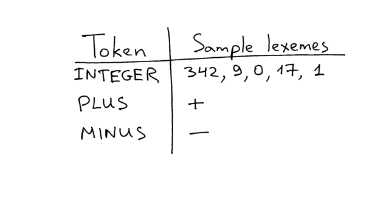

02_解析器_加减法运算

📅 2015-07-03  

在《The 5 Elements of Effective Thinking》一书中，作者Burger 和Starbird 分享了一则关于国际小号大师Tony Plog 举办培训班的故事：刚开始的时候，学员们非常完美地演奏了复杂的曲子，但之后在被要求演奏基础的音符时，声音却显得非常幼稚。最终大师Tony Plog 同样也演奏了简单的音符，却丝毫没有幼稚的感觉。区别很明显，Tony 解释到：熟练掌握简单的音符可以让乐手更好地掌控复杂的曲子。这则故事告诉我们，想要有所成就，必须先专注于熟练掌握最简单、基础的想法。  

上面的故事对于软件开发来说也同样适用。它时刻提醒我们不要轻视简单、基础工作的重要性，尽管有时候看起来像是在做无用功。能够熟练运用工具、框架固然重要，但是知晓它们背后的原理也同样重要。正如Ralph Waldo Emerson(艾默生) 所说：  
> "如果你只会方法，反而会被方法束缚；但如果你掌握了原理，你就可以创造自己的的方法"  

关于这一点就说这么多，下面让我们继续学习编译器和解释器吧。  

今天我们会扩展[01_初识解释器_构造简单的加法器](../lsbasi_cn/01_%E5%88%9D%E8%AF%86%E8%A7%A3%E9%87%8A%E5%99%A8_%E6%9E%84%E9%80%A0%E7%AE%80%E5%8D%95%E7%9A%84%E5%8A%A0%E6%B3%95%E5%99%A8.md)所写的计算器，是指能够完成以下工作：  
1. 处理源代码中的空格  
2. 两个多位整数(n>0) 的运算  
3. 两个数字的减法运算  

以下就是新计算器的源代码：  

```python
# -*- coding: UTF-8 -*- 
# 不指定字符集的话，可能不识别中文注释

# 运算符类型增加减法
INTEGER, PLUS, MINUS, EOF = 'INTEGER', 'PLUS', 'MINUS', 'EOF'

class Token(object):
    def __init__(self, type, value):
        # token type: INTEGER, PLUS, or EOF
        self.type = type
        # token value: 0, 1, 2. 3, 4, 5, 6, 7, 8, 9, '+', or None
        self.value = value

    def __str__(self):
        """序列化为字符串，有利于调试:
            Token(INTEGER, 3)
            Token(PLUS, '+')
        """
        return 'Token({type}, {value})'.format(
            type=self.type,
            # 将对象转化为解释器读取的形式，字符串
            # str()调用__str__()
            # repr()调用__repr__()
            value=repr(self.value)
        )

    def __repr__(self):
        return self.__str__()

# 解释器类
class Interpreter(object):
    def __init__(self, text):
        # 客户端输入，如 "3 + 5", "12 - 5" 等等
        self.text = text
        # 当前字符位置
        self.pos = 0
        # 当前的Token
        self.current_token = None
        # 当前字符
        self.current_char = self.text[self.pos]

    def error(self):
        raise Exception('Error parsing input')

    def advance(self):
        """获取下一个字符，并赋值给变量current_char"""
        self.pos += 1
        if self.pos > len(self.text) - 1:
            self.current_char = None  # 源代码结束
        else:
            self.current_char = self.text[self.pos]

	# 跳过空格
    def skip_whitespace(self):
        while self.current_char is not None and self.current_char.isspace():
            self.advance()

	# 整数
    def integer(self):
        """获取多个字符并组成为一个整数"""
        result = ''
        while self.current_char is not None and self.current_char.isdigit():
            result += self.current_char
            self.advance()
        return int(result)

    def get_next_token(self):
        """词法分析器
        	根据变量current_char 来判断
        """
        while self.current_char is not None:

            if self.current_char.isspace():
                self.skip_whitespace()
                continue

            if self.current_char.isdigit():
                return Token(INTEGER, self.integer())

            if self.current_char == '+':
                self.advance()
                return Token(PLUS, '+')

            if self.current_char == '-':
                self.advance()
                return Token(MINUS, '-')

            self.error()

        return Token(EOF, None)

    def eat(self, token_type):
        # 匹配Token 类型
        if self.current_token.type == token_type:
            self.current_token = self.get_next_token()
        else:
            self.error()

    def expr(self):
        """解释器 或者叫 语法分析器

        expr -> INTEGER PLUS INTEGER
        expr -> INTEGER MINUS INTEGER
        """
        self.current_token = self.get_next_token()

        # 左值为整数
        left = self.current_token
        self.eat(INTEGER)

        # 操作符
        op = self.current_token
        if op.type == PLUS:
            self.eat(PLUS)
        else:
            self.eat(MINUS)

        # 右值为整数
        right = self.current_token
        self.eat(INTEGER)
        
        # 根据运算符计算最终结果
        if op.type == PLUS:
            result = left.value + right.value
        else:
            result = left.value - right.value
        return result


def main():
    while True:
        try:
            # To run under Python3 replace 'raw_input' call
            # with 'input'
            text = raw_input('calc> ')
        except EOFError:
            break
        if not text:
            continue
        interpreter = Interpreter(text)
        result = interpreter.expr()
        print(result)


if __name__ == '__main__':
    main()
```

将上述代码保存为`calc2.py` 或者直接从[Github](https://github.com/rspivak/lsbasi/blob/master/part2/calc2.py)下载并运行。看输出是否素和预期：可以处理空格；多位操作数；减法运算。  

下面是在我电脑上运行的结果：  
```python
$ python calc2.py
calc> 27 + 3
30
calc> 27 - 7
20
calc>
```  

与[01_初识解释器_构造简单的加法器](../lsbasi_cn/01_%E5%88%9D%E8%AF%86%E8%A7%A3%E9%87%8A%E5%99%A8_%E6%9E%84%E9%80%A0%E7%AE%80%E5%8D%95%E7%9A%84%E5%8A%A0%E6%B3%95%E5%99%A8.md)相比，代码的主要改动为：  
1. `get_next_token()` 方法重构。将`pos` 自增功能独立到`advace()` 方法；  
2. 新增两个方法：`skip_whitespace()` 忽略空格和`integer()` 获取多位整数；  
3. `expr()` 方法可以识别`int + int` 和`int - int` 的Token 序列。  

在[01_初识解释器_构造简单的加法器](../lsbasi_cn/01_%E5%88%9D%E8%AF%86%E8%A7%A3%E9%87%8A%E5%99%A8_%E6%9E%84%E9%80%A0%E7%AE%80%E5%8D%95%E7%9A%84%E5%8A%A0%E6%B3%95%E5%99%A8.md)我们学习了词法分析与词法分析器(lexical analyzer)两个重要概念。今天我们再来介绍词素(lexemes)、语法分析与语法分析器。  

我们之前已经有此的概念了，下面我们来介绍一下词素。什么是词素？**词素是一系列符合某个词的特征字符**。下面图片包含一些简单的词素，可以帮助我们理解词与词素的关系：  

> 译注：一个词可以看作具有某个特征的几何；词素就是这个几何中的子集。子集的个数可以是无限多个。

  

还记得我们的`expr()` 方法吗？我之前说它是实际进行运算的地方。但是在我们解释一个表达式之前，我们需要知道它是什么样的短语`phrase`，例如：加法或者减法。`expr()` 主要完成：从`get_next_token()` 生成的Token 序列中识别出特定的语法结构，并计算最终结果。  

通过Token 序列确定结构的过程称为解析。实现解析功能的部分称为解析器。  

`expr()` 方法就是执行解析的地方，通过解析Token 结构，计算结果并返回。  

下面，是今天的联系：  


1. 扩展计算器，使之可以支持乘法；  
2. 扩展计算器，使之可以支持除法；  
3. 修改代码，使之支持连续的运算。  

**自检**  
1. 什么是词素？  
2. 从Token 序列中识别特定语法机构的过程是什么？  
3. 执行这部分功能的组件叫什么？  

希望你喜欢。下篇文章将会带你扩展这个计算器，使之可以处理更复杂的算数运算，敬请期待。  
以下书籍可能会对你有所帮助：  

1. [Language Implementation Patterns: Create Your Own Domain-Specific and General Programming Languages (Pragmatic Programmers)](http://www.amazon.com/gp/product/193435645X/ref=as_li_tl?ie=UTF8&camp=1789&creative=9325&creativeASIN=193435645X&linkCode=as2&tag=russblo0b-20&linkId=MP4DCXDV6DJMEJBL)  
2. [Writing Compilers and Interpreters: A Software Engineering Approach](http://www.amazon.com/gp/product/0470177071/ref=as_li_tl?ie=UTF8&camp=1789&creative=9325&creativeASIN=0470177071&linkCode=as2&tag=russblo0b-20&linkId=UCLGQTPIYSWYKRRM)  
3. [Modern Compiler Implementation in Java](http://www.amazon.com/gp/product/052182060X/ref=as_li_tl?ie=UTF8&camp=1789&creative=9325&creativeASIN=052182060X&linkCode=as2&tag=russblo0b-20&linkId=ZSKKZMV7YWR22NMW)  
4. [Modern Compiler Design](http://www.amazon.com/gp/product/1461446988/ref=as_li_tl?ie=UTF8&camp=1789&creative=9325&creativeASIN=1461446988&linkCode=as2&tag=russblo0b-20&linkId=PAXWJP5WCPZ7RKRD)  
5. [Compilers: Principles, Techniques, and Tools (2nd Edition)](http://www.amazon.com/gp/product/0321486811/ref=as_li_tl?ie=UTF8&camp=1789&creative=9325&creativeASIN=0321486811&linkCode=as2&tag=russblo0b-20&linkId=GOEGDQG4HIHU56FQ)   

-----  
2020-06-11 13:50  

译注：句法(syntax)，有些地方会被翻译成语法(grammar)。二者之间是有区别的，grammar 除了特定的句子成分外，还包含时态等信息，一般常用于自然语言；而syntax 常用于机器语言。


