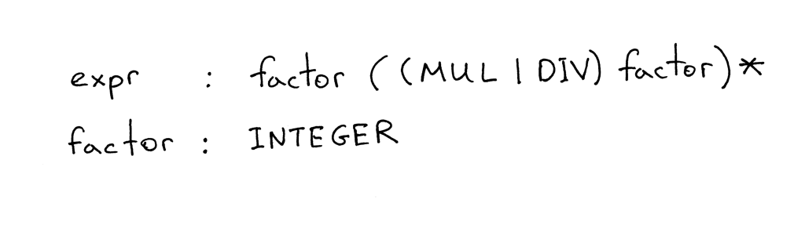
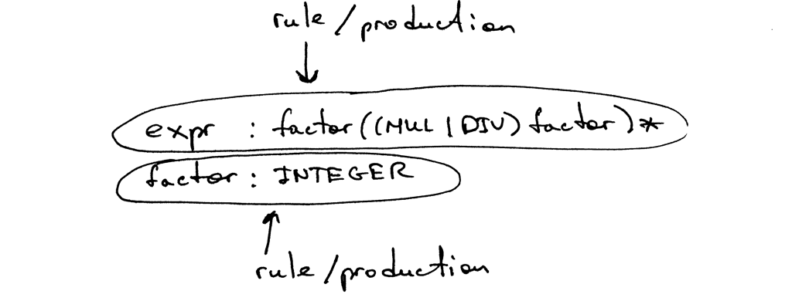
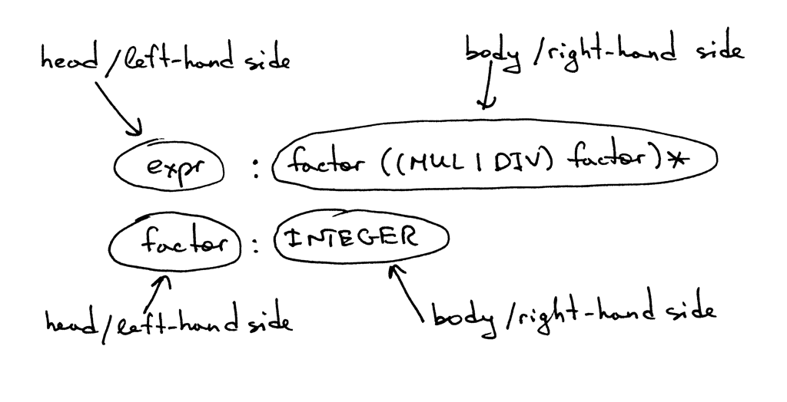
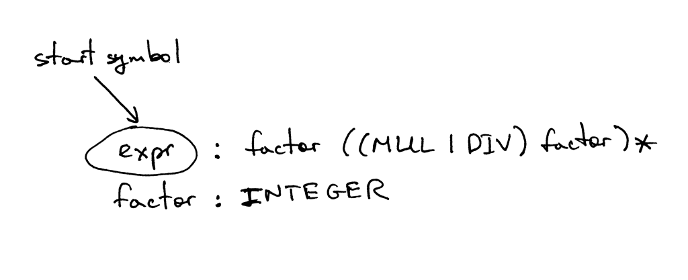
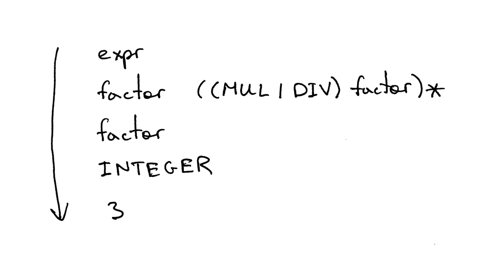
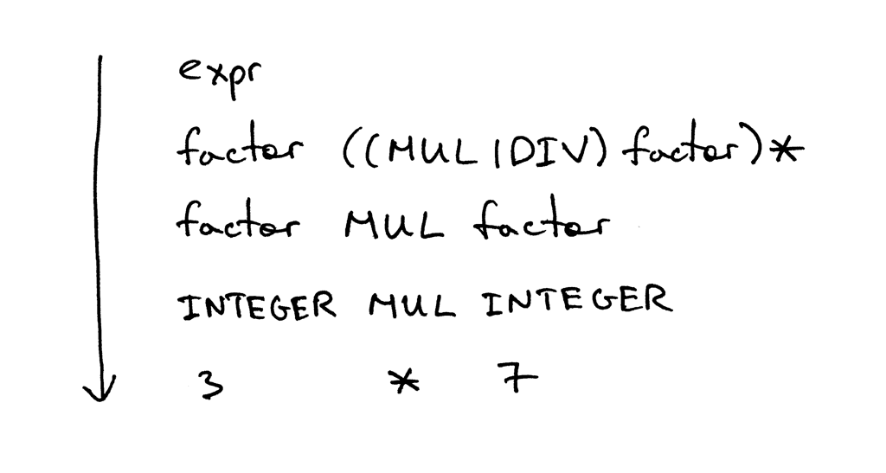
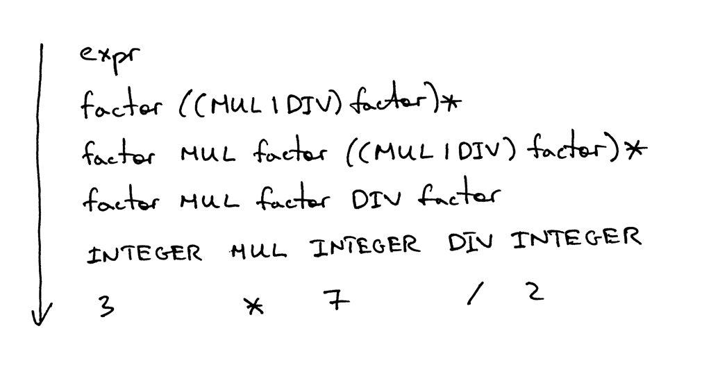
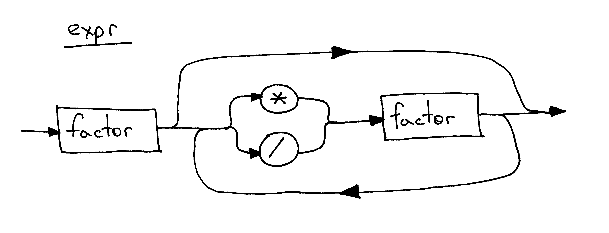

04_上下文无关语法

📅 2015-09-11  

一直以来，你是在消极地阅读这些文章，还是能积极地投入实践？我由衷地希望你能积极地动手实践🙂  

孔子曰：~~*学而时习之，不亦说乎?*~~

*闻而忘之*  
  

*见而记之*
  

*行而知之*  


在前面的文章中，我们学会了如何解析(识别)和解释任意多加减操作的算术表达式，例如:`7-3+2-1`。我们还学会了如何绘制指定语法的语法图。  

今天我们将继续学习任意多乘除法操作的算术表达式，例如:`7*4/2*3`。本文规定除法为整数除法，例如:`9/4=2`。*译注：其实就是求商运算*  

我也会讲一些在定义编程语言语法时广泛用到的概念：***上下文无关语法(context-free grammars)*** 或者***BNF (Backus-Naur Form)***，*译注：这里语法不是syntax，两者还是有些区别的，syntax 一般翻译为句法*。本文无意使用纯粹的[BNF](https://en.wikipedia.org/wiki/Backus%E2%80%93Naur_Form)，而是更像[EBNF](https://en.wikipedia.org/wiki/Extended_Backus%E2%80%93Naur_Form)。  

我们使用上下文无关语法(Grammar)的原因如下：  
1. 上下文无关语法以一种非常简洁的形式指定了一种编程语言的语法。与语法图不同，它非常紧凑。我们后面的文章会用的更多  
2. 上下文无关语法可以用于大型文档的解析  
3. 上下文无关语法是非常好的着手点，如果你要从头开始编写自己的语法分析器。一般来说，我们可以通过遵循一些简单的规则，就可以将语法翻译成代码  
4. 现在有很多被称为语法分析器生成器的工具，可以将指定的语法生成为语法分析器。在后面的系列中我们会继续探讨这些工具  

现在我们来看一下上下文无关具体长什么样子吧。  
下面的语法可以描述形如`7*4/2*3` 的算术表达式(此表达式只是语法可以表示的众多子集中的一个元素)。 


上下文无关语法由一系列的规则组成，以上图为例，语法中就包含两条规则：  


每条语法规则的左边是一个**非终止符**，称为**规则头**或者**左边**；右边是由一系列**终止符**和/或**非终止符**组成的规则体，也被称为**右边**。  


在上面的语法中，像`MUL`、`DIV` 和`INTEGER` 这样的`Token` 被称为**终止符**。像`expr` 和`factor` 被称为**非终止符**。非终止符一般由一系列终止符和/或非终止符构成。*译注：这里就可以看出递归的影子了*  


第一条规则的规则头被称为**起始符**。本语法中的起始符是`expr`。  


我们可以按照如下规则去解读`expr`: 由一个`factor` 后面跟着0 个或多个 **"由`*` 或`/` 和一个`factor` 组成的结构"** 组成。  
至于`factor`，本文中的`factor` 就是一个整数。  

下面简单介绍一下语法中各运算符的意义：  
- `|` 或运算。`(MUL|DIV)` 表示`MUL` 或者`DIV`  
- `(...)` 表示一个组
- `(...)*` 表示此组将重复0 次或多次  

如果你之前学习过正则表达式，那你对上面的符号一定不陌生。  

上下文无关语法根据句式定义语言。以算术表达式为例：首先从起始符开始，然后不断地将非终止符由对应的终止符替换，直到生成仅有终止符的句子。这些句子(的全集)就构成了语言。  

如果一个语法不能生成某个特定的算术表达式，那么就可以说词语发不支持该表达式，在识别该表达式时，语法分析器会抛出异常。  

下面是几个例子，例如:`3`


`3*7`  


`3*7/2`


理论知识有点多了~  

当我第一次见到上下文无关语法这个科技感很强的名词时，我是一脸懵逼的： 
  

绝对没有一丝丝喜悦，我保证绝对不是下面这种心情：  


我们需要花费一些时间去熟悉这个概念、学习它的原理以及它和语法分析器与词法分析器的关系。但是长远来开，这些努力是值得的，因为在编译器的学习和实践中它的用处会非常广。所以为什么不早点掌握呢? 🙂  

让我们试着将语法转化为代码吧。  

下面是一些语法到代码的转化规则，通过这些规则，我们可以轻松地将语法转化为一个语法分析器:  
1. 对于任意一条规则`R`，可以转化为一个同名函数`R()`。函数体亦遵循相同的原则
2. 或运算`(a1 | a2 | aN)` 翻译为`if-elif-else` 语句  
3. 可选分组`(…)*`转化为`while`语句  
4. 每个`Token(T)`，转化为`eat` 方法: `eat(T)`。如果`eat()` 与当前token 匹配，则从词法分析器获取下一个token 赋值给current_token 变量  

看起来如下图所示:  
  

让我们按照上面的规则一步步地翻译为代码。  
```python
# 1. 由(1) 知，我们需要定义一个同名函数
def factor(self):
	# 2. 由(4) 知，需要在函数体去匹配一个token
	self.eat(INTEGER)
```

不难吧，下面继续分析`expr`:  
```python
# 1. 由(1) 定义同名方法
def expr(self):
	# 2. 第一个factor
	self.factor()
	
	# 3. 由(3) 可选分组转化为while 循环
	while self.current_token.type in (MUL, DIV):
        token = self.current_token
        # 4. 由(2) 或运算转化为选择语句
        if token.type == MUL:
        	# 5. 分组内是一个整体
            self.eat(MUL)
            self.factor()
        elif token.type == DIV:
            self.eat(DIV)
            self.factor()
```

多花点时间来搞清楚我是如何将语法转化为代码的。  

为方便起见，我将上述代码连同一个语法分析器与语法分析器一起打包到`parser.py`。你可以直接从[Github](https://github.com/rspivak/lsbasi/blob/master/part4/parser.py) 下载运行。它有一个交互窗口，你可以输入表达式看表达式是否合法：根据上面语法构造的语法分析器是否能够识别。  

下面是在我电脑上运行的情况：  

```python
$ python parser.py
calc> 3
calc> 3 * 7
calc> 3 * 7 / 2
calc> 3 *
Traceback (most recent call last):
  File "parser.py", line 155, in <module>
    main()
  File "parser.py", line 151, in main
    parser.parse()
  File "parser.py", line 136, in parse
    self.expr()
  File "parser.py", line 130, in expr
    self.factor()
  File "parser.py", line 114, in factor
    self.eat(INTEGER)
  File "parser.py", line 107, in eat
    self.error()
  File "parser.py", line 97, in error
    raise Exception('Invalid syntax')
Exception: Invalid syntax
```

试着运行一下。我不禁想再提一下语法图。下面是`expr`语法对应的语法图。


是时候继续挖掘我们新计算器的源码了。下面的代码可以处理任意多因数的乘除法。你也可以发现我将语法分析器单独成一个`Lexer` 类，并且新的`Interpreter` 类会采用一个`Lexer` 实例做参数：  
```python
# Token types
#
# EOF (end-of-file) token is used to indicate that
# there is no more input left for lexical analysis
INTEGER, MUL, DIV, EOF = 'INTEGER', 'MUL', 'DIV', 'EOF'


class Token(object):
    def __init__(self, type, value):
        # token type: INTEGER, MUL, DIV, or EOF
        self.type = type
        # token value: non-negative integer value, '*', '/', or None
        self.value = value

    def __str__(self):
        """String representation of the class instance.

        Examples:
            Token(INTEGER, 3)
            Token(MUL, '*')
        """
        return 'Token({type}, {value})'.format(
            type=self.type,
            value=repr(self.value)
        )

    def __repr__(self):
        return self.__str__()


class Lexer(object):
    def __init__(self, text):
        # client string input, e.g. "3 * 5", "12 / 3 * 4", etc
        self.text = text
        # self.pos is an index into self.text
        self.pos = 0
        self.current_char = self.text[self.pos]

    def error(self):
        raise Exception('Invalid character')

    def advance(self):
        """Advance the `pos` pointer and set the `current_char` variable."""
        self.pos += 1
        if self.pos > len(self.text) - 1:
            self.current_char = None  # Indicates end of input
        else:
            self.current_char = self.text[self.pos]

    def skip_whitespace(self):
        while self.current_char is not None and self.current_char.isspace():
            self.advance()

    def integer(self):
        """Return a (multidigit) integer consumed from the input."""
        result = ''
        while self.current_char is not None and self.current_char.isdigit():
            result += self.current_char
            self.advance()
        return int(result)

    def get_next_token(self):
        """Lexical analyzer (also known as scanner or tokenizer)

        This method is responsible for breaking a sentence
        apart into tokens. One token at a time.
        """
        while self.current_char is not None:

            if self.current_char.isspace():
                self.skip_whitespace()
                continue

            if self.current_char.isdigit():
                return Token(INTEGER, self.integer())

            if self.current_char == '*':
                self.advance()
                return Token(MUL, '*')

            if self.current_char == '/':
                self.advance()
                return Token(DIV, '/')

            self.error()

        return Token(EOF, None)


class Interpreter(object):
    def __init__(self, lexer):
        self.lexer = lexer
        # set current token to the first token taken from the input
        self.current_token = self.lexer.get_next_token()

    def error(self):
        raise Exception('Invalid syntax')

    def eat(self, token_type):
        # compare the current token type with the passed token
        # type and if they match then "eat" the current token
        # and assign the next token to the self.current_token,
        # otherwise raise an exception.
        if self.current_token.type == token_type:
            self.current_token = self.lexer.get_next_token()
        else:
            self.error()

    def factor(self):
        """Return an INTEGER token value.

        factor : INTEGER
        """
        token = self.current_token
        self.eat(INTEGER)
        return token.value

    def expr(self):
        """Arithmetic expression parser / interpreter.

        expr   : factor ((MUL | DIV) factor)*
        factor : INTEGER
        """
        result = self.factor()

        while self.current_token.type in (MUL, DIV):
            token = self.current_token
            if token.type == MUL:
                self.eat(MUL)
                result = result * self.factor()
            elif token.type == DIV:
                self.eat(DIV)
                result = result / self.factor()

        return result


def main():
    while True:
        try:
            # To run under Python3 replace 'raw_input' call
            # with 'input'
            text = raw_input('calc> ')
        except EOFError:
            break
        if not text:
            continue
        lexer = Lexer(text)
        interpreter = Interpreter(lexer)
        result = interpreter.expr()
        print(result)


if __name__ == '__main__':
    main()
```

将上面代码保存成`calc4.py` 或者直接从[Github](https://github.com/rspivak/lsbasi/blob/master/part4/calc4.py) 下载并运行查看结果。  

下面是在我计算机上运行的例子：
```python
$ python calc4.py
calc> 7 * 4 / 2
14
calc> 7 * 4 / 2 * 3
42
calc> 10 * 4  * 2 * 3 / 8
30
```

我知道你已经等不及练习了🙂  
  

- 写出复杂四则运算的上下文无关语法，例如`2 + 7 * 4`，`7 - 8 / 4`，`14 + 2 * 3 - 6 / 2` 等等  
- 将改语法翻译为相应的解释器  
- 休息一下  

## 自检  

牢记今天所学的内容，根据下图回答问题：  
  

1. 什么是上下文无关语法
2. 上下文无关语法由多少规则
3. 什么是终止符(在上图指出即可)
4. 什么非终止符(同上)  
5. 什么是规则头(同上)  
6. 什么是规则体(同上)  
7. 什么是起始符

到此为止，今天的理论有点多，能坚持下来真的很厉害了！

敬请关注新的文章，不要忘记练习哦，they will do you good。  

以下书籍可能会对你有所帮助：  

1. [Language Implementation Patterns: Create Your Own Domain-Specific and General Programming Languages (Pragmatic Programmers)](http://www.amazon.com/gp/product/193435645X/ref=as_li_tl?ie=UTF8&camp=1789&creative=9325&creativeASIN=193435645X&linkCode=as2&tag=russblo0b-20&linkId=MP4DCXDV6DJMEJBL)  
2. [Writing Compilers and Interpreters: A Software Engineering Approach](http://www.amazon.com/gp/product/0470177071/ref=as_li_tl?ie=UTF8&camp=1789&creative=9325&creativeASIN=0470177071&linkCode=as2&tag=russblo0b-20&linkId=UCLGQTPIYSWYKRRM)  
3. [Modern Compiler Implementation in Java](http://www.amazon.com/gp/product/052182060X/ref=as_li_tl?ie=UTF8&camp=1789&creative=9325&creativeASIN=052182060X&linkCode=as2&tag=russblo0b-20&linkId=ZSKKZMV7YWR22NMW)  
4. [Modern Compiler Design](http://www.amazon.com/gp/product/1461446988/ref=as_li_tl?ie=UTF8&camp=1789&creative=9325&creativeASIN=1461446988&linkCode=as2&tag=russblo0b-20&linkId=PAXWJP5WCPZ7RKRD)  
5. [Compilers: Principles, Techniques, and Tools (2nd Edition)](http://www.amazon.com/gp/product/0321486811/ref=as_li_tl?ie=UTF8&camp=1789&creative=9325&creativeASIN=0321486811&linkCode=as2&tag=russblo0b-20&linkId=GOEGDQG4HIHU56FQ)   

-----  
2020-06-22 09:55