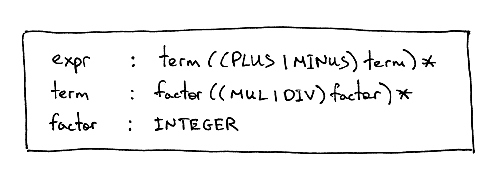
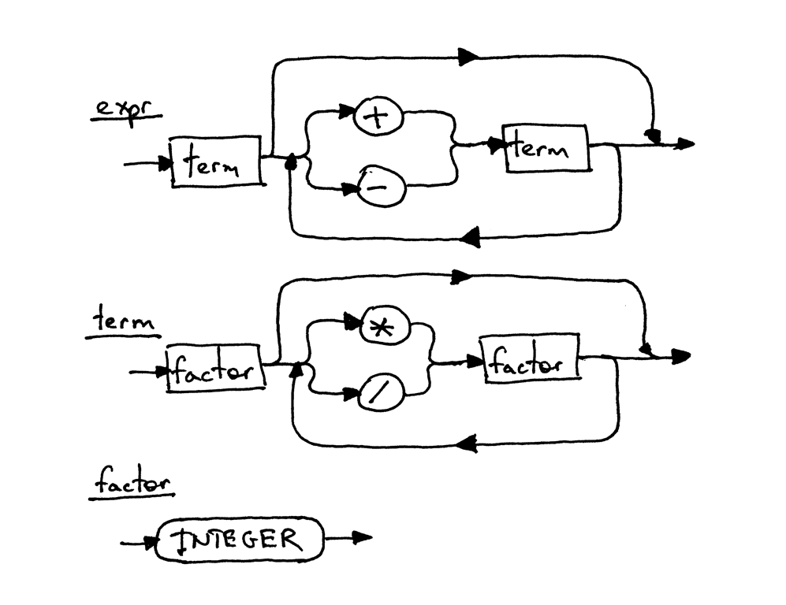

05_运算的优先级

📅 2015-10-14  

你是如何去处理复杂的事情的，譬如理解如何创造一个编译器和解释器。这类问题开始时就像一团乱麻，需要我们抽丝剥茧，最后缠成完美的线团。  

学习没有捷径，我们需要一次一个知识点，慢慢进步。有时你可能会觉得有些东西可能无法立即接受，但即便如此也要坚持下去。我保证，如果你有足够的毅力，一定会"茅塞顿开"。(如果我每次遇到难题都攒25 分钱的话，我肯定早就成为富翁了🙂)

关于如何编写编译器与解释器，我能给你最好的建议恐怕就是仔细阅读这系列的文章、代码，并且自己动手去写代码，哪怕是为了熟悉代码而重复工作，然后再学习新的知识。不要着急，只要脚踏实地，将一些基础的概念烂熟于心。这可能会很慢，但一定是值得的，相信我。  

我们最终会得到一个完美的线团，就算它并不是那么完美，也比什么都不做或者三天打鱼两天晒网要好。  

牢牢记住：一步一个脚印，通过写代码来练习所学的知识：  


今天我们会用到之前所学的所有知识，来写一个可以处理四则运算的解释器，譬如`14 + 2 * 3 - 6 / 2`。  

在此之前，我们先了解一下运算符的`结合性`和`优先级`。

一般约定`7 + 3 + 1` 与`(7 + 3) + 1` 相同，`7 - 3 - 1` 与`(7 - 3) - 1` 等效。这个我们都学习过并将其视作理所当然。如果我们将`7 - 3 - 1` 等同于`7 - (3 - 1)` 结果就会是5 而不是3 了。  

在普通的算数运算和大多数地编程语言中，加减乘除都是向左结合的：  
```txt
7 + 3 + 1 is equivalent to (7 + 3) + 1
7 - 3 - 1 is equivalent to (7 - 3) - 1
8 * 4 * 2 is equivalent to (8 * 4) * 2
8 / 4 / 2 is equivalent to (8 / 4) / 2
```  

什么是向左结合?  

当一个操作数，例如`7+3+1` 中的3，两边都有加号的时候，我们需要约定那边的运算符会使用该操作数。是左还是右? 运算符`+` 向左关联，因为操作数属于左边的加号，所以我们说运算符`+` 是向左结合的。这也是为什么约定`7 + 3 + 1` 等于`(7 + 3) + 1`。  

```txt
译注：应该不难得到下图
        +
      /   \
    +       \   
  /   \       \
7   +   3   +   1
```

好了，当操作数两边的符号不一致时，例如`7 + 5 * 2`，该怎么处理呢？表达式是应该等效于`7 + (5 * 2)` 还是`(7 + 5) * 2`，如何解决这个歧义呢?  

上面的例子中，结合性失效了，因为结合性只适用于同种(优先级的)运算符，加法(+,-) 或乘法(*,/)。我们需要另一种约定来解决表达式拥有不同运算符时歧义的问题。我们将这种约定定义为运算符的优先级。  

如下：我们约定，在`7 + 5 * 2` 中，`*` 要比`+` 先获取到操作数5。这也是我们熟知的先乘除，后加减。所以`7 + 5 * 2` 等同于`7 + (5 * 2)`，`7 - 8 / 4` 等同于`7 - (8 / 4)`。

```txt
译注：应该不难得到下图
        +
      /   \
    /       * 
  /       /   \
7   +   5   *   2
```

在具有相同优先级的表达式中，只需从左至右使用结合性即可：  
```txt
7 + 3 - 1 is equivalent to (7 + 3) - 1
8 / 4 * 2 is equivalent to (8 / 4) * 2
```
我希望你不会因为我讲太多关于结合性与优先级的内容而感到心烦。关于结合性和优先级，我们可以绘制一个漂亮的表格，然后我们可以将其语法按照[04_上下文无关语法](../lsbasi_cn/04_%E4%B8%8A%E4%B8%8B%E6%96%87%E6%97%A0%E5%85%B3%E8%AF%AD%E6%B3%95.md) 给出的规则翻译成代码，我们的解释器也终将能够处理优先级与结合性的运算。表格详情如下：  
  

从表中可以看出，加减法在同一优先级，向左结合。乘除法同在商议优先级，也是向左结合。下面是根据优先级表如何构造上下文无关语法的规则：  
- 对于每个优先级，定义一个非终止符。规则体包含该优先级的运算符，和上一优先级的非终止符(作为操作数)
- 创建额外的非终止符(factor) 作为表达式的基础单位。一般来说，如果我们有N 个优先级，就需要有N+1 个非终止符：N 条规则，外加一个表达式的基本组成单位。  

继续，根据上述规则来构造上下文无关语法。  
由规则1。我们需要定义两条规则`expr` 优先级为2，`term` 优先级为1。根据规则2。我们需要额外定义一个`factor` 规则，虽然只是一个整数。  

新语法的起始符是`expr`，规则体是一个高一级的`term` 后面跟着0个或多个由"加减法运算符和`term` 组成的结构":  

以此类推，`term` 则是由更高一级的运算符和规则组成:    
最基本的单位`factor`:  
  

作为语法图的一部分，我们已经在前面的文章中见过上述规则了，现在我们将它们组合成一种考虑优先级与结合性的上下文无关语法：


下面是其对应的语法图： 
 

每一个方框都代表一个方法调用。如果我们根据语法图从`expr` 来解析`7+5*2`，随着流程走，我们会看到乘除法会优先于加减法执行。  
为了能自圆其说，我们就以`7+5*2`为例，按照语法图的规则，跟踪一下运算过程。这里也只是一种展示运算优先级的方式:  
  

下面让我们以[04_上下文无关语法](../lsbasi_cn/04_%E4%B8%8A%E4%B8%8B%E6%96%87%E6%97%A0%E5%85%B3%E8%AF%AD%E6%B3%95.md)的规则将语法转化为代码，并看其是如何运行的，这里再次给出语法明细:  
  

下面是解释器的完整代码，它可以验证只包含加减乘除操作的所有表达式。与[04_上下文无关语法](../lsbasi_cn/04_%E4%B8%8A%E4%B8%8B%E6%96%87%E6%97%A0%E5%85%B3%E8%AF%AD%E6%B3%95.md)中相比，主要有以下改动:  
- `Lexer` 类可以识别`+`，`-`，`*`，`/` 运算符(并没有太新的变化)  
- 回忆每一条规则`R` 都有同名的方法`R()`。最终解释器拥有3 个非终止符`expr`，`term`，`factor`。

源码如下:  
```python
# Token types
#
# EOF (end-of-file) token is used to indicate that
# there is no more input left for lexical analysis
INTEGER, PLUS, MINUS, MUL, DIV, EOF = (
    'INTEGER', 'PLUS', 'MINUS', 'MUL', 'DIV', 'EOF'
)


class Token(object):
    def __init__(self, type, value):
        # token type: INTEGER, PLUS, MINUS, MUL, DIV, or EOF
        self.type = type
        # token value: non-negative integer value, '+', '-', '*', '/', or None
        self.value = value

    def __str__(self):
        """String representation of the class instance.

        Examples:
            Token(INTEGER, 3)
            Token(PLUS, '+')
            Token(MUL, '*')
        """
        return 'Token({type}, {value})'.format(
            type=self.type,
            value=repr(self.value)
        )

    def __repr__(self):
        return self.__str__()


class Lexer(object):
    def __init__(self, text):
        # client string input, e.g. "3 * 5", "12 / 3 * 4", etc
        self.text = text
        # self.pos is an index into self.text
        self.pos = 0
        self.current_char = self.text[self.pos]

    def error(self):
        raise Exception('Invalid character')

    def advance(self):
        """Advance the `pos` pointer and set the `current_char` variable."""
        self.pos += 1
        if self.pos > len(self.text) - 1:
            self.current_char = None  # Indicates end of input
        else:
            self.current_char = self.text[self.pos]

    def skip_whitespace(self):
        while self.current_char is not None and self.current_char.isspace():
            self.advance()

    def integer(self):
        """Return a (multidigit) integer consumed from the input."""
        result = ''
        while self.current_char is not None and self.current_char.isdigit():
            result += self.current_char
            self.advance()
        return int(result)

    def get_next_token(self):
        """Lexical analyzer (also known as scanner or tokenizer)

        This method is responsible for breaking a sentence
        apart into tokens. One token at a time.
        """
        while self.current_char is not None:

            if self.current_char.isspace():
                self.skip_whitespace()
                continue

            if self.current_char.isdigit():
                return Token(INTEGER, self.integer())

            if self.current_char == '+':
                self.advance()
                return Token(PLUS, '+')

            if self.current_char == '-':
                self.advance()
                return Token(MINUS, '-')

            if self.current_char == '*':
                self.advance()
                return Token(MUL, '*')

            if self.current_char == '/':
                self.advance()
                return Token(DIV, '/')

            self.error()

        return Token(EOF, None)


class Interpreter(object):
    def __init__(self, lexer):
        self.lexer = lexer
        # set current token to the first token taken from the input
        self.current_token = self.lexer.get_next_token()

    def error(self):
        raise Exception('Invalid syntax')

    def eat(self, token_type):
        # compare the current token type with the passed token
        # type and if they match then "eat" the current token
        # and assign the next token to the self.current_token,
        # otherwise raise an exception.
        if self.current_token.type == token_type:
            self.current_token = self.lexer.get_next_token()
        else:
            self.error()

    def factor(self):
        """factor : INTEGER"""
        token = self.current_token
        self.eat(INTEGER)
        return token.value

    def term(self):
        """term : factor ((MUL | DIV) factor)*"""
        result = self.factor()

        while self.current_token.type in (MUL, DIV):
            token = self.current_token
            if token.type == MUL:
                self.eat(MUL)
                result = result * self.factor()
            elif token.type == DIV:
                self.eat(DIV)
                result = result / self.factor()

        return result

    def expr(self):
        """Arithmetic expression parser / interpreter.

        calc>  14 + 2 * 3 - 6 / 2
        17

        expr   : term ((PLUS | MINUS) term)*
        term   : factor ((MUL | DIV) factor)*
        factor : INTEGER
        """
        result = self.term()

        while self.current_token.type in (PLUS, MINUS):
            token = self.current_token
            if token.type == PLUS:
                self.eat(PLUS)
                result = result + self.term()
            elif token.type == MINUS:
                self.eat(MINUS)
                result = result - self.term()

        return result


def main():
    while True:
        try:
            # To run under Python3 replace 'raw_input' call
            # with 'input'
            text = raw_input('calc> ')
        except EOFError:
            break
        if not text:
            continue
        lexer = Lexer(text)
        interpreter = Interpreter(lexer)
        result = interpreter.expr()
        print(result)


if __name__ == '__main__':
    main()
```

将上述代码保存为`calc5.py` 或者直接从[Github](https://github.com/rspivak/lsbasi/blob/master/part5/calc5.py) 上下载并运行。以下是在我电脑上的运行情况:  
```python
$ python calc5.py
calc> 3
3
calc> 2 + 7 * 4
30
calc> 7 - 8 / 4
5
calc> 14 + 2 * 3 - 6 / 2
17
```

下面是今天的练习:  

- 自己写一个上面的解释器，并保证它正常工作。但是不要copy 问中的代码  
- 扩展解释器，使其可以支持括号运算，例如`7 + 3 * (10 / (12 / (3 + 1) - 1))`

## 自检  
1. 什么是向左结合  
2. 加减法运算符的结合性，乘除法的结合性  
3. 加法与乘法谁的优先级比较高  

你已经读到最后了，真棒！敬请关注后续的文章，不要忘记做练习哦。  

以下书籍可能会对你有所帮助：  

1. [Language Implementation Patterns: Create Your Own Domain-Specific and General Programming Languages (Pragmatic Programmers)](http://www.amazon.com/gp/product/193435645X/ref=as_li_tl?ie=UTF8&camp=1789&creative=9325&creativeASIN=193435645X&linkCode=as2&tag=russblo0b-20&linkId=MP4DCXDV6DJMEJBL)  
2. [Writing Compilers and Interpreters: A Software Engineering Approach](http://www.amazon.com/gp/product/0470177071/ref=as_li_tl?ie=UTF8&camp=1789&creative=9325&creativeASIN=0470177071&linkCode=as2&tag=russblo0b-20&linkId=UCLGQTPIYSWYKRRM)  
3. [Modern Compiler Implementation in Java](http://www.amazon.com/gp/product/052182060X/ref=as_li_tl?ie=UTF8&camp=1789&creative=9325&creativeASIN=052182060X&linkCode=as2&tag=russblo0b-20&linkId=ZSKKZMV7YWR22NMW)  
4. [Modern Compiler Design](http://www.amazon.com/gp/product/1461446988/ref=as_li_tl?ie=UTF8&camp=1789&creative=9325&creativeASIN=1461446988&linkCode=as2&tag=russblo0b-20&linkId=PAXWJP5WCPZ7RKRD)  
5. [Compilers: Principles, Techniques, and Tools (2nd Edition)](http://www.amazon.com/gp/product/0321486811/ref=as_li_tl?ie=UTF8&camp=1789&creative=9325&creativeASIN=0321486811&linkCode=as2&tag=russblo0b-20&linkId=GOEGDQG4HIHU56FQ)   

-----  
2020-06-23 16:28


