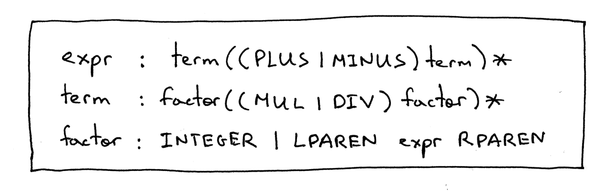
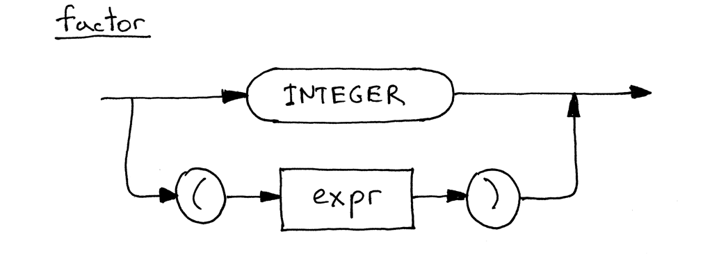
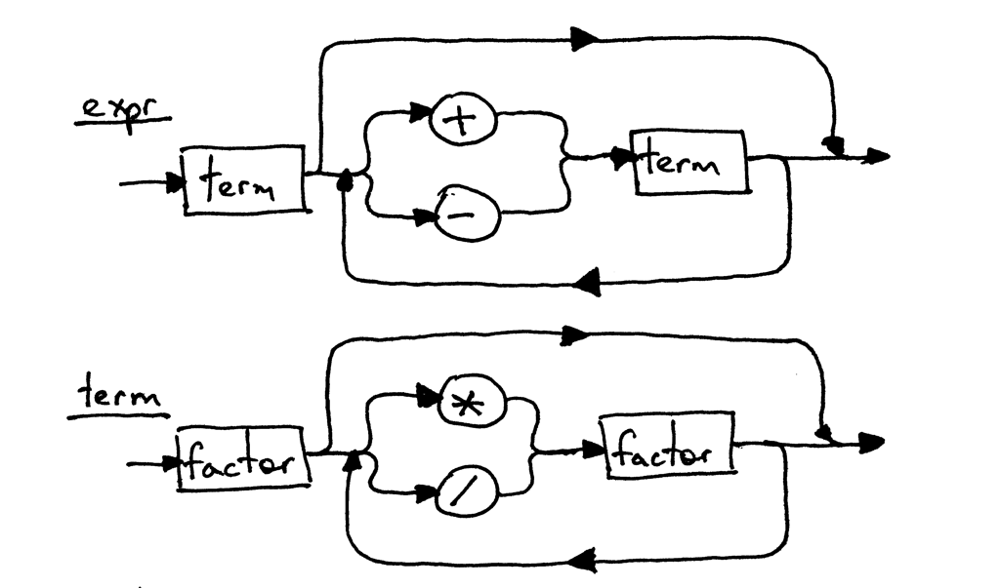
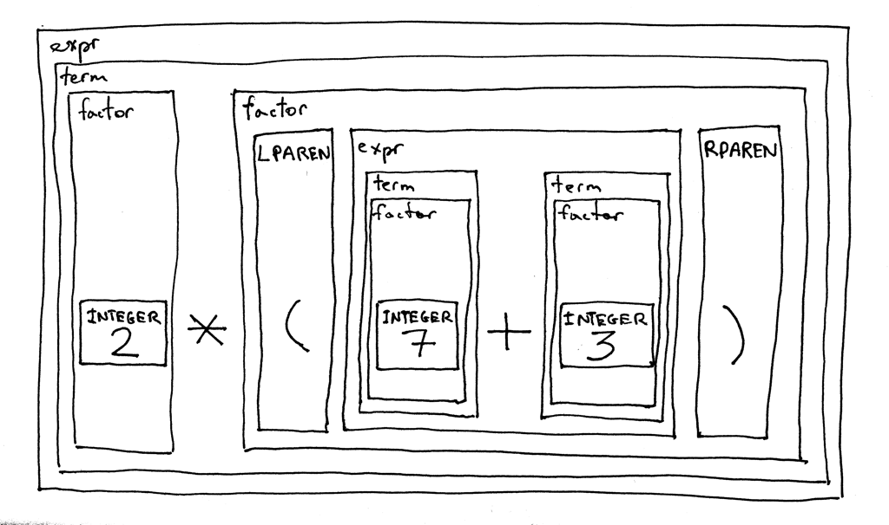

06_表达式嵌套

📅 2015-11-02  

今天是意义非凡的一天！为什么这么说呢？原因在于今天我们需要将括号表达式规则添加进解释器语法中以重新包装前面讨论的算术表达式解释器，进而使其支持无限深度的括号运算嵌套，例如：`7 + 3 * (10 / (12 / (3 + 1) - 1))`。  
下面就让我们开始吧，OK？  
首先我们将要对之前的语法分析器进行修改，以支持解析括号内的表达式。正如我们在第5章讲的一样，`factor`规则（因数）是表达式中最基本的数据单位，其类型为`整数`。然而在本文中，我们将会增加另一种
最基本的`factor`类型：括号包含的表达式`expr`。说干就干。  
下面是更新后的语法：  


上图中的`expr`和`term`规则与其在第五章中的定义是一样的，唯一改动的地方就是的`factor`部分：`LPAREN`代表左括号，`RPAREN`代表右括号，非终止符`expr`则表示在括号内表达式。

下面是更新后的语法图/铁路图，我们可以看到`factor`元素中新增加了一个可选的路径：


因为`expr`和`term`的语法规则没有改变，他们的语法图还是和第5章中保持一致。


这里在我们的语法分析器中有一个非常有意思的特性，它是递归的，如果你试着分析表达式`2×(7+3)`，你会首先通过`expr`开始，最终你会再一次递归地进入到另一个`expr`,去分析括号内的`7+3`。 

我们让根据新的语法去解析一下这个表达式`2 * (7 + 3)`，看一下它是如何工作的。  


友情提示：如果你需要一个简单地了解`递归`，请看一下`Daniel P. Friedman`和`Matthias Felleisen`的[The little schemer](https://www.amazon.com/gp/product/0262560992/ref=as_li_tl?ie=UTF8&camp=1789&creative=9325&creativeASIN=0262560992&linkCode=as2&tag=russblo0b-20&linkId=IM7CT7RLWNGJ7J54)这本书，书的内容是很棒的。  

好了，让我们开始着手将我们的新语法翻译成Python代码吧。  
下面是我们的代码和之前系列文章中的代码的差异：  
1. 词法分析器被修改了，现在可以返回两个新的`token`：左右括号；
2. 解释器的`factor()`方法也被简单的修改了一下，因为它除了要解析整数之外，还需要去解析括号内的表达式。

下面是一个完整的计算器代码，它可以验证包含整数、任意数量的加减乘除运算、以及任意嵌套深度括号的算术表达式。  
```python
# Token types
#
# EOF (end-of-file) token is used to indicate that
# there is no more input left for lexical analysis
INTEGER, PLUS, MINUS, MUL, DIV, LPAREN, RPAREN, EOF = (
    'INTEGER', 'PLUS', 'MINUS', 'MUL', 'DIV', '(', ')', 'EOF'
)


class Token(object):
    def __init__(self, type, value):
        self.type = type
        self.value = value

    def __str__(self):
        """String representation of the class instance.

        Examples:
            Token(INTEGER, 3)
            Token(PLUS, '+')
            Token(MUL, '*')
        """
        return 'Token({type}, {value})'.format(
            type=self.type,
            value=repr(self.value)
        )

    def __repr__(self):
        return self.__str__()


class Lexer(object):
    def __init__(self, text):
        # client string input, e.g. "4 + 2 * 3 - 6 / 2"
        self.text = text
        # self.pos is an index into self.text
        self.pos = 0
        self.current_char = self.text[self.pos]

    def error(self):
        raise Exception('Invalid character')

    def advance(self):
        """Advance the `pos` pointer and set the `current_char` variable."""
        self.pos += 1
        if self.pos > len(self.text) - 1:
            self.current_char = None  # Indicates end of input
        else:
            self.current_char = self.text[self.pos]

    def skip_whitespace(self):
        while self.current_char is not None and self.current_char.isspace():
            self.advance()

    def integer(self):
        """Return a (multidigit) integer consumed from the input."""
        result = ''
        while self.current_char is not None and self.current_char.isdigit():
            result += self.current_char
            self.advance()
        return int(result)

    def get_next_token(self):
        """Lexical analyzer (also known as scanner or tokenizer)

        This method is responsible for breaking a sentence
        apart into tokens. One token at a time.
        """
        while self.current_char is not None:

            if self.current_char.isspace():
                self.skip_whitespace()
                continue

            if self.current_char.isdigit():
                return Token(INTEGER, self.integer())

            if self.current_char == '+':
                self.advance()
                return Token(PLUS, '+')

            if self.current_char == '-':
                self.advance()
                return Token(MINUS, '-')

            if self.current_char == '*':
                self.advance()
                return Token(MUL, '*')

            if self.current_char == '/':
                self.advance()
                return Token(DIV, '/')

            if self.current_char == '(':
                self.advance()
                return Token(LPAREN, '(')

            if self.current_char == ')':
                self.advance()
                return Token(RPAREN, ')')

            self.error()

        return Token(EOF, None)


class Interpreter(object):
    def __init__(self, lexer):
        self.lexer = lexer
        # set current token to the first token taken from the input
        self.current_token = self.lexer.get_next_token()

    def error(self):
        raise Exception('Invalid syntax')

    def eat(self, token_type):
        # compare the current token type with the passed token
        # type and if they match then "eat" the current token
        # and assign the next token to the self.current_token,
        # otherwise raise an exception.
        if self.current_token.type == token_type:
            self.current_token = self.lexer.get_next_token()
        else:
            self.error()

    def factor(self):
        """factor : INTEGER | LPAREN expr RPAREN"""
        token = self.current_token
        if token.type == INTEGER:
            self.eat(INTEGER)
            return token.value
        elif token.type == LPAREN:
            self.eat(LPAREN)
            result = self.expr()
            self.eat(RPAREN)
            return result

    def term(self):
        """term : factor ((MUL | DIV) factor)*"""
        result = self.factor()

        while self.current_token.type in (MUL, DIV):
            token = self.current_token
            if token.type == MUL:
                self.eat(MUL)
                result = result * self.factor()
            elif token.type == DIV:
                self.eat(DIV)
                result = result / self.factor()

        return result

    def expr(self):
        """Arithmetic expression parser / interpreter.

        calc> 7 + 3 * (10 / (12 / (3 + 1) - 1))
        22

        expr   : term ((PLUS | MINUS) term)*
        term   : factor ((MUL | DIV) factor)*
        factor : INTEGER | LPAREN expr RPAREN
        """
        result = self.term()

        while self.current_token.type in (PLUS, MINUS):
            token = self.current_token
            if token.type == PLUS:
                self.eat(PLUS)
                result = result + self.term()
            elif token.type == MINUS:
                self.eat(MINUS)
                result = result - self.term()

        return result


def main():
    while True:
        try:
            # To run under Python3 replace 'raw_input' call
            # with 'input'
            text = raw_input('calc> ')
        except EOFError:
            break
        if not text:
            continue
        lexer = Lexer(text)
        interpreter = Interpreter(lexer)
        result = interpreter.expr()
        print(result)


if __name__ == '__main__':
    main()
```

保存上面的代码，到`calc6.py`文件，然后尝试运行它，看看你的新解释器能否能不能正确计算具有不同运算符和括号的表达式。下面是我的作品：  
```bash
$ python calc6.py
calc> 3
3
calc> 2 + 7 * 4
30
calc> 7 - 8 / 4
5
calc> 14 + 2 * 3 - 6 / 2
17
calc> 7 + 3 * (10 / (12 / (3 + 1) - 1))
22
calc> 7 + 3 * (10 / (12 / (3 + 1) - 1)) / (2 + 3) - 5 - 3 + (8)
10
calc> 7 + (((3 + 2)))
12
``` 

然后是今天的课外作了：

- 写一个你自己版本的解释器，就像我们本文中描述的那样。记住一句话：重复是学习之母。

今天的学习到这里就要结束了，恭喜你，你已经学会了如何去创作一个基本的`递归下降`的解析器或者是解释器，可以用来计算非常复杂的表达式。

在下篇文章中，我们会花费比较多的时间去讲`递归下降`的解释器，同样也会介绍一个非常重要，并且在编译原理中广泛运用的数据结构。该数据结构的使用也会贯穿我们整个文章系列。  
请保持关注，我们应该会很快再见。在此之前请认真实现你自己的解释器。祝你在此过程中能发现更多乐趣！

以下书籍可能会对你有所帮助：  

1. [Language Implementation Patterns: Create Your Own Domain-Specific and General Programming Languages (Pragmatic Programmers)](http://www.amazon.com/gp/product/193435645X/ref=as_li_tl?ie=UTF8&camp=1789&creative=9325&creativeASIN=193435645X&linkCode=as2&tag=russblo0b-20&linkId=MP4DCXDV6DJMEJBL)  
2. [Writing Compilers and Interpreters: A Software Engineering Approach](http://www.amazon.com/gp/product/0470177071/ref=as_li_tl?ie=UTF8&camp=1789&creative=9325&creativeASIN=0470177071&linkCode=as2&tag=russblo0b-20&linkId=UCLGQTPIYSWYKRRM)  
3. [Modern Compiler Implementation in Java](http://www.amazon.com/gp/product/052182060X/ref=as_li_tl?ie=UTF8&camp=1789&creative=9325&creativeASIN=052182060X&linkCode=as2&tag=russblo0b-20&linkId=ZSKKZMV7YWR22NMW)  
4. [Modern Compiler Design](http://www.amazon.com/gp/product/1461446988/ref=as_li_tl?ie=UTF8&camp=1789&creative=9325&creativeASIN=1461446988&linkCode=as2&tag=russblo0b-20&linkId=PAXWJP5WCPZ7RKRD)  
5. [Compilers: Principles, Techniques, and Tools (2nd Edition)](http://www.amazon.com/gp/product/0321486811/ref=as_li_tl?ie=UTF8&camp=1789&creative=9325&creativeASIN=0321486811&linkCode=as2&tag=russblo0b-20&linkId=GOEGDQG4HIHU56FQ)   

-----  
2021-01-07 17:05