07_表达式嵌套

📅 2015-12-05  

> 今天的内容比较多，希望能耐心看下来  

就像我之前保证的，今天我们将会讲一个贯穿整个文章系列的数据结构（其实就是抽象语法树）。现在让我们系好安全带，准备出发！  
迄今为止，我们的解释器和解析器（语法分析器）的代码是混在一起的，只要解析器识别了一个特定的语法结构，像加减乘除运算，那么解释器就会立刻把它给计算出来。这种解释器一般被称作`语法制导`的解释器，通常只会对输入进行一次性的处理，比较适合一些基础的应用。  
为了分析像`PASCAL`这么复杂的语言结构，我们会需要构建一个中间表示层`intermediate representation (IR)`。我们的语法分析器将会负责通过读取（词法分析器的输出`Token`作为）输入，然后去构建中间表示层，最后我们的解释器将会使用并将`IR`解释执行为最终的结果。  
事实证明树形的数据结构比较适合去表示中间表示层。


## 树与解析树

这里我们快速过一下树的定义：
1. 一个树通常有很多节点，按照上下级的关系组织起来  
2. 每个树都会有一个根节点作为它最顶层的节点  
3. 除根节点外，每个节点都会有一个父节点  
4. 下图中标星号的节点是一个父节点，然后2和7是它的子节点，节点由左向右排列  
5. 没有子节点的节点称为叶子节点  
6. 根节点外有一个或多个子节点的节点被称作`内部节点（interior node）`   
7. 子节点也可以包含一个完整的子数。在下图中左边标星号的子节点就是一个完整的子数，因为它有自己的子节点2和7  
8. 在计算机学科中，我们通常从根节点作为最上面，然后由上至下去绘制它的子节点或者是分支节点  

下面是一个`2×7+3`表达式的树状结构：
  

本系列中我们用到的`IR`就是抽象语法树（abstract-syntax tree,AST）。但是在我们深究AST之前，我们先去简单了解一下`解析树（parse trees）`。尽管在我们的解释器和编译器中不会用到解析树，但是它确实可以为我们提供一个可视化的执行过程，帮我们去更好的理解我们的解释器是如何工作的。我们也会比较它和抽象语法树，看一下为什么AST更适合用来做`IR`。  

那什么是解析树的？解析树有时候也会称为`具体语法树`，是根据我们的语法定义构造的数据结构。基本上它能够展示我们的解析器如何去识别一种语言的结构，换而言之，它能够表示语法中的开始符号派生出一个确定的字符串。  

语法分析器的调用栈就可以看作成一个解析树，它是在你的语法分析器试图识别一个特定的语言结构时，自动在内存中创建的。  

让我们看一下表达式`2×7+3`对应的解析树是什么样子的：  
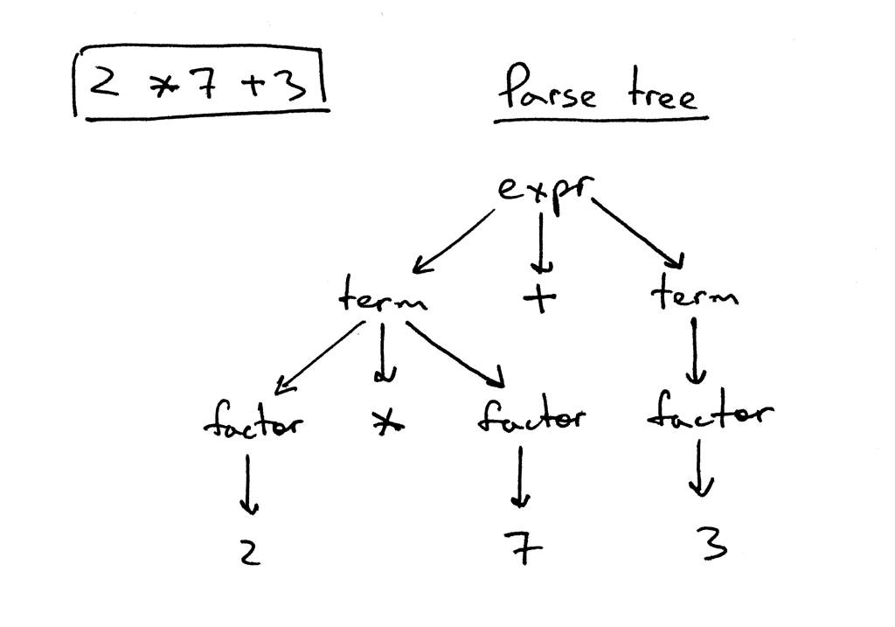 

从上图中可以看到：  
1. 解析树记录了一串规则。语法分析器在识别输入时会用到；  
2. 解析树的根节点用语法的起始符`expr`标记（请参见`04_上下文无关语法`）；  
3. 每个内部节点都表示一个非终止符，它表示着一个具体的语法规则，像`expr`、`term`·和`factor`；  
4. 每个叶子节点都表示一个`Token`。  

之前说过，我们不会在文章中构造或使用解析树，但解析树可以通过可视化调用序列来帮我们去了解语法分析器是如何解释输入的。

通过一个小工具[genptdot.py](https://github.com/rspivak/lsbasi/blob/master/part7/python/genptdot.py)，我们可以看到不同的数学表达式对应着不同的解析树。这个小工具是我专门为了帮助可视化解析树而开发的。在使用此工具之前，你首先需要安装一个工具包[Graphviz](http://graphviz.org/)，然后通过运行后面的这条命令，生成解析树的PNG图片。  
```bash
$ python genptdot.py "14 + 2 * 3 - 6 / 2" > \
  parsetree.dot && dot -Tpng -o parsetree.png parsetree.dot
```

下面是`14+2×3-6÷2`所对应的解析树： 
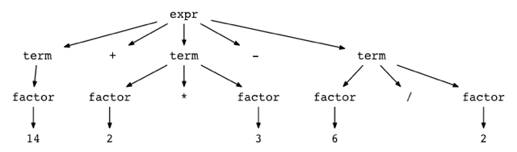  

通过多传入几个表达式，看一下每个表达式所对应的解析树有什么不同。  

## 抽象语法树  

现在我们开始讲一下抽象语法树AST，这个`IR`将会在我们后面的系列中频繁用到，对我们的解释器和未来的编译器项目来说都是一个非常核心的数据结构。  

让我们对照`2×7+3`对应的AST和解析树，来看一下二者有何不同：  
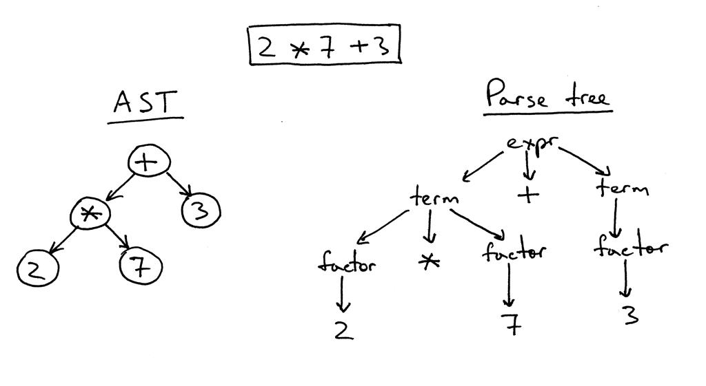  
正如上图所示，抽象语法树更能抓住输入的精髓，所以它的数据结构会更紧凑一些。  
下面是一些抽象语法树和解析树的不同：  
1. 抽象语法树使用运算符作为根节点或内部节点，然后使用操作数作为他们的子节点；  
2. 抽象语法树并不会使用语法规则作为它的内部节点；  
3. 抽象语法树并不会表示每一个语法细节，这也是为什么它被叫做`抽象`语法树的原因。没有规则的节点，也没有括号；  
4. 抽象语法树相较于解析树，结构更紧密。  

所以什么是抽象语法树？抽象语法树AST就是一个数结构，用来表示一种语言的抽象语法结构。它的根节点和内部节点都是代表着一个运算符，每个叶子节点相当于一个操作数。

前面提到过AST并不会像解析树那么庞大，下面让我们比较一下`7 + ((2 + 3))`对应的AST和解析树，你可以看到AST非常紧凑，但是却能涵盖输入所有的要点。  
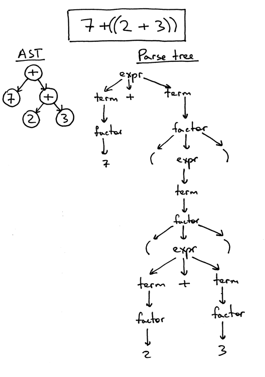  

看起来还不错，但是我们该如何表示操作符的优先级？比方x要先于y运算，那我们就只需将x放到比y更低层的节点中就可以了。这在之前的例子中也能看得出来。  

让我们看一下其他例子。下图的左侧是`2×7+3`的AST，但如果我们想要通过括号把7+3的优先级提高一些，你可以看到右侧修改后的`2×(7+3)`的AST。
  

下面是表达式`1+2+3+4+5`的AST。  
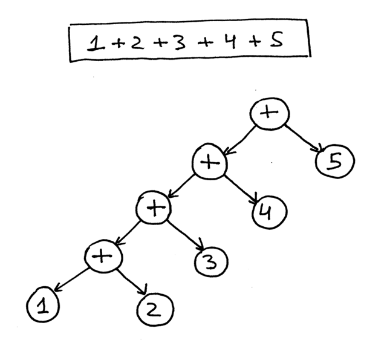  
从上图就可以看到越高优先级的运算符在树结构的位置就越靠下。  

现在我们开始用代码实现不同的AST节点，然后修改我们的语法分析器来生成一个AST。  

首先是创建一个AST的基类，其他节点类都会集成它：  
```python
class AST(object):
    pass
```

没有太多东西,回想一下AST表示的是`运算符-操作数`的模型。目前为止我们已经有4个运算符（加减乘除）和1个整数操作数。虽然我们可以为每一个运算符创建一个节点类，但是我们不会这样做，我们将会提取它们的特征创建一个`二元运算符`类`BinOp`。  
```python
class BinOp(AST):
    def __init__(self, left, op, right):
        self.left = left
        self.token = self.op = op
        self.right = right
```

`BinOp`的构造函数接收三个参数：`left`运算符左侧的节点；`right`运算符右侧的节点；`op`表示运算符本身，例如：`Token(PLUS,'+')`。  
为了在AST中表示整数，我们需要构建一个数值类型`Num`，用于保存一个整数的token和它的值：  
```python
class Num(AST):
    def __init__(self, token):
        self.token = token
        self.value = token.value
```

也许你已经注意到所有的节点都会保存一个token，这样对我们将来的操作的话会有极大的方便性。  
回忆一下我们之前的表达是`2×7+3`，我们将会手工构造它的AST：
```bash
>>> from spi import Token, MUL, PLUS, INTEGER, Num, BinOp
>>>
>>> mul_token = Token(MUL, '*')
>>> plus_token = Token(PLUS, '+')
>>> mul_node = BinOp(
...     left=Num(Token(INTEGER, 2)),
...     op=mul_token,
...     right=Num(Token(INTEGER, 7))
... )
>>> add_node = BinOp(
...     left=mul_node,
...     op=plus_token,
...     right=Num(Token(INTEGER, 3))
... )
```

以上就是如何定义AST的节点，下图是手工定义AST节点的过程：
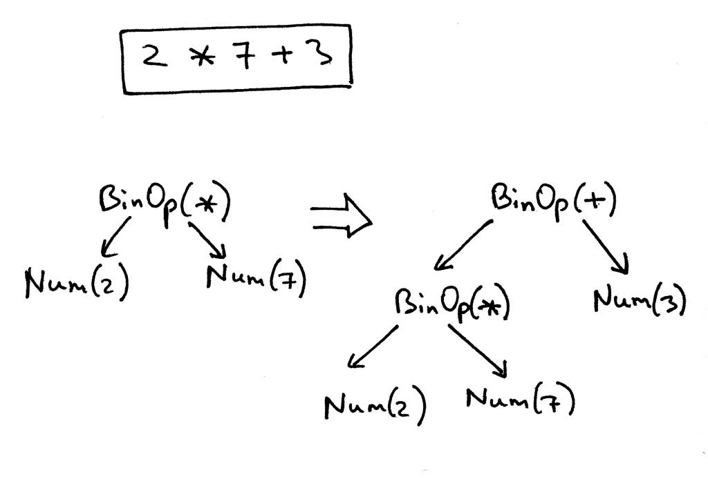  

下面是我们修改后的解释器的代码，通过识别一个算术表达式的输入，构造并返回一个AST。  
```python
class AST(object):
    pass


class BinOp(AST):
    def __init__(self, left, op, right):
        self.left = left
        self.token = self.op = op
        self.right = right


class Num(AST):
    def __init__(self, token):
        self.token = token
        self.value = token.value


class Parser(object):
    def __init__(self, lexer):
        self.lexer = lexer
        # set current token to the first token taken from the input
        self.current_token = self.lexer.get_next_token()

    def error(self):
        raise Exception('Invalid syntax')

    def eat(self, token_type):
        # compare the current token type with the passed token
        # type and if they match then "eat" the current token
        # and assign the next token to the self.current_token,
        # otherwise raise an exception.
        if self.current_token.type == token_type:
            self.current_token = self.lexer.get_next_token()
        else:
            self.error()

    def factor(self):
        """factor : INTEGER | LPAREN expr RPAREN"""
        token = self.current_token
        if token.type == INTEGER:
            self.eat(INTEGER)
            return Num(token)
        elif token.type == LPAREN:
            self.eat(LPAREN)
            node = self.expr()
            self.eat(RPAREN)
            return node

    def term(self):
        """term : factor ((MUL | DIV) factor)*"""
        node = self.factor()

        while self.current_token.type in (MUL, DIV):
            token = self.current_token
            if token.type == MUL:
                self.eat(MUL)
            elif token.type == DIV:
                self.eat(DIV)

            node = BinOp(left=node, op=token, right=self.factor())

        return node

    def expr(self):
        """
        expr   : term ((PLUS | MINUS) term)*
        term   : factor ((MUL | DIV) factor)*
        factor : INTEGER | LPAREN expr RPAREN
        """
        node = self.term()

        while self.current_token.type in (PLUS, MINUS):
            token = self.current_token
            if token.type == PLUS:
                self.eat(PLUS)
            elif token.type == MINUS:
                self.eat(MINUS)

            node = BinOp(left=node, op=token, right=self.term())

        return node

    def parse(self):
        return self.expr()
```

让我们通过一些例子来回顾一下AST的构造过程。每一个`BinOp`的节点，都会接受一个`left`节点和一个`op`节点，并把自己作为`left`节点传递给下一个`BinOp`，以此类推。
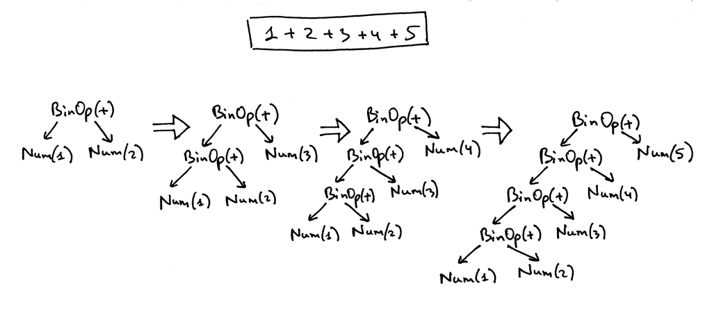  

为了帮助你更好的看观察不同表达式的AST，我还写了一个小工具，可以将一个表达式作为第一个参数输入，然后生成一个`dot`文件。这个文件会通过`dot`工具（Graphviz的一部分）处理，然后绘制出一个抽象语法树。例如绘制`7 + 3 * (10 / (12 / (3 + 1) - 1))`的AST：
```bash
$ python genastdot.py "7 + 3 * (10 / (12 / (3 + 1) - 1))" > \
  ast.dot && dot -Tpng -o ast.png ast.dot
```
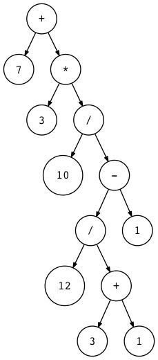  

我们可以多写一些算术表达式，然后手工去构建AST并和自动生成的结果对比，这样的话就可以帮助我们更好的去理解AST的工作原理。下面就是一个表达式`2 * 7 + 3`的例子：
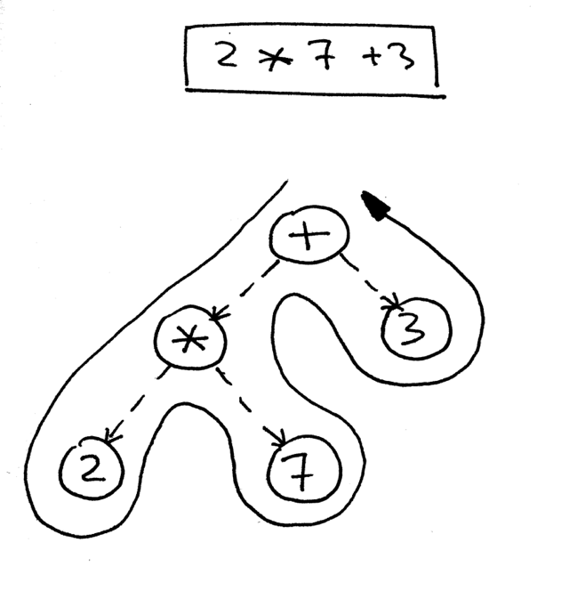  

## 遍历AST  

我们如何去定位AST中的表达式，以便能够计算出正确的结果。我们可以选择通过`后序遍历（postorder traversal）`，这是一种特殊的`深度优先（depth-first）`遍历策略：从根结点开始，依次递归地遍历每一个节点，远离根节点的节点将会被优先访问到。在我们上面提到过，越是远离根节点的话，就证明计算的优先级越高，这也符合我们的要求。

下图是后序遍历的伪代码，占位符`<<postorder actions>>`用来来表示加减乘除这样的计算行为，或者是返回整数的行为。对，要么就是返回整数本身，要么就是返回加减运算之后的结果。  
 

有两点原因，我们会让我们去选择后序遍历：首先我们需要去确定在计算内部节点时的优先级，越是远离根节点的优先级就越高；然后我们需要在在使用一个节点之前，要先去算出该节点的值，然后再把它用到新的运算中去。下图中我们采用后序遍历，首先计算出`2+7=14`，然后再去算`14+3=17`。  
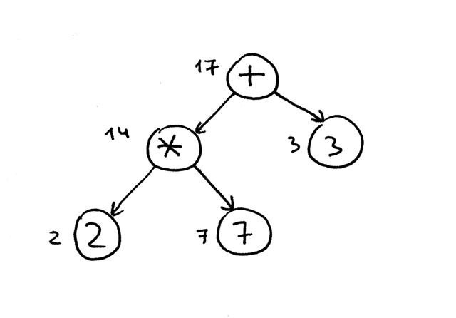 

完整起见，这里简单介绍三种不同的深度优先遍历算法：前序遍历、中序遍历和后序遍历。顾名思义，就是看一下你在代码中什么位置插入action行为。  
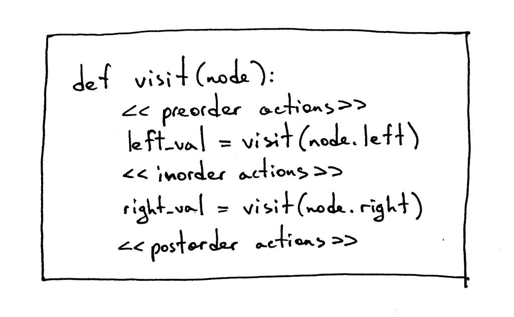 

有时我们需要同时用到三种遍历策略。你也会在源码中看到相关的例子。

OK，现在我们用python代码去遍历语法分析器生成的AST。下面是实现了访问者模式的源代码：
```python
class NodeVisitor(object):
    def visit(self, node):
        # 这里用方法名取代了很多if 条件语句
        method_name = 'visit_' + type(node).__name__
        visitor = getattr(self, method_name, self.generic_visit)
        return visitor(node)

    def generic_visit(self, node):
        raise Exception('No visit_{} method'.format(type(node).__name__))
```

下面是我们解释器的源代码，它继承自`NodeVisitor`类并实现了不同的`visit_NodeType`方法，其中`NodeType`被替换为节点的类名，如 `BinOp`、`Num` 等。
```python
class Interpreter(NodeVisitor):
    def __init__(self, parser):
        self.parser = parser

    def visit_BinOp(self, node):
        if node.op.type == PLUS:
            return self.visit(node.left) + self.visit(node.right)
        elif node.op.type == MINUS:
            return self.visit(node.left) - self.visit(node.right)
        elif node.op.type == MUL:
            return self.visit(node.left) * self.visit(node.right)
        elif node.op.type == DIV:
            return self.visit(node.left) / self.visit(node.right)

    def visit_Num(self, node):
        return node.value
```

这里代码有两个有趣的地方值得一提：首先遍历方法与AST数据是解耦的，可以看到AST节点本身没有提供任何代码来访问自身的数据，该逻辑被封装在`NodeVisitor`类中；其次是采用方法名取代很多if语句，这也是一种常用的设计思维，例如用哈希表来存储方法等。
```python
def visit(node):
    node_type = type(node).__name__
    if node_type == 'BinOp':
        return self.visit_BinOp(node)
    elif node_type == 'Num':
        return self.visit_Num(node)
    elif ...
    # ...

#### 或者是 ####

def visit(node):
    if isinstance(node, BinOp):
        return self.visit_BinOp(node)
    elif isinstance(node, Num):
        return self.visit_Num(node)
    elif ...
```

`NodeVisitor`的`visit`方法非常通用，且能够根据传入的节点类型调用对应的方法。正如我们之前所说，为了充分利用它，我们的解释器继承了`NodeVisitor`类并实现了关键的方法。所以如果传递给`visit`的的节点类型是`BinOp`，那么它就会调用`visit_BinOp()`；如果节点类型是整数，它就会调用`visit_Num()`。  

在这里可以多花一些时间去详细了解其实现原理。事实上标准的Python ast库也是用同样的机制去实现的。我们在以后将会扩展更多的节点类型。（译注：在脚本语言中可以这样用，但是在编译型语言中需要用`map`或`hashmap`去存储函数名）`generic_visit`方法是一个异常处理方法，如果遇到一个不能正确匹配的节点类型的话，就会调用该方法产生一个异常。

好吧，现在让我们手工去构建`2 * 7 + 3`的AST，并把它传进解释，看能不能正常运行。   
```bash
>>> from spi import Token, MUL, PLUS, INTEGER, Num, BinOp
>>>
>>> mul_token = Token(MUL, '*')
>>> plus_token = Token(PLUS, '+')
>>> mul_node = BinOp(
...     left=Num(Token(INTEGER, 2)),
...     op=mul_token,
...     right=Num(Token(INTEGER, 7))
... )
>>> add_node = BinOp(
...     left=mul_node,
...     op=plus_token,
...     right=Num(Token(INTEGER, 3))
... )
>>> from spi import Interpreter
>>> inter = Interpreter(None)
>>> inter.visit(add_node)
17
```

如你所见，我把根结点传到`visit`方法之后，便触发了遍历过程，通过调用一系列的函数，最后获得了一个正确的计算结果。以下是完整的源代码供你参考：  
```python
""" SPI - Simple Pascal Interpreter """

###############################################################################
#                                                                             #
#  LEXER                                                                      #
#                                                                             #
###############################################################################

# Token types
#
# EOF (end-of-file) token is used to indicate that
# there is no more input left for lexical analysis
INTEGER, PLUS, MINUS, MUL, DIV, LPAREN, RPAREN, EOF = (
    'INTEGER', 'PLUS', 'MINUS', 'MUL', 'DIV', '(', ')', 'EOF'
)


class Token(object):
    def __init__(self, type, value):
        self.type = type
        self.value = value

    def __str__(self):
        """String representation of the class instance.

        Examples:
            Token(INTEGER, 3)
            Token(PLUS, '+')
            Token(MUL, '*')
        """
        return 'Token({type}, {value})'.format(
            type=self.type,
            value=repr(self.value)
        )

    def __repr__(self):
        return self.__str__()


class Lexer(object):
    def __init__(self, text):
        # client string input, e.g. "4 + 2 * 3 - 6 / 2"
        self.text = text
        # self.pos is an index into self.text
        self.pos = 0
        self.current_char = self.text[self.pos]

    def error(self):
        raise Exception('Invalid character')

    def advance(self):
        """Advance the `pos` pointer and set the `current_char` variable."""
        self.pos += 1
        if self.pos > len(self.text) - 1:
            self.current_char = None  # Indicates end of input
        else:
            self.current_char = self.text[self.pos]

    def skip_whitespace(self):
        while self.current_char is not None and self.current_char.isspace():
            self.advance()

    def integer(self):
        """Return a (multidigit) integer consumed from the input."""
        result = ''
        while self.current_char is not None and self.current_char.isdigit():
            result += self.current_char
            self.advance()
        return int(result)

    def get_next_token(self):
        """Lexical analyzer (also known as scanner or tokenizer)

        This method is responsible for breaking a sentence
        apart into tokens. One token at a time.
        """
        while self.current_char is not None:

            if self.current_char.isspace():
                self.skip_whitespace()
                continue

            if self.current_char.isdigit():
                return Token(INTEGER, self.integer())

            if self.current_char == '+':
                self.advance()
                return Token(PLUS, '+')

            if self.current_char == '-':
                self.advance()
                return Token(MINUS, '-')

            if self.current_char == '*':
                self.advance()
                return Token(MUL, '*')

            if self.current_char == '/':
                self.advance()
                return Token(DIV, '/')

            if self.current_char == '(':
                self.advance()
                return Token(LPAREN, '(')

            if self.current_char == ')':
                self.advance()
                return Token(RPAREN, ')')

            self.error()

        return Token(EOF, None)


###############################################################################
#                                                                             #
#  PARSER                                                                     #
#                                                                             #
###############################################################################

class AST(object):
    pass


class BinOp(AST):
    def __init__(self, left, op, right):
        self.left = left
        self.token = self.op = op
        self.right = right


class Num(AST):
    def __init__(self, token):
        self.token = token
        self.value = token.value


class Parser(object):
    def __init__(self, lexer):
        self.lexer = lexer
        # set current token to the first token taken from the input
        self.current_token = self.lexer.get_next_token()

    def error(self):
        raise Exception('Invalid syntax')

    def eat(self, token_type):
        # compare the current token type with the passed token
        # type and if they match then "eat" the current token
        # and assign the next token to the self.current_token,
        # otherwise raise an exception.
        if self.current_token.type == token_type:
            self.current_token = self.lexer.get_next_token()
        else:
            self.error()

    def factor(self):
        """factor : INTEGER | LPAREN expr RPAREN"""
        token = self.current_token
        if token.type == INTEGER:
            self.eat(INTEGER)
            return Num(token)
        elif token.type == LPAREN:
            self.eat(LPAREN)
            node = self.expr()
            self.eat(RPAREN)
            return node

    def term(self):
        """term : factor ((MUL | DIV) factor)*"""
        node = self.factor()

        while self.current_token.type in (MUL, DIV):
            token = self.current_token
            if token.type == MUL:
                self.eat(MUL)
            elif token.type == DIV:
                self.eat(DIV)

            node = BinOp(left=node, op=token, right=self.factor())

        return node

    def expr(self):
        """
        expr   : term ((PLUS | MINUS) term)*
        term   : factor ((MUL | DIV) factor)*
        factor : INTEGER | LPAREN expr RPAREN
        """
        node = self.term()

        while self.current_token.type in (PLUS, MINUS):
            token = self.current_token
            if token.type == PLUS:
                self.eat(PLUS)
            elif token.type == MINUS:
                self.eat(MINUS)

            node = BinOp(left=node, op=token, right=self.term())

        return node

    def parse(self):
        return self.expr()


###############################################################################
#                                                                             #
#  INTERPRETER                                                                #
#                                                                             #
###############################################################################

class NodeVisitor(object):
    def visit(self, node):
        method_name = 'visit_' + type(node).__name__
        visitor = getattr(self, method_name, self.generic_visit)
        return visitor(node)

    def generic_visit(self, node):
        raise Exception('No visit_{} method'.format(type(node).__name__))


class Interpreter(NodeVisitor):
    def __init__(self, parser):
        self.parser = parser

    def visit_BinOp(self, node):
        if node.op.type == PLUS:
            return self.visit(node.left) + self.visit(node.right)
        elif node.op.type == MINUS:
            return self.visit(node.left) - self.visit(node.right)
        elif node.op.type == MUL:
            return self.visit(node.left) * self.visit(node.right)
        elif node.op.type == DIV:
            return self.visit(node.left) / self.visit(node.right)

    def visit_Num(self, node):
        return node.value

    def interpret(self):
        tree = self.parser.parse()
        return self.visit(tree)


def main():
    while True:
        try:
            try:
                text = raw_input('spi> ')
            except NameError:  # Python3
                text = input('spi> ')
        except EOFError:
            break
        if not text:
            continue

        lexer = Lexer(text)
        parser = Parser(lexer)
        interpreter = Interpreter(parser)
        result = interpreter.interpret()
        print(result)


if __name__ == '__main__':
    main()
```

将下面的文件保存为`spi.py`或者是直接从[github](https://github.com/rspivak/lsbasi/blob/master/part7/python/spi.py)上面下载，然后尝试运行一下：  
```bash
$ python spi.py
spi> 7 + 3 * (10 / (12 / (3 + 1) - 1))
22
spi> 7 + 3 * (10 / (12 / (3 + 1) - 1)) / (2 + 3) - 5 - 3 + (8)
10
spi> 7 + (((3 + 2)))
12
```

今天我们学习了解析树、AST、以及如何构造并遍历AST。我们也已经将我们的语法分析器和解释器解耦开来，现在它们的关系如下图所示：  
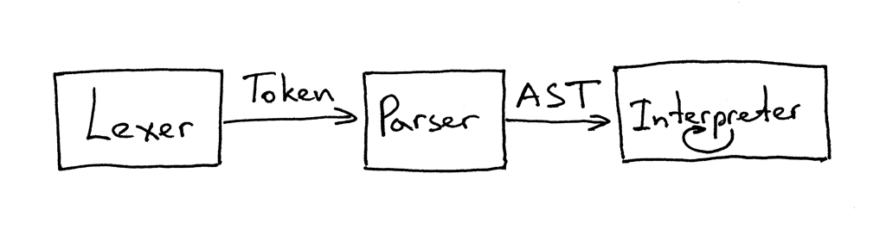 
可以说是语法分析器`parser`通过获取并处理词法分析器`lexer`产生的`token`，返回一个AST给解释器`interpreter`，然后解释器通过后序遍历解释执行。

以上就是今天的全部内容，但是在结束之前我还想简单说一下递归下降的解释器。从名字可以看出，递归下降的解释器是一个自上向下的解释器，通过一系列的递归调用过程来处理输入，自上向下就反映了这个解释器会首先构造一个根节点，然后再去构造更低级的子节点。

下面是练习时间：  
   
- 编写一个解释器，将算术表达式作为输入并以`反向波兰表示法（RPN）`打印。如：输入`(5 + 3) * 12 / 3`，输出`5 3 + 12 * 3 /`  
- 编写一个解释其，将算术表达式作为输入并以`LISP`语法打印。如：输入`(2 + 3 * 5)`，输出`(+ 2 (* 3 5))`  

下一章中，我们将会为我们的`PASCAL`解释器添加赋值语句和一元运算符，敬请期待。  

PS：本章的代码我还提供了解释器的`Rust`实现，你可以在GitHub上找到。这也是我学习`Rust`编程语言的一种方式，但请注意，代码风格可能还不是`惯用的`。 总之欢迎有关如何使代码更好的评论和建议。


以下书籍可能会对你有所帮助：  

1. [Language Implementation Patterns: Create Your Own Domain-Specific and General Programming Languages (Pragmatic Programmers)](http://www.amazon.com/gp/product/193435645X/ref=as_li_tl?ie=UTF8&camp=1789&creative=9325&creativeASIN=193435645X&linkCode=as2&tag=russblo0b-20&linkId=MP4DCXDV6DJMEJBL)  
2. [Writing Compilers and Interpreters: A Software Engineering Approach](http://www.amazon.com/gp/product/0470177071/ref=as_li_tl?ie=UTF8&camp=1789&creative=9325&creativeASIN=0470177071&linkCode=as2&tag=russblo0b-20&linkId=UCLGQTPIYSWYKRRM)  
3. [Modern Compiler Implementation in Java](http://www.amazon.com/gp/product/052182060X/ref=as_li_tl?ie=UTF8&camp=1789&creative=9325&creativeASIN=052182060X&linkCode=as2&tag=russblo0b-20&linkId=ZSKKZMV7YWR22NMW)  
4. [Modern Compiler Design](http://www.amazon.com/gp/product/1461446988/ref=as_li_tl?ie=UTF8&camp=1789&creative=9325&creativeASIN=1461446988&linkCode=as2&tag=russblo0b-20&linkId=PAXWJP5WCPZ7RKRD)  
5. [Compilers: Principles, Techniques, and Tools (2nd Edition)](http://www.amazon.com/gp/product/0321486811/ref=as_li_tl?ie=UTF8&camp=1789&creative=9325&creativeASIN=0321486811&linkCode=as2&tag=russblo0b-20&linkId=GOEGDQG4HIHU56FQ)   

-----  
2021-01-09 17:20