08_单目运算符

📅 2016-01-08  

> 今天的内容比较简单，但需要上一章的内容做铺垫  

今天我们将会讨论单目运算符：正号和负号。我们今天内容大部分基于第7章，所以如果你想重新复习一下，就只需要翻到第7章，然后再重新过一遍就可以了。永远要记住重复是学习字母。  

前面提到过，然后今天我们将要学习的内容如下：  
1. 扩展我们的语法，使其支持单目运算，也就是正号和负号；  
2. 增加一个新的单目运算符AST节点；  
3. 扩展我们的语法分析器，支持生成带有单目运算符的AST；
4. 扩展我们的解释器，然后新增一个`visit_UnaryOp`方法来解释单目运算符。

步入正题，目前为止，我们只与双目运算符打交道。顾名思义，双目运算符就是具有两个操作数的运算符。 那什么是单目运算符？单目运算符是只有一个操作数的运算符。  
下面就是单目正和单目负的语法规则：  
- `-`将对其操作数取负值；  
- `+`不改变操作数符号；  
- 单目运算符的优先级要高于加减乘除等双目运算，即使符号看起来是一样的。  

在表达式`+-3`中，第一个`+`就表示单目运算符正，`-`表示负。`+-3`等同于`+(-(3))`，也等于`-3`。但是这里我们正倾向于将其理解为：单目负和正整数三，而不是负三作为一个整体。  
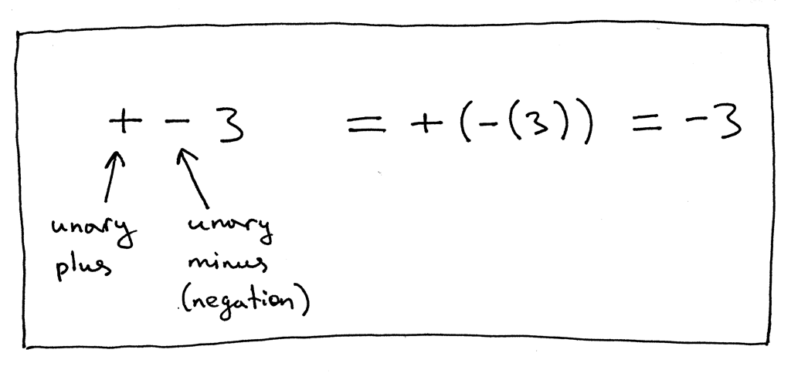

让我们再看一个表达式的例子，`5--2`：  
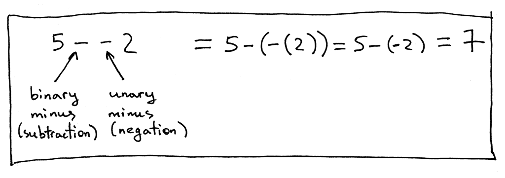  

在表达式中第一个`-`表示双目运算减，然后第二个`-`表示单目运算符负。来看更多的例子：  
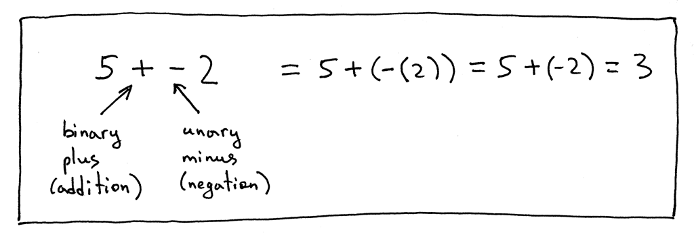    
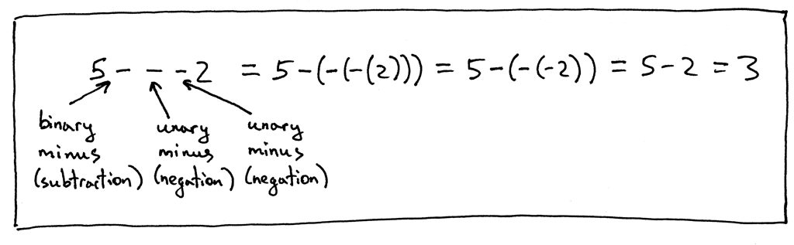  

现在我们将会更新一下我们的语法，使其支持正负运算符。我们将会修改`factor`规则，因为单目运算符的优先级要比双目运算符更高一些，所以我们需要在`factor`规则上动手。  

这是我们之前的`factor`规则：    
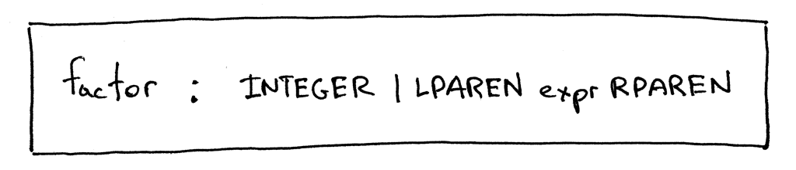  

下面是我们修改后的`factor`规则：  
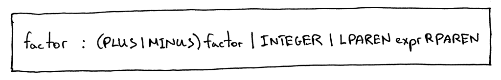 

如你所见我扩展了`factor`规则，使其可以引用自身，这样的话它就允许我们去派生更复杂的表达式：像`- - - + - 3`这样，虽然有很多单目运算符，但仍是一个合法的表达式。  
下面就是一个完整的语法图：  
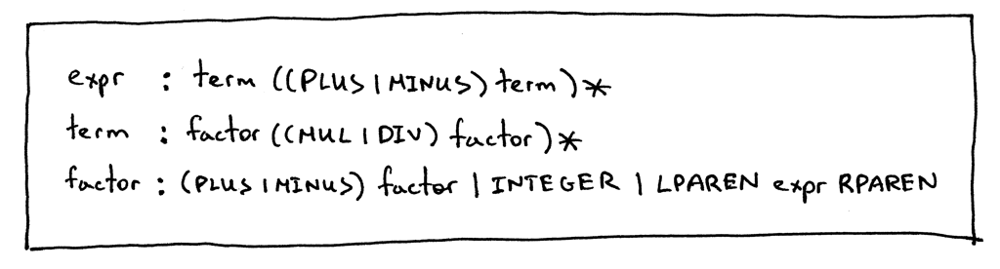 

下一步增加一个AST节点类，来表示单目运算符：  
```python
class UnaryOp(AST):
    def __init__(self, op, expr):
        self.token = self.op = op
        self.expr = expr
```

构造函数的话包含两个参数：第一个是`op`代表单目运算符的`token`；第二个是`expr`表达式，代表着一个AST节点。  
我们更新了语法中的`factor`规则，相应地我们需要修改语法分析中的`factor`的方法：在`factor`中添加处理`±factor`的子规则。  
```python
def factor(self):
    """factor : (PLUS | MINUS) factor | INTEGER | LPAREN expr RPAREN"""
    token = self.current_token
    if token.type == PLUS:
        self.eat(PLUS)
        node = UnaryOp(token, self.factor())
        return node
    elif token.type == MINUS:
        self.eat(MINUS)
        node = UnaryOp(token, self.factor())
        return node
    elif token.type == INTEGER:
        self.eat(INTEGER)
        return Num(token)
    elif token.type == LPAREN:
        self.eat(LPAREN)
        node = self.expr()
        self.eat(RPAREN)
        return node
```

最后我们需要扩展我们的解释器，添加`visit_UnaryOp`方法，以解释单目运算：  
```python
def visit_UnaryOp(self, node):
    op = node.op.type
    if op == PLUS:
        return +self.visit(node.expr)
    elif op == MINUS:
        return -self.visit(node.expr)
```

我们先手工构造一个`5---2`的AST，并传入我们的解释器，来验证一下我们的新方法是不是可以正常运行：  
```bash
>>> from spi import BinOp, UnaryOp, Num, MINUS, INTEGER, Token
>>> five_tok = Token(INTEGER, 5)
>>> two_tok = Token(INTEGER, 2)
>>> minus_tok = Token(MINUS, '-')
>>> expr_node = BinOp(
...     Num(five_tok),
...     minus_tok,
...     UnaryOp(minus_token, UnaryOp(minus_token, Num(two_tok)))
... )
>>> from spi import Interpreter
>>> inter = Interpreter(None)
>>> inter.visit(expr_node)
3
```  
结果应如下图所示：  
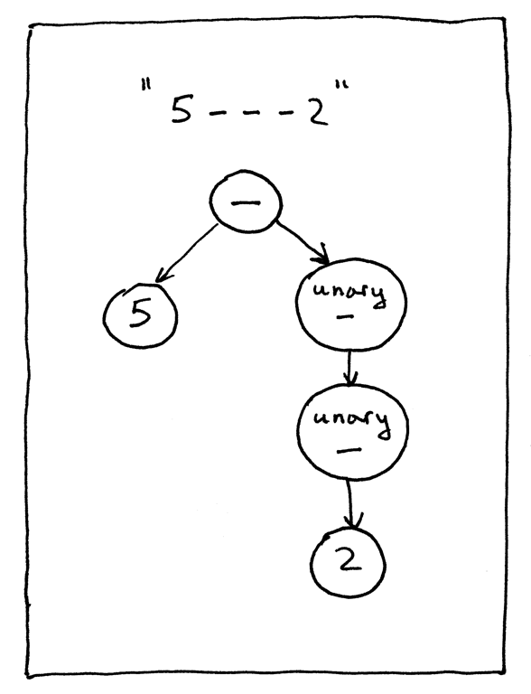 

从[Github](https://github.com/rspivak/lsbasi/blob/master/part8/python/spi.py)下载完整代码，然后尝试运行,看一下我们更新后的解释器能不能正确的计算包含单目运算的表达式。
下面是一个简单的例子：  
```bash
$ python spi.py
spi> - 3
-3
spi> + 3
3
spi> 5 - - - + - 3
8
spi> 5 - - - + - (3 + 4) - +2
10
```

我还更新了生成中AST的[工具](https://github.com/rspivak/lsbasi/blob/master/part8/python/genastdot.py)，现在可以支持单目运算符，下面就是一些简单的例子： 
```bash
$ python genastdot.py "- 3" > ast.dot && dot -Tpng -o ast.png ast.dot
``` 
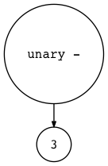   


```bash
$ python genastdot.py "+ 3" > ast.dot && dot -Tpng -o ast.png ast.dot
``` 
 


```bash
$ python genastdot.py "5---+-3" > ast.dot && dot -Tpng -o ast.png ast.dot
``` 
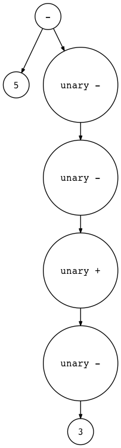 


```bash
$ python genastdot.py "5 - - - + - (3 + 4) - +2" > ast.dot && dot -Tpng -o ast.png ast.dot
``` 
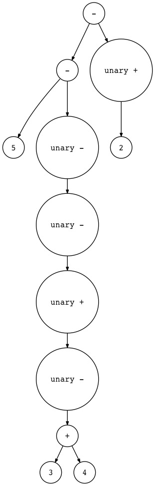 

下面就是新的课外作业：  
 

- 安装一个`Free Pascal`的编译器，然后编译运行[testunary.pas](https://github.com/rspivak/lsbasi/blob/master/part8/python/testunary.pas)，去验证一下我们的结果是不是和我们代码产生的代码一样。  

以上就是今天的所有内容，下节的话我们将会介绍赋值表达式，敬请关注。


以下书籍可能会对你有所帮助：  

1. [Language Implementation Patterns: Create Your Own Domain-Specific and General Programming Languages (Pragmatic Programmers)](http://www.amazon.com/gp/product/193435645X/ref=as_li_tl?ie=UTF8&camp=1789&creative=9325&creativeASIN=193435645X&linkCode=as2&tag=russblo0b-20&linkId=MP4DCXDV6DJMEJBL)  
2. [Writing Compilers and Interpreters: A Software Engineering Approach](http://www.amazon.com/gp/product/0470177071/ref=as_li_tl?ie=UTF8&camp=1789&creative=9325&creativeASIN=0470177071&linkCode=as2&tag=russblo0b-20&linkId=UCLGQTPIYSWYKRRM)  
3. [Modern Compiler Implementation in Java](http://www.amazon.com/gp/product/052182060X/ref=as_li_tl?ie=UTF8&camp=1789&creative=9325&creativeASIN=052182060X&linkCode=as2&tag=russblo0b-20&linkId=ZSKKZMV7YWR22NMW)  
4. [Modern Compiler Design](http://www.amazon.com/gp/product/1461446988/ref=as_li_tl?ie=UTF8&camp=1789&creative=9325&creativeASIN=1461446988&linkCode=as2&tag=russblo0b-20&linkId=PAXWJP5WCPZ7RKRD)  
5. [Compilers: Principles, Techniques, and Tools (2nd Edition)](http://www.amazon.com/gp/product/0321486811/ref=as_li_tl?ie=UTF8&camp=1789&creative=9325&creativeASIN=0321486811&linkCode=as2&tag=russblo0b-20&linkId=GOEGDQG4HIHU56FQ)   

-----  
2021-01-10 11:21