09_Pascal语言  

📅 2016-05-01  

> 本节内容较前面有较大跨越，建议静下心来多看两遍。  


我记得在我大学学习系统编程的时候，总是觉得只有汇编和C 才是真正的编程语言（因为看起来可以直接操作硬件吧）。该如何形容Pascal 呢？大概就是不想了解底层的程序员用来开发上层应用程序的高级语言吧。  

然而我从未想过会有今天，今天的我要靠（我深爱的）Python 来养活自己。并且出于第一章的原因，我要用它来写一个Pascal 的编译器和解释器。  

这些日子，我一直认为自己是一个狂热的语言爱好者，我喜欢每一种语言和它自己的特性。话虽如此，但我还是更偏爱某些语言而胜过其他。对的，我是有偏见的，并且我也承认。:)  

以前的我大概是这个样子：  
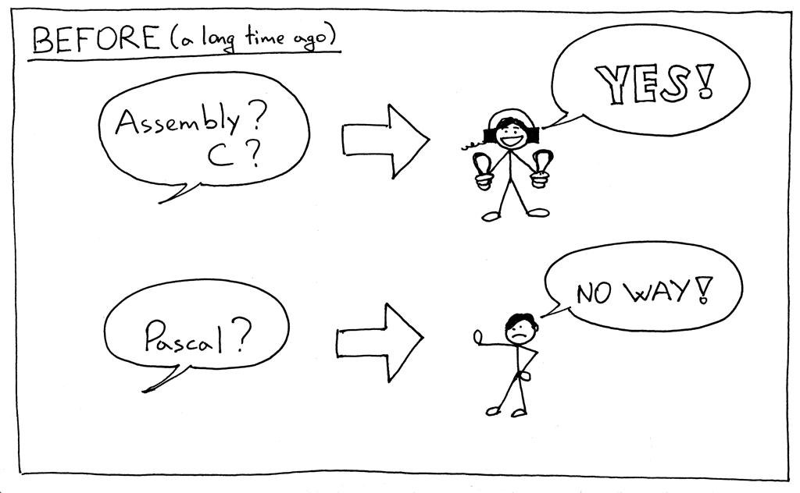  

而现在的我则更加“海纳百川”：  
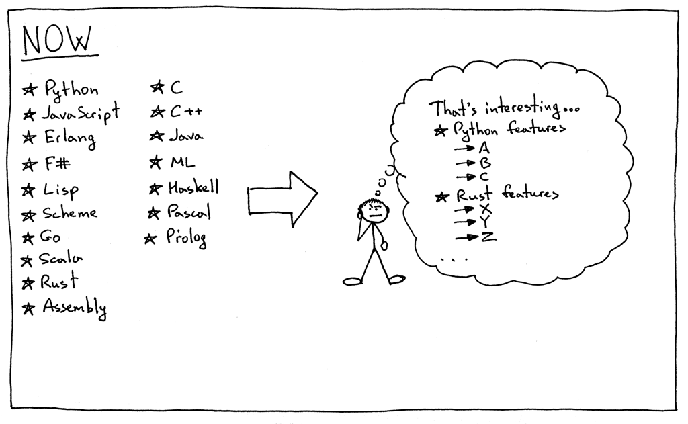  


好了，步入正题。今天我们主要学习以下知识点：  
1. 如何解析和翻译Pascal 语言的定义；  
2. 如何解析和翻译复合语句（compound statement）；  
3. 如何解析和翻译普通的Pascal 语句（statement）；  
4. 了解一点符号表（symbol table），知道如何存储变量；  

## Pascal 语法
我们将通过下面的示例代码来介绍将要用到的新的概念：  
```pascal
BEGIN
    BEGIN
        number := 2;
        a := number;
        b := 10 * a + 10 * number / 4;
        c := a - - b
    END;
    x := 11;
END.
```

你可能会觉得这个跨度也太大了吧，我们之前还在做计算器，现在就在做计算机了？但是我希望这个跳跃会让你更兴奋。因为我们在做一门正儿八经的Pascal 语言，认真的！:)  

我们先看一下新的语言结构与相应的语法规则：  
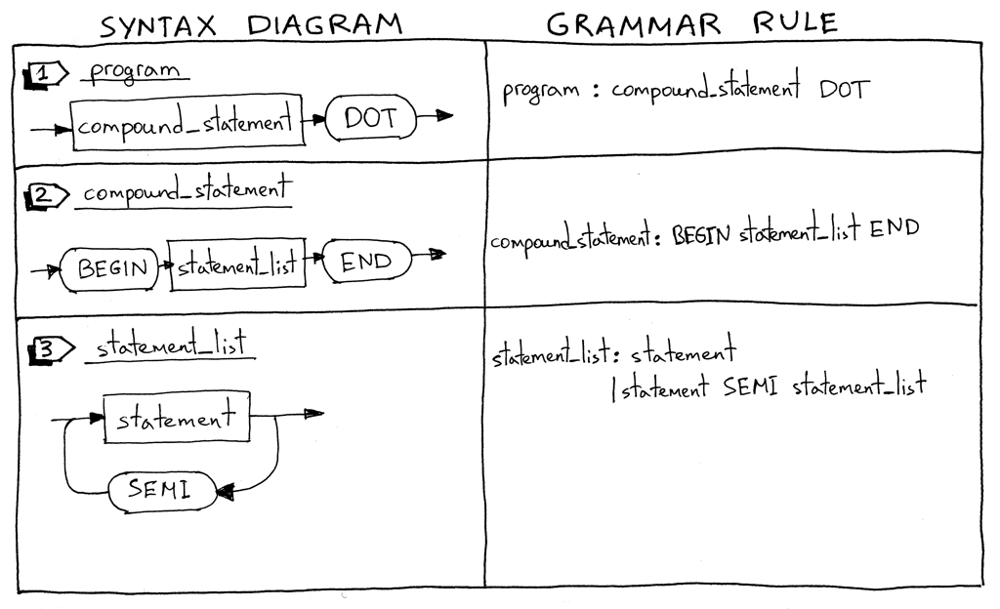  
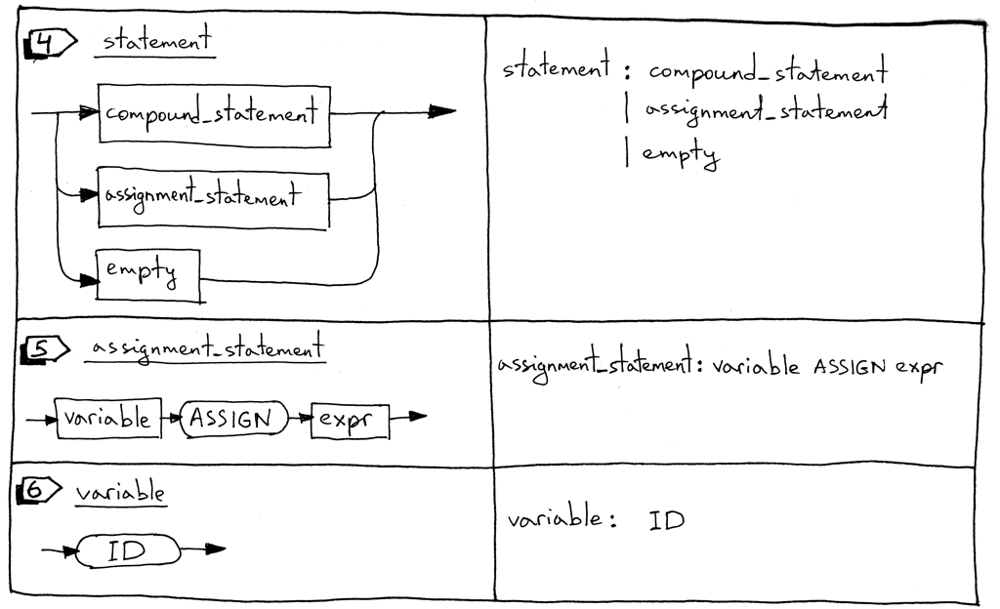  
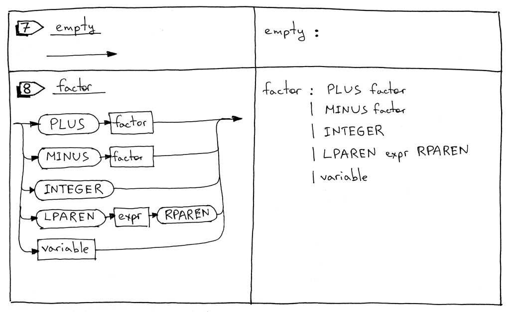  

1. 首先，我们看一下Pascal 语言的定义：一个Pascal 程序代码，是由一个复合语句后面再跟一个`.` 组成的：  
    ```pascal
    BEGIN END.
    ```  
    当然，这里的语法定义并不完整，在后面的系列中我们再继续扩充。  

2. 其次是复合语句。复合语句是一个由`BEGIN END` 包含的代码块，其内部应包含0 条或者多条Pascal 语句（复合语句也是一种Pascal 语句）。再复合语句中，除最后一条语句外，其他语句都应以`;` 结尾。如下例：  
    ```pascal
    BEGIN END
    BEGIN a := 5; x := 11 END
    BEGIN a := 5; x := 11; END
    BEGIN 
        BEGIN 
            a := 5 
        END; 
        x := 11 
    END
    ```

3. 再次是语句列表（statement list），就是复合语句内部的0 条或多条语句。见上例。  
4. Pascal 语句。可以是一个复合语句，也可以是一个赋值语句（assignment statement）或者空语句（empty statement）。  
5. 赋值语句。一个变量，跟随着`:=`，再跟随着一个`expr` 表达式。
    ```pascal
    a := 11
    b := a + 9 - 5 * 2
    ``` 

6. 变量（variable）就是一个标识符。我们使用`ID` token 来表示变量，变量token 的值就是变量名，例如`a`、`number`。比如下面代码中的`a`、`b` 就是变量：  
    ```pascal
    BEGIN a := 11; b := a + 9 - 5 * 2 END
    ```

7. 空语句。空语句不包含任何内容。专用于语句列表的末尾或者空的复合语句`BEGIN END`    
8. 因式（factor）规则需要更新以处理变量。  

下面来看一下完整的语法：  

    ```
    program : compound_statement DOT

    compound_statement : BEGIN statement_list END

    statement_list : statement
                   | statement SEMI statement_list

    statement : compound_statement
              | assignment_statement
              | empty

    assignment_statement : variable ASSIGN expr

    empty :

    expr: term ((PLUS | MINUS) term)*

    term: factor ((MUL | DIV) factor)*

    factor : PLUS factor
           | MINUS factor
           | INTEGER
           | LPAREN expr RPAREN
           | variable

    variable: ID
    ```  

你可能发现在复合语句中我们并没有使用`*` 来表示0 条或多条语句，取而代之的是语句列表(statement list)。这种操作在后面我们学习解析器生成器，例如[PLY](http://www.dabeaz.com/ply/) 时派上用场（come in handy）。并且我们也将`(PLUS | MINUS) factor` 单目运算符拆成了两条单独的规则。  

## 词法分析器  
为了支持更新后的语法，我们需要对词法分析器、语法分析器和解释器做一系列的更改。我们逐个认识。下面是词法分析器需要变更的地方：  
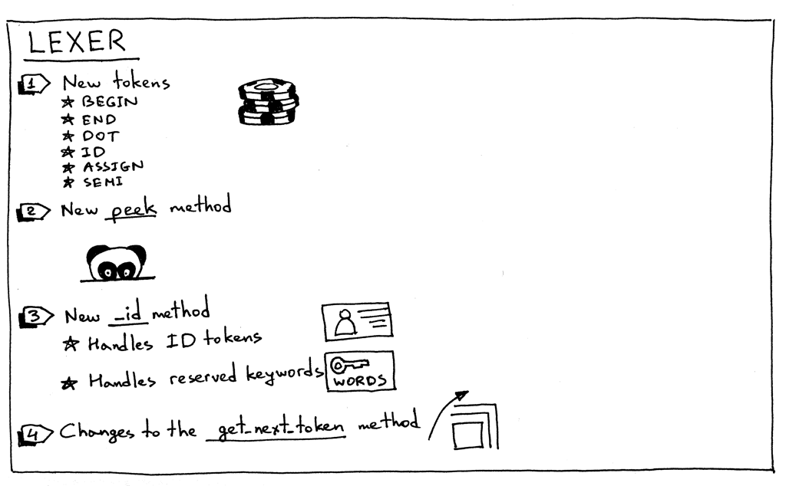  

1. 为了支持Pascal 的定义、复合语句、赋值语句和变量，我们的词法分析器需要返回新的token：  
   - `BEGIN` 标志着复合语句的开始 
   - `END` 标志着复合语句的结束  
   - `DOT` 用`.` 表示Pascal 程序的结束  
   - `ASSIGN` 用`:=` 表示将右边的表达式结果赋给左边的变量。多数语言中使用`=` 用于赋值语句  
   - `SEMI` 用`;` 表示一条语句的结束  
   - `ID` 标识符。以字母开始，包含任意长度的字母和数字  

2. 有时候，不同的token 会有相同的开头部分，例如`==` 和`=>`，为了区分它们，我们需要一个方法可以在不修改`pos` 指针的情况下，获取输入缓冲区（Input Buffer）中的字符。为此，我们将使用`peek()` 方法来对赋值语句进行分词。此方法非必须，但是可以让我们的`get_next_token()` 更加清晰明了。  
    ```python
    def peek(self):
        peek_pos = self.pos + 1
        if peek_pos > len(self.text) - 1:
            return None
        else:
            return self.text[peek_pos]
    ```

3. 因为在Pascal 中变量（Variable）和保留字（Reserved Keyword）都属于标识符，所以我们将使用`_id()` 方法来统一对二者进行分词。词法分析器首先获取`[a-zA-Z][0-9a-zA-Z]*` 形式的`ID` token， 判断如果是保留字就返回一个预先构造好的保留字token，否则返回一个变量token，其值就是变量名：  
    ```python
    RESERVED_KEYWORDS = {
        'BEGIN': Token('BEGIN', 'BEGIN'),
        'END': Token('END', 'END'),
    }

    def _id(self):
        """Handle identifiers and reserved keywords"""
        result = ''
        while self.current_char is not None and self.current_char.isalnum():
            result += self.current_char
            self.advance()

        token = RESERVED_KEYWORDS.get(result, Token(ID, result))
        return token
    ```

4. 最后我们来看一下`get_next_token()` 方法的更新  
    ```python
    def get_next_token(self):
        while self.current_char is not None:
            ...
            if self.current_char.isalpha():
                return self._id()

            if self.current_char == ':' and self.peek() == '=':
                self.advance()
                self.advance()
                return Token(ASSIGN, ':=')

            if self.current_char == ';':
                self.advance()
                return Token(SEMI, ';')

            if self.current_char == '.':
                self.advance()
                return Token(DOT, '.')
            ...
    ```
是时候表演真正的技术了。从[Github](https://github.com/rspivak/lsbasi/blob/master/part9/python) 下载项目代码，并在[spi.py](https://github.com/rspivak/lsbasi/blob/master/part9/python/spi.py) 路径下执行以下代码，观察输出：  
```console
>>> from spi import Lexer
>>> lexer = Lexer('BEGIN a := 2; END.')
>>> lexer.get_next_token()
Token(BEGIN, 'BEGIN')
>>> lexer.get_next_token()
Token(ID, 'a')
>>> lexer.get_next_token()
Token(ASSIGN, ':=')
>>> lexer.get_next_token()
Token(INTEGER, 2)
>>> lexer.get_next_token()
Token(SEMI, ';')
>>> lexer.get_next_token()
Token(END, 'END')
>>> lexer.get_next_token()
Token(DOT, '.')
>>> lexer.get_next_token()
Token(EOF, None)
>>>
```


## 语法分析器  
继续语法分析器部分，下图是将要进行的改动：  
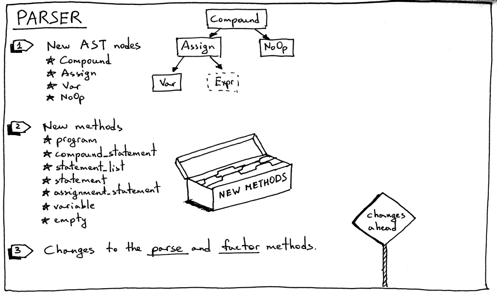 

1. 首先是抽象语法树AST 节点：  
   - 复合语句。复合语句一般包含一个语句列表作为其子节点，这里我们用数组表示。  
        ```python
        class Compound(AST):
            """Represents a 'BEGIN ... END' block"""
            def __init__(self):
                self.children = []
        ```  
    - 赋值语句：由左值（变量）、中间值（赋值运算符）和右值（`expr` 表达式）三个子节点构成。  
        ```python
        class Assign(AST):
        def __init__(self, left, op, right):
            self.left = left
            self.token = self.op = op
            self.right = right
        ```
    - 变量：变量节点只包含变量名作为其值。  
        ```python
        class Var(AST):
            """The Var node is constructed out of ID token."""
            def __init__(self, token):
                self.token = token
                self.value = token.value
        ```
    - `NoOp`：无操作，用来代表空语句。  
        ```python
        class NoOp(AST):
            pass
        ```

2. 你或许还记得：在我们递归下降的解析器中，每条语法规则都有与之对应的方法用于生成AST 节点。所以我们现在需要新增7 个方法，用于构造新语法所对应的抽象语法树。
    ```python
    def program(self):
        """program : compound_statement DOT"""
        node = self.compound_statement()
        self.eat(DOT)
        return node

    def compound_statement(self):
        """
        compound_statement: BEGIN statement_list END
        """
        self.eat(BEGIN)
        nodes = self.statement_list()
        self.eat(END)

        root = Compound()
        for node in nodes:
            root.children.append(node)

        return root

    def statement_list(self):
        """
        statement_list : statement
                    | statement SEMI statement_list
        """
        node = self.statement()

        results = [node]

        while self.current_token.type == SEMI:
            self.eat(SEMI)
            results.append(self.statement())

        if self.current_token.type == ID:
            self.error()

        return results

    def statement(self):
        """
        statement : compound_statement
                | assignment_statement
                | empty
        """
        if self.current_token.type == BEGIN:
            node = self.compound_statement()
        elif self.current_token.type == ID:
            node = self.assignment_statement()
        else:
            node = self.empty()
        return node

    def assignment_statement(self):
        """
        assignment_statement : variable ASSIGN expr
        """
        left = self.variable()
        token = self.current_token
        self.eat(ASSIGN)
        right = self.expr()
        node = Assign(left, token, right)
        return node

    def variable(self):
        """
        variable : ID
        """
        node = Var(self.current_token)
        self.eat(ID)
        return node

    def empty(self):
        """An empty production"""
        return NoOp()
    ```

3. 然后再更新下`factor` 方法，使之能处理变量token  
    ```python
    def factor(self):
        """factor : PLUS  factor
                | MINUS factor
                | INTEGER
                | LPAREN expr RPAREN
                | variable
        """
        token = self.current_token
        if token.type == PLUS:
            self.eat(PLUS)
            node = UnaryOp(token, self.factor())
            return node
        ...
        else:
            node = self.variable()
            return node
    ```

4. 最后更新`parse` 方法，用于从Pascal 程序入口开始构造抽象语法树  
    ```python
    def parse(self):
        node = self.program()
        if self.current_token.type != EOF:
            self.error()

        return node
    ```

以我们最开始的简单Pascal 程序为例：  
```pascal
BEGIN
    BEGIN
        number := 2;
        a := number;
        b := 10 * a + 10 * number / 4;
        c := a - - b
    END;
    x := 11;
END.
```  

通过[genastdot.py](https://github.com/rspivak/lsbasi/blob/master/part9/python/genastdot.py)脚本可以对其进行可视化处理：  
```console
$ python genastdot.py assignments.txt > ast.dot && dot -Tpng -o ast.png ast.dot
```
结果如下：  
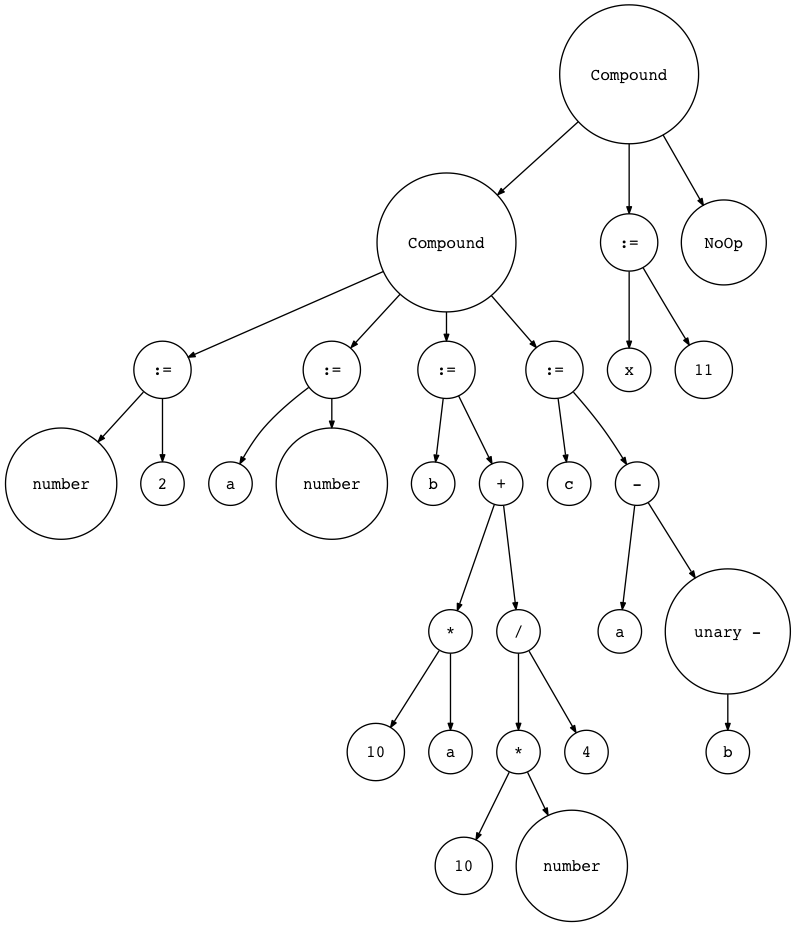  

## 解释器  
最后是我们解释器的变更：  
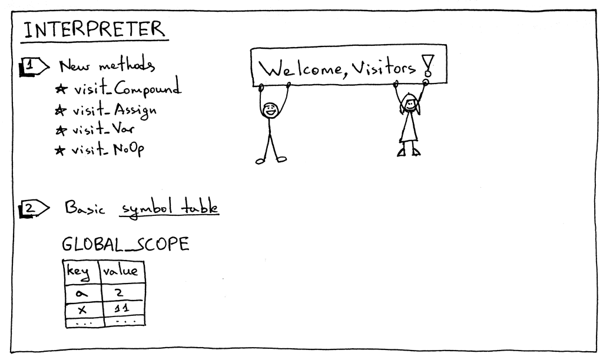   

为了可以解释执行新的AST 节点，我们需要添加对应的visit 方法：  
- visit_Compund  
- visit_Assign  
- visit_Var
- visit_NoOp  

其中遍历`Compound` 和`NoOp` 方法很简单：对于复合语句依次遍历其子元素即可；对于空语句则直接跳过。  
```python
def visit_Compound(self, node):
    for child in node.children:
        self.visit(child)

def visit_NoOp(self, node):
    pass
```

而对于赋值语句和变量节点的处理则需要详细解释一下。  
当我们对一个变量赋值时，我们需要将变量值存放在某处，以便将来使用：  
```python
def visit_Assign(self, node):
    var_name = node.left.value
    self.GLOBAL_SCOPE[var_name] = self.visit(node.right)
```

上面的代码将变量以键值对（key-value pair）的形式存放在符号表（symbol table）`GLOBAL_SCOPE` 中（也可以理解为全局的上下文环境）。符号表是一种抽象的数据结构（abstract data type, ADT），目前我们的符号表很简单，只包含变量元素，于是我们采用python 中的字典来实现。这种做法有点投机取巧的意思，因为真正的符号表应该是一个单独的类，并且拥有自己独特的方法。我们会在后面实现真正的符号表。  

以赋值语句`a:=3` 为例，我们看一下语句执行前后符号表内容的变化：  
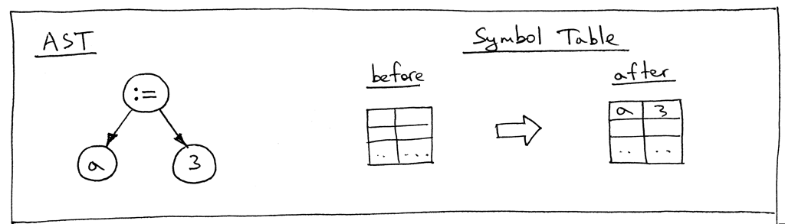  

下面继续看赋值语句`b:=a` 的抽象语法树：  
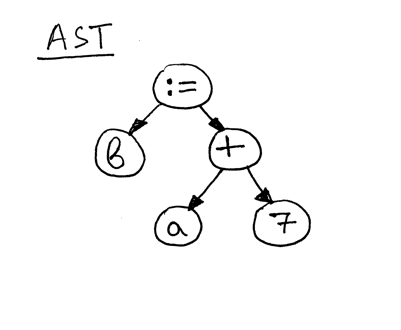  

可以看到，AST 右手边`a+7` 会用到变量`a`。所以我们需要定义`visit_Var()` 方法，通过其从符号表中获取变量的值：  
```python
def visit_Var(self, node):
    var_name = node.value
    val = self.GLOBAL_SCOPE.get(var_name)
    if val is None:
        raise NameError(repr(var_name))
    else:
        return val
```

当代码执行到`visit_Var()` 时，首先需要从符号表`GLOBAL_SCOPE` 中获取变量的值，如果变量不存在，则会抛出`NameError` 异常。下图是执行赋值语句`b:=a+7` 前后符号表内容的变化：  
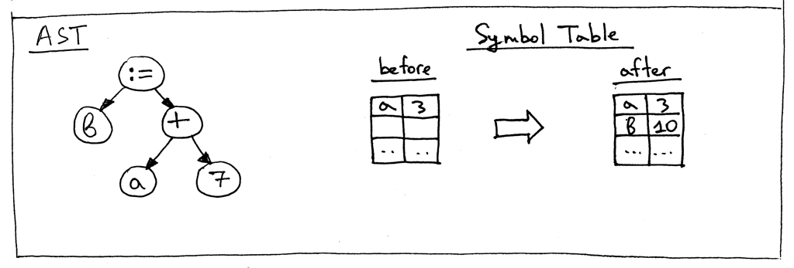  

以上就是我们今天所需要做的所有工作。最后，我们简单地打印一下`GLOBAL_SCOPE` 的内容以验证代码功能是否正确。  

可以同时通过python 命令，或者[assignments.txt](https://github.com/rspivak/lsbasi/blob/master/part9/python/assignments.txt) 向我们的程序传递Pascal 程序代码：  

- 通过字符串传递Pascal 代码 
    ```console
    $ python 
    >>> from spi import Lexer, Parser, Interpreter
    >>> text = """\
    ... BEGIN
    ...
    ...     BEGIN
    ...         number := 2;
    ...         a := number;
    ...         b := 10 * a + 10 * number / 4;
    ...         c := a - - b
    ...     END;
    ...
    ...     x := 11;
    ... END.
    ... """
    >>> lexer = Lexer(text)
    >>> parser = Parser(lexer)
    >>> interpreter = Interpreter(parser)
    >>> interpreter.interpret()
    >>> print(interpreter.GLOBAL_SCOPE)
    {'a': 2, 'x': 11, 'c': 27, 'b': 25, 'number': 2}
    ```
- 通过文本文件传递Pascal 代码  
    ```console
    $ python spi.py assignments.txt
    {'a': 2, 'x': 11, 'c': 27, 'b': 25, 'number': 2}
    ```

如果你还没有动手实验，请赶紧试一下，看我们的解释器是不是能正确运行。  


让我们再次总结一下为了扩展Pascal 解释器所做的工作：  
1. 添加新的语法规则  
2. 添加新的token，与其对应的词法分析方法，更新`get_next_token`方法  
3. 添加新的抽象语法树节点  
4. 为新的AST 节点添加对应的语法分析方法  
5. 为解释器添加新的visit 方法，以遍历新的抽象语法树  
6. 使用字典来作为符号表保存变量  

为了简单起见，本文中引入了一些奇技淫巧，在后面的系列中，我们将会采用更加正规的实现：  
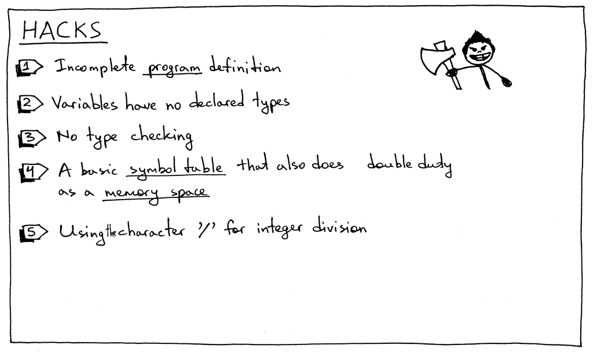  

1. 当前的Pascal 语法仍然是不完整的，后面我们将会添加更多的部件；  
2. Pascal 是一种静态类型编程语言，目前我们还没有实现变量类型的声明；  
3. 并且对于变量的使用也没有进行类型检查。正常情况下字符串与整数相加会引发异常；  
4. 目前符号表是使用字典实现的，但它同时也肩负着内存管理的任务。在后面的系列中，我们会有专门的文章来介绍它；  
5. 文中我们使用`/` 来表示除法运算，但是Pascal 中使用`div` 来表示整数的除法；  
6. 文中的解释器对关键字的大小写是敏感的，后面应修改成大小写不敏感。  


趁热打铁，下面是今天的作业：  
  

1. 将我们的编译器修改为对大小写不敏感的，使之可以执行下面的代码：  
```python
BEGIN

    BEGIN
        number := 2;
        a := NumBer;
        B := 10 * a + 10 * NUMBER / 4;
        c := a - - b
    end;

    x := 11;
END.
```

2. 添加`div` 运算符来处理整数运算  
3. 修改解释器（词法分析器部分），使之能识别下划线开头的变量名，例如：`_num := 5`。


以下书籍可能会对你有所帮助：  

1. [Language Implementation Patterns: Create Your Own Domain-Specific and General Programming Languages (Pragmatic Programmers)](http://www.amazon.com/gp/product/193435645X/ref=as_li_tl?ie=UTF8&camp=1789&creative=9325&creativeASIN=193435645X&linkCode=as2&tag=russblo0b-20&linkId=MP4DCXDV6DJMEJBL)  
2. [Compilers: Principles, Techniques, and Tools (2nd Edition)](http://www.amazon.com/gp/product/0321486811/ref=as_li_tl?ie=UTF8&camp=1789&creative=9325&creativeASIN=0321486811&linkCode=as2&tag=russblo0b-20&linkId=GOEGDQG4HIHU56FQ)   

-----  
2022-06-11 22:08