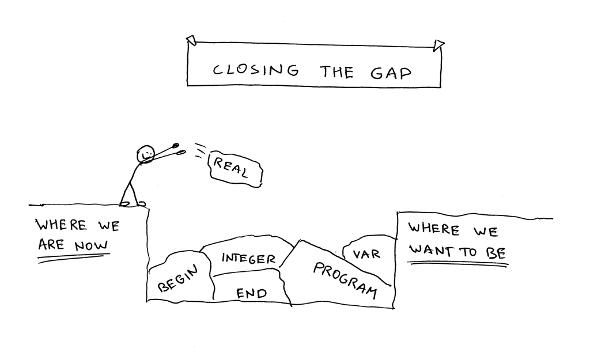
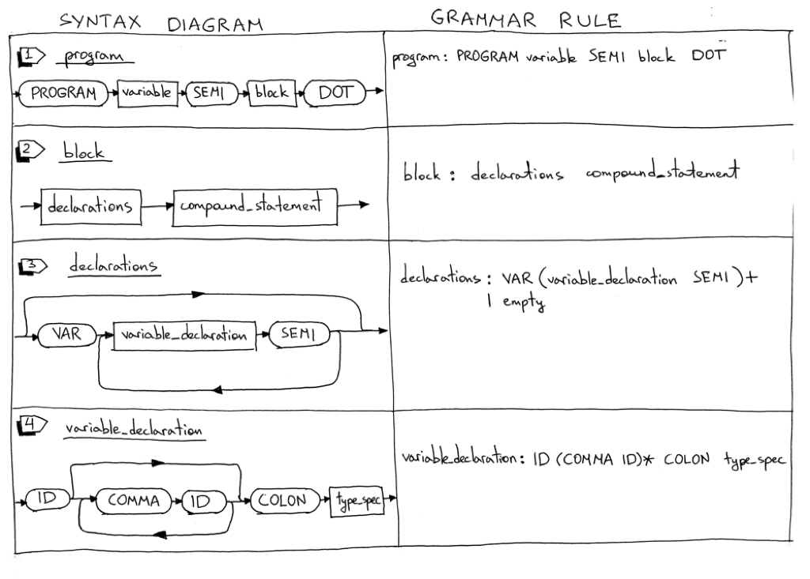
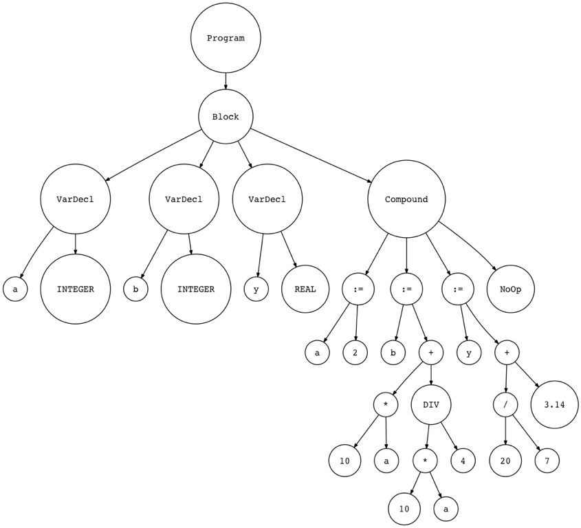

10_完整的Pascal 子集   

📅 2016-08-04  

今天我们会继续填坑： 目前已经实现了功能残缺的Pascal 解释器，距离完整功能的Pascal 子集还有一段距离。  


文中我们会继续更新我们的解释器以解释执行第一个Pascal 程序。我们也可以通过对比[Free Pascal Comiler](http://www.freepascal.org/) 的运行结果，以确定程序的正确性。以下是实例代码：  
```pascal
PROGRAM Part10;
VAR
   number     : INTEGER;
   a, b, c, x : INTEGER;
   y          : REAL;

BEGIN {Part10}
   BEGIN
      number := 2;
      a := number;
      b := 10 * a + 10 * number DIV 4;
      c := a - - b
   END;
   x := 11;
   y := 20 / 7 + 3.14;
   { writeln('a = ', a); }
   { writeln('b = ', b); }
   { writeln('c = ', c); }
   { writeln('number = ', number); }
   { writeln('x = ', x); }
   { writeln('y = ', y); }
END.  {Part10}
{内是注释，在词法分析时可以忽略掉}
```

在具体操作之前，可以先从[Github](https://github.com/rspivak/lsbasi/blob/master/part10/python/spi.py) 下载Python 代码和[Pascal 源码](https://github.com/rspivak/lsbasi/blob/master/part10/python/part10.pas)试一试效果：  
```shell-session
$ python spi.py part10.pas
a = 2
b = 25
c = 27
number = 2
x = 11
y = 5.99714285714
```  

如果移除Pascal 代码中的注释语句，则Free Pascal Compiler 将会在生成的可执行程序中输出相同的结果：  
```shell-session
$ fpc part10.pas
$ ./part10
a = 2
b = 25
c = 27
number = 2
x = 11
y =  5.99714285714286E+000
```

好了，看一下我们今天的主要内容：  
1. 学习如何解析Pascal `PROGRAM` 程序头  
2. 学习如何解析变量声明代码块  
3. 更新除法运算，引入`DIV` 运算符用作整数除法  
4. 支持Pascal 注释  

首先看一下语法图，今天我们会新增和更新一些语法规则：  
  
  

1. 程序的定义引入了`PROGRAM` 关键字，程序名，后面跟代码块`block` 和句点`DOT`  
    ```pascal
    PROGRAM Part10;
    BEGIN
    END.
    ```

2. 代码块`block`包含变量声明`declaration` 和复合语句`compund_statment`：  
    ```pascal
    VAR
    number : INTEGER;

    BEGIN
    END

    {或者不包含变量声明}
    BEGIN
    END
    ```

3. Pascal 的声明代码块可以是好几部分，每一部分都是可选的。这里我们只介绍变量的声明。声明模块的内容也可以为空。  
4. Pascal 是静态类型语言，于是每个变量在使用前都应明确地指明类型。通过`VAR` 关键字可以在Pascal 程序中声明变量并指定变量类型：   
    ```pascal
    VAR
        number     : INTEGER;
        a, b, c, x : INTEGER;
        y          : REAL;
    ```

5. `type_spec` 规则用于处理整数和实数类型：  
    ```pascal
    VAR
        a : INTEGER;
        b : REAL;
    ```
    变量a 是整数型，b 则被声明为实数型（浮点型）。本文不涉及强制类型检查，但是后续文章会补充说明。

6. `term` 规则需要更新以适配`DIV` 关键字，同时保留`/` 作为实数的除法：  
    ```pascal
    {整数的除法就是取余运算}
    20 / 7 = 2
    {实数的除法}
    20 / 7 = 2.85714285714
    {用DIV 表示整数除法}
    20 DIV 7 = 2
    ```

7. `factor` 规则需要更新以支持整数和实数类型的常量，原先的`INTEGER` 规则由`INTEGER_CONST` 和`REAL_CONST` 替换，`INTEGER` token 会被用来表示整数类型：  
    ```pascal
    y := 20 / 7 + 3.14;
    ```

下面是完整的语法规则：   
```
program : PROGRAM variable SEMI block DOT

block : declarations compound_statement

declarations : VAR (variable_declaration SEMI)+
             | empty

variable_declaration : ID (COMMA ID)* COLON type_spec

type_spec : INTEGER | REAL

compound_statement : BEGIN statement_list END

statement_list : statement
               | statement SEMI statement_list
 
statement : compound_statement
          | assignment_statement
          | empty

assignment_statement : variable ASSIGN expr

empty :

expr : term ((PLUS | MINUS) term)*

term : factor ((MUL | INTEGER_DIV | FLOAT_DIV) factor)*

factor : PLUS factor
       | MINUS factor
       | INTEGER_CONST
       | REAL_CONST
       | LPAREN expr RPAREN
       | variable

variable: ID
```  

后面我们将同上次一样，继续：  
1. 更新词法分析器  
2. 更新语法分析器  
3. 更新解释器  

## 更新词法分析器   
> 词法分析器需要更新的地方  
> - 新增token  
> - 新增/更新保留关键字  
> - 新增`skip_comment` 方法处理注释  
> - 重命名`integer` 方法，因为现在需要处理实数了  
> - 更新`get_next_token` 方法以返回新的token  

下面是变动的细节：  
1. 为了处理程序头、变量声明、整数、实数以及它们相关的运算，我们需要新增一些token、保留关键字，同时需要修改`INTEGER` 用于表示整数类型，以下是新增或需要修改的token：   
   - `PROGRAM` 保留字  
   - `VAR` 保留字   
   - `COLON` 冒号(`:`)  
   - `COMMA` 逗号(`,`)  
   - `INTEGER` 整数类型  
   - `REAL` 实数类型  
   - `INTEGER_CONST` 整数常量  
   - `REAL_CONST` 实数常量  
   - `INTEGER_DIV` 整数除法运算符(DIV)  
   - `FLOAT_DIV` 实数除法运算符(/)  


2. 完整的保留字map    
    ```python
    RESERVED_KEYWORDS = {
        'PROGRAM': Token('PROGRAM', 'PROGRAM'),
        'VAR': Token('VAR', 'VAR'),
        'DIV': Token('INTEGER_DIV', 'DIV'),
        'INTEGER': Token('INTEGER', 'INTEGER'),
        'REAL': Token('REAL', 'REAL'),
        'BEGIN': Token('BEGIN', 'BEGIN'),
        'END': Token('END', 'END'),
    }
    ```  

3. 跳过注释`skip_comment`  
   ```python
   def skip_comment(self):
        while self.current_char != '}':
            self.advance()
        self.advance()  # the closing curly brace
   ```

4. 重命名`integer` 方法为`number`。因为要处理整数和实数类型    
   ```python
    def number(self):
        """Return a (multidigit) integer or float consumed from the input."""
        result = ''
        while self.current_char is not None and self.current_char.isdigit():
            result += self.current_char
            self.advance()

        if self.current_char == '.':
            result += self.current_char
            self.advance()

            while (
                self.current_char is not None and
                self.current_char.isdigit()
            ):
                result += self.current_char
                self.advance()

            token = Token('REAL_CONST', float(result))
        else:
            token = Token('INTEGER_CONST', int(result))

        return token
   ```  

5. 更新`get_next_token` 方法  
   ```python
    def get_next_token(self):
        while self.current_char is not None:
            ...
            if self.current_char == '{':
                self.advance()
                self.skip_comment()
                continue
            ...
            if self.current_char.isdigit():
                return self.number()

            if self.current_char == ':':
                self.advance()
                return Token(COLON, ':')

            if self.current_char == ',':
                self.advance()
                return Token(COMMA, ',')
            ...
            if self.current_char == '/':
                self.advance()
                return Token(FLOAT_DIV, '/')
            ...
   ```

## 更新语法分析器   
> 语法分析的改动主要有三处  
> 1. 新增抽象语法树节点：Program, Block, VarDecl, Type  
> 2. 新增语法规则对应的方法  
> 3. 更新已经存在的program, term, factor 方法   

1. 新增抽象语法树节点4 个：   
    - Program，包含程序名和代码块    
        ```python
        class Program(AST):
            def __init__(self, name, block):
                self.name = name
                self.block = block
        ```
    - Block，包含变量声明和复合语句    
        ```python
        class Block(AST):
            def __init__(self, declarations, compound_statement):
                self.declarations = declarations
                self.compound_statement = compound_statement
        ```
    - VarDecl，每个变量声明节点包括变量名和变量类型节点 
        ```python
        class VarDecl(AST):
            def __init__(self, var_node, type_node):
                self.var_node = var_node
                self.type_node = type_node
        ```     
    - Type，包含变量的token 和变量的类型作为value     
        ```python
        class Type(AST):
            def __init__(self, token):
                self.token = token
                self.value = token.value
        ```     

2. 前面我们讲过，每个AST 节点都应有一个对应的构造方法。今天我们新增了4 个语法树节点，所以也要新增4 个与之对应的构造方法：   
    ```python
    def block(self):
        """block : declarations compound_statement"""
        declaration_nodes = self.declarations()
        compound_statement_node = self.compound_statement()
        node = Block(declaration_nodes, compound_statement_node)
        return node

    def declarations(self):
        """declarations : VAR (variable_declaration SEMI)+
                        | empty
        """
        declarations = []
        if self.current_token.type == VAR:
            self.eat(VAR)
            while self.current_token.type == ID:
                var_decl = self.variable_declaration()
                declarations.extend(var_decl)
                self.eat(SEMI)

        return declarations

    def variable_declaration(self):
        """variable_declaration : ID (COMMA ID)* COLON type_spec"""
        var_nodes = [Var(self.current_token)]  # first ID
        self.eat(ID)

        while self.current_token.type == COMMA:
            self.eat(COMMA)
            var_nodes.append(Var(self.current_token))
            self.eat(ID)

        self.eat(COLON)

        type_node = self.type_spec()
        var_declarations = [
            VarDecl(var_node, type_node)
            for var_node in var_nodes
        ]
        return var_declarations

    def type_spec(self):
        """type_spec : INTEGER
                    | REAL
        """
        token = self.current_token
        if self.current_token.type == INTEGER:
            self.eat(INTEGER)
        else:
            self.eat(REAL)
        node = Type(token)
        return node
    ```  

3. 然后我们还要更新之前的program，term，和factor 方法  
    ```python
    def program(self):
        """program : PROGRAM variable SEMI block DOT"""
        self.eat(PROGRAM)
        var_node = self.variable()
        prog_name = var_node.value
        self.eat(SEMI)
        block_node = self.block()
        program_node = Program(prog_name, block_node)
        self.eat(DOT)
        return program_node

    def term(self):
        """term : factor ((MUL | INTEGER_DIV | FLOAT_DIV) factor)*"""
        node = self.factor()

        while self.current_token.type in (MUL, INTEGER_DIV, FLOAT_DIV):
            token = self.current_token
            if token.type == MUL:
                self.eat(MUL)
            elif token.type == INTEGER_DIV:
                self.eat(INTEGER_DIV)
            elif token.type == FLOAT_DIV:
                self.eat(FLOAT_DIV)

            node = BinOp(left=node, op=token, right=self.factor())

        return node

    def factor(self):
        """factor : PLUS factor
                | MINUS factor
                | INTEGER_CONST
                | REAL_CONST
                | LPAREN expr RPAREN
                | variable
        """
        token = self.current_token
        if token.type == PLUS:
            self.eat(PLUS)
            node = UnaryOp(token, self.factor())
            return node
        elif token.type == MINUS:
            self.eat(MINUS)
            node = UnaryOp(token, self.factor())
            return node
        elif token.type == INTEGER_CONST:
            self.eat(INTEGER_CONST)
            return Num(token)
        elif token.type == REAL_CONST:
            self.eat(REAL_CONST)
            return Num(token)
        elif token.type == LPAREN:
            self.eat(LPAREN)
            node = self.expr()
            self.eat(RPAREN)
            return node
        else:
            node = self.variable()
            return node
    ```

最后来看一下我们更新后的抽象语法树长什么样子：  
```Pascal
PROGRAM Part10AST;
VAR
   a, b : INTEGER;
   y    : REAL;

BEGIN {Part10AST}
   a := 2;
   b := 10 * a + 10 * a DIV 4;
   y := 20 / 7 + 3.14;
END.  {Part10AST}
```  

通过[genastdot.py](https://github.com/rspivak/lsbasi/blob/master/part10/python/genastdot.py) 可以绘制对应的树状图，并观察到我们新增的节点   
```shell-session
$ python genastdot.py part10ast.pas > ast.dot && dot -Tpng -o ast.png ast.dot
```  
  

## 更新解释器   
> 在完成词法分析器和语法分析器的修改后，我们需要添加对应的`visit` 方法来遍历抽象语法树，进而解释执行Pascal 程序了：  
> - visit_Program  
> - visit_Block  
> - visit_VarDecl  
> - visit_Type  

思路很直接，其实`visit_VarDecl` 和`visit_Type` 什么都没干  
```python
def visit_Program(self, node):
    self.visit(node.block)

def visit_Block(self, node):
    for declaration in node.declarations:
        self.visit(declaration)
    self.visit(node.compound_statement)

def visit_VarDecl(self, node):
    # Do nothing
    pass

def visit_Type(self, node):
    # Do nothing
    pass
```

我们还需要更新二元运算的解释代码，因为引入了整数除法：  
```python
def visit_BinOp(self, node):
    if node.op.type == PLUS:
        return self.visit(node.left) + self.visit(node.right)
    elif node.op.type == MINUS:
        return self.visit(node.left) - self.visit(node.right)
    elif node.op.type == MUL:
        return self.visit(node.left) * self.visit(node.right)
    elif node.op.type == INTEGER_DIV:
        return self.visit(node.left) // self.visit(node.right)
    elif node.op.type == FLOAT_DIV:
        return float(self.visit(node.left)) / float(self.visit(node.right))
```

最后总结一下今天我们对解释器做了哪些扩展：  
- 新增了一些语法规则，并且也更新了一下语法规则  
- 新增/更新了一些token 和词法分析的方法  
- 新增了抽象语法树节点  
- 新增了AST 的构造方法  
- 新增了AST 节点的遍历方法   

并且相比于上一章，我们也移除了一些黑科技：  
- 正式引入`PROGRAM` 程序头  
- 支持通过`VAR` 声明变量  
- 采用`DIV` 进程整数除法运算，而`/` 则被用于实数的除法运算   

如果你觉得不太好掌握的话，可以不看我的源码，自己动手实现一个解释器，并且使用[part10.pas](https://github.com/rspivak/lsbasi/blob/master/part10/python/part10.pas) 验证一下。  

以上就是今天的所有内容，下一章我们将学习符号表的管理。再见！


-----  
2022-06-15 21:31