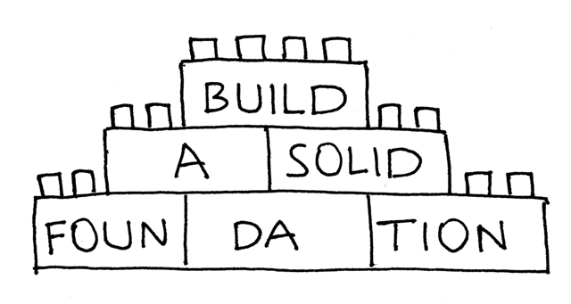
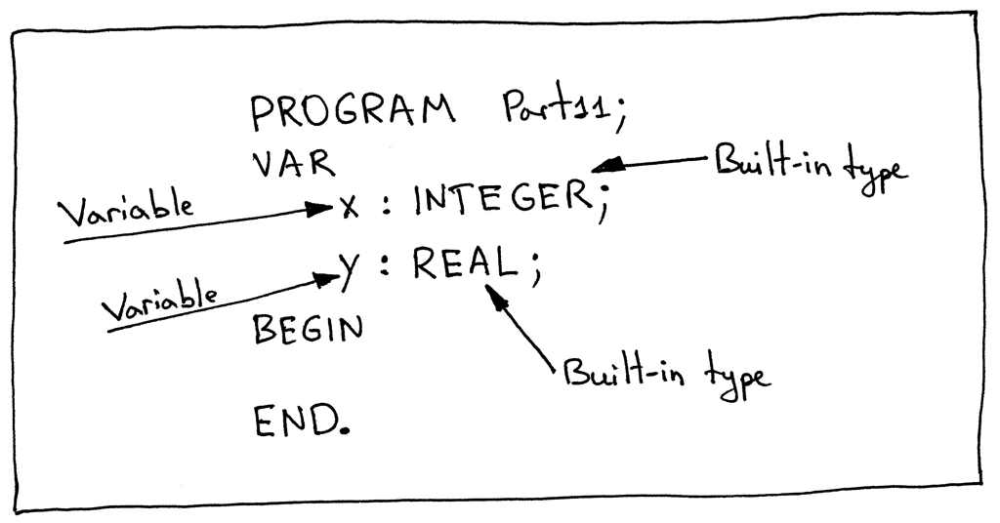
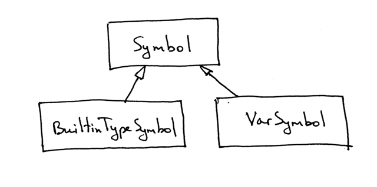
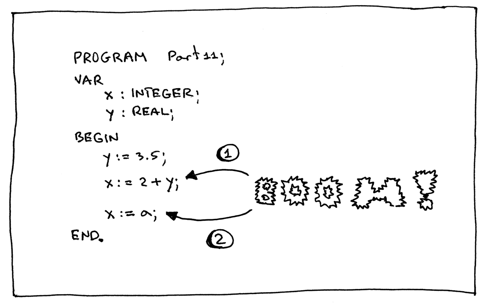
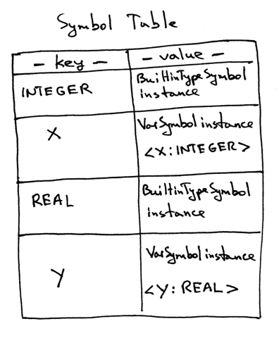
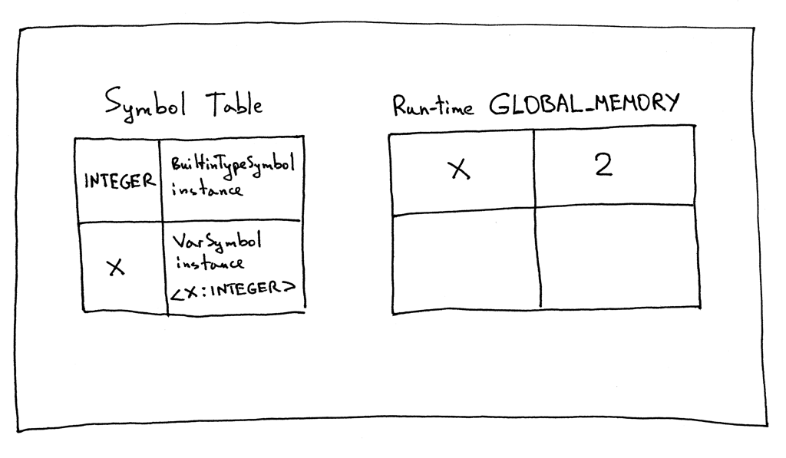

11_符号表管理   

📅 2016-09-20  

某天，我在想我们已经完成了多少内容了，我们应该回顾一下之前所学，也看一下将来还需要学习哪些内容了。  
  

迄今为止，我们学习了：  
- 词法分析，以及在不借助正则表达式或外部工具（如[Lex](https://en.wikipedia.org/wiki/Lex_(software))）的情况下创建我们自己的词法分析器。  
- 语法分析，通过语法规则解析token 流。构造我们自己的语法分析器。  
- 通过语法图表示语法规则。语法图可以形象地向我们展示语句的正确与否。  
- 上下文无关语法。  
- 编写一个基本的解释器。  
- 运算符的关联性和优先级，以及如何使用优先级表构造语法规则。  
- 如何构造抽象语法树，以及如何用一个抽象语法树表示Pascal 程序。  
- 如何遍历抽象语法树来实现解释器。  

通过之前的学习和实践，我们构建了一个解释器，它可以实现词法分析、语法分析、构建AST并通过遍历AST 节点来解释程序代码。老实说，到此为止，你应该得到表扬，但是请不要被胜利冲昏了头脑。尽管我们已经走过了很远的路，但前方仍然有着令人兴奋的未知，诸君，前进吧！   

有了以前知识的铺垫，现在我们要主备处理以下课题了：  
- 嵌套过程与函数（定义）  
- 过程和函数的调用  
- 语义分析（类型检查、变量声明确认）  
- 控制流（例如IF 语句）  
- 聚合数据类型（盲猜是类似于结构体的自定义数据类型）  
- 更多内置数据类型  
- 源码级别的调试器  
- 杂项

但是在开始这些课题之前，我们首先要打好基础，完成准备工作：  
  

这里我们开始深入研究符号、符号表和作用域这些超级重要的概念。这些概念将会跨越好几章内容，所以请做好心理准备，后面你会知道我们为什么要这样做。现在就开始吧。  

## 符号Symbol  
首先是符号，以及我们为什么要用到符号。这里我们定义符号就是一些程序内容的标识符，例如：变量、子程序或者类型等都属于符号。基于使用需要，符号至少应具备以下内容：  
- 符号名  
- 符号类别（变量、类型、子程序等）  
- 符号类型（整数、字符串等）  

今天我们主要处理变量符号和内置类型的符号，因为我们之前已经使用过相关的概念了。顺便提一句，“内置类型”是编译器或翻译器已经提前声明好的符号，不需要在用户程序中创建就可以直接使用。  

下面的Pascal 例程一共使用了四个符号来声明变量：两个变量和两个类型：  
  


在代码中应该如何表示符号的概念呢？我们需要创建一个`Symbol` 类：  
```python
class Symbol(object):
    def __init__(self, name, type=None):
        self.name = name
        self.type = type
```

可以看到，构造方法中`type` 参数是可选的，因为并不是所有的符号都需要指定类型。那么如何确定符号的类别呢？我们通过类名来对符号的类别进行编码。也就是对于不同的符号类别，我们需要创建对应的子类。  

目前我们已经有整数和实数两种内置类型了，所以今天就以它们为例，看一下如何创建内置符号：  
```python
class BuiltinTypeSymbol(Symbol):
    def __init__(self, name):
        super().__init__(name)

    def __str__(self):
        return self.name

    __repr__ = __str__
```

`BuiltinTypeSymbol` 类集成自`Symbol` 类，但是构造函数只需要传入符号名即可。而双下划线的`__repr__` 和`__str__()` 的目的是为了让我们调试程序时的输出更美观。  

下载解释器[spi.py](https://github.com/rspivak/lsbasi/blob/master/part11/python/spi.py)，并在命令行敞口与之交互以增强理解：  
```shell-session
$ python
>>> from spi import BuiltinTypeSymbol
>>> int_type = BuiltinTypeSymbol('INTEGER')
>>> int_type
INTEGER
>>> real_type = BuiltinTypeSymbol('REAL')
>>> real_type
REAL
```
 
如何创建变量符号呢？同样我们也需要创建一个`VarSymbol` 的子类：  
```python
class VarSymbol(Symbol):
    def __init__(self, name, type):
        super().__init__(name, type)

    def __str__(self):
        return '<{name}:{type}>'.format(name=self.name, type=self.type)

    __repr__ = __str__
```

变量符号中我们需要传入符号名和变量类型，该类的实例对象表示一个变量符号，如`a`，`b`等。  

通过上面的命令窗口，我们也可以看到变量符号是如何构造的：  
```python
$ python
>>> from spi import BuiltinTypeSymbol, VarSymbol
>>> int_type = BuiltinTypeSymbol('INTEGER')
>>> real_type = BuiltinTypeSymbol('REAL')
>>>
>>> var_x_symbol = VarSymbol('x', int_type)
>>> var_x_symbol
<x:INTEGER>
>>> var_y_symbol = VarSymbol('y', real_type)
>>> var_y_symbol
<y:REAL>
```  

如你所见，在构建变量符号之前，我们首先要声明类型的符号，这样才能传入变量符号的构造函数中去。（后面我们将更新解释器，内置类型符号就不需要人工声明了）  

下面是三种符号类型的继承关系：  
  

看起来还不错，但是目前我们还未明说为啥会用到这些符号呢？原因主要有两点：  
- 我们需要在变量赋值时做类型检查，以确保不会误操作  
- 变量应当先声明再使用！  

以下面的Pascal 程序为例：  
  

以之前提到的[Free Pascal Compiler](http://www.freepascal.org/) 编译可以知道：  
- `x := 2 + y;` 表达式会报类型不兼容的错误；  
- `x := a;` 因为使用没有声明的变量`a`，也会导致变量异常。  


为了能在程序运行前定位到错误信息，我们才需要跟踪程序中的符号。之前也提到过，我们需要在符号表中暂存程序中需要用到的符号！   

## 符号表  
符号表是一种抽象数据结构，用于追踪Pascal 程序中各种符号。今天我们将会通过单独的`SymbolTable` 类来管理符号表及其内容：  
```python
class SymbolTable(object):
    def __init__(self):
        self._symbols = {}

    def __str__(self):
        s = 'Symbols: {symbols}'.format(
            symbols=[value for value in self._symbols.values()]
        )
        return s

    __repr__ = __str__

    def define(self, symbol):
        print('Define: %s' % symbol)
        self._symbols[symbol.name] = symbol

    def lookup(self, name):
        print('Lookup: %s' % name)
        symbol = self._symbols.get(name)
        # 'symbol' is either an instance of the Symbol class or 'None'
        return symbol
```

符号表类主要有两个作用：定义符号`define`，用于存储符号到内部的字典；查找符号`lookup`，从内部字典中查找符号是否已定义。  

下面我们手动创建一个符号表：  
```Pascal
PROGRAM Part11;
VAR
   x : INTEGER;
   y : REAL;

BEGIN

END.
```  

启动之前下载的`spi.py` 文件：  
```shell-session
$ python
>>> from spi import SymbolTable, BuiltinTypeSymbol, VarSymbol
>>> symtab = SymbolTable()
>>> int_type = BuiltinTypeSymbol('INTEGER')
>>> symtab.define(int_type)
Define: INTEGER
>>> symtab
Symbols: [INTEGER]
>>>
>>> var_x_symbol = VarSymbol('x', int_type)
>>> symtab.define(var_x_symbol)
Define: <x:INTEGER>
>>> symtab
Symbols: [INTEGER, <x:INTEGER>]
>>>
>>> real_type = BuiltinTypeSymbol('REAL')
>>> symtab.define(real_type)
Define: REAL
>>> symtab
Symbols: [INTEGER, <x:INTEGER>, REAL]
>>>
>>> var_y_symbol = VarSymbol('y', real_type)
>>> symtab.define(var_y_symbol)
Define: <y:REAL>
>>> symtab
Symbols: [INTEGER, <x:INTEGER>, REAL, <y:REAL>]
```

符号表内部字典`_symbols` 内容如下（注意看符号表是不包含变量值的）：  


那么如何让程序自动创建符号表呢？可以通过遍历抽象语法树让代码自动管理符号表，只不过需要重新写一套遍历的方法。  

在此之前，先扩展下符号表类`SymbolTable`，不用每次都需要手动添加内置类型了：   
```python
class SymbolTable(object):
    def __init__(self):
        self._symbols = OrderedDict()
        self._init_builtins()

    def _init_builtins(self):
        self.define(BuiltinTypeSymbol('INTEGER'))
        self.define(BuiltinTypeSymbol('REAL'))

    def __str__(self):
        s = 'Symbols: {symbols}'.format(
            symbols=[value for value in self._symbols.values()]
        )
        return s

    __repr__ = __str__

    def define(self, symbol):
        print('Define: %s' % symbol)
        self._symbols[symbol.name] = symbol

    def lookup(self, name):
        print('Lookup: %s' % name)
        symbol = self._symbols.get(name)
        # 'symbol' is either an instance of the Symbol class or 'None'
        return symbol
```

然后创建`SymbolTableBuilder` 类，在遍历AST 的时候自动创建符号表：  
```python
class SymbolTableBuilder(NodeVisitor):
    def __init__(self):
        self.symtab = SymbolTable()

    def visit_Block(self, node):
        for declaration in node.declarations:
            self.visit(declaration)
        self.visit(node.compound_statement)

    def visit_Program(self, node):
        self.visit(node.block)

    def visit_BinOp(self, node):
        self.visit(node.left)
        self.visit(node.right)

    def visit_Num(self, node):
        pass

    def visit_UnaryOp(self, node):
        self.visit(node.expr)

    def visit_Compound(self, node):
        for child in node.children:
            self.visit(child)

    def visit_NoOp(self, node):
        pass

    def visit_VarDecl(self, node):
        type_name = node.type_node.value
        type_symbol = self.symtab.lookup(type_name)
        var_name = node.var_node.value
        var_symbol = VarSymbol(var_name, type_symbol)
        self.symtab.define(var_symbol)
```

`SymbolTableBuilder` 类中的很多方法名与解释器类`Interpreter` 中的相同，毕竟二者都会遍历AST。但是`visit_VarDecl` 声明变量的节点需要单独说明：  
```python
def visit_VarDecl(self, node):
    type_name = node.type_node.value
    type_symbol = self.symtab.lookup(type_name)
    var_name = node.var_node.value
    var_symbol = VarSymbol(var_name, type_symbol)
    self.symtab.define(var_symbol)
```  

该方法负责声明变量，并将其存储在符号表中，但是在此之前，该方法需要先从符号表中查找类型符号是否已定义（如果没有定义的话理论上应该抛出异常）。通过代码看一下其工作过程：  
```shell-session
$ python
>>> from spi import Lexer, Parser, SymbolTableBuilder
>>> text = """
... PROGRAM Part11;
... VAR
...    x : INTEGER;
...    y : REAL;
...
... BEGIN
...
... END.
... """
>>> lexer = Lexer(text)
>>> parser = Parser(lexer)
>>> tree = parser.parse()
>>> symtab_builder = SymbolTableBuilder()
Define: INTEGER
Define: REAL
>>> symtab_builder.visit(tree)
Lookup: INTEGER
Define: <x:INTEGER>
Lookup: REAL
Define: <y:REAL>
>>> # Let’s examine the contents of our symbol table
…
>>> symtab_builder.symtab
Symbols: [INTEGER, REAL, <x:INTEGER>, <y:REAL>]
```  

我们可以看到代码输出了一些`Define: ...` 和`Lookup: ...` 的序列。这些就是构造符号表的顺序。最后程序输出了符号表的内容。以上工作都是由`SymbolTableBuilder` 的方法自动完成的。  

同样的，还有两个方法`visit_Assign` 和`visit_Var` 需要先查询符号表来确定符号是否已存在。若不存在则应抛出异常：  
```python
def visit_Assign(self, node):
    var_name = node.left.value
    var_symbol = self.symtab.lookup(var_name)
    if var_symbol is None:
        raise NameError(repr(var_name))

    self.visit(node.right)

def visit_Var(self, node):
    var_name = node.value
    var_symbol = self.symtab.lookup(var_name)

    if var_symbol is None:
        raise NameError(repr(var_name))
```  

下面是两个错误程序的示例：  
```Pascal  
PROGRAM NameError1;
VAR
   a : INTEGER;

BEGIN
   a := 2 + b;
END.
```  

可以验证，错误的地方在于无法找到变量`b`：  
```shell-session
$ python
>>> from spi import Lexer, Parser, SymbolTableBuilder
>>> text = """
... PROGRAM NameError1;
... VAR
...    a : INTEGER;
...
... BEGIN
...    a := 2 + b;
... END.
... """
>>> lexer = Lexer(text)
>>> parser = Parser(lexer)
>>> tree = parser.parse()
>>> symtab_builder = SymbolTableBuilder()
Define: INTEGER
Define: REAL
>>> symtab_builder.visit(tree)
Lookup: INTEGER
Define: <a:INTEGER>
Lookup: a
Lookup: b
Traceback (most recent call last):
  ...
  File "spi.py", line 674, in visit_Var
    raise NameError(repr(var_name))
NameError: 'b'
```

不出意外，发生了异常！来看下一个，我们在未定义的情况下使用了变量`a`：  
```Pascal
PROGRAM NameError2;
VAR
   b : INTEGER;

BEGIN
   b := 1;
   a := b + 2;
END.
```  
验证：  
```shell-session
>>> from spi import Lexer, Parser, SymbolTableBuilder
>>> text = """
... PROGRAM NameError2;
... VAR
...    b : INTEGER;
...
... BEGIN
...    b := 1;
...    a := b + 2;
... END.
... """
>>> lexer = Lexer(text)
>>> parser = Parser(lexer)
>>> tree = parser.parse()
>>> symtab_builder = SymbolTableBuilder()
Define: INTEGER
Define: REAL
>>> symtab_builder.visit(tree)
Lookup: INTEGER
Define: <b:INTEGER>
Lookup: b
Lookup: a
Traceback (most recent call last):
  ...
  File "spi.py", line 665, in visit_Assign
    raise NameError(repr(var_name))
NameError: 'a'
```  

需要强调一点：我们构造符号表是在程序运行之前执行的。如果要执行下面的程序，我们需要注意这一点：  
```Pascal
PROGRAM Part11;
VAR
   x : INTEGER;
BEGIN
   x := 2;
END.
```

符号表和运行时`run-time` 的全局内存`GLOBAL_MEMORY` 的内容如下图所示：  
  

发现区别了吧。符号表并不存储变量的值，因为这是解释器的工作。记得我们第09 章里面的黑科技吗？  
  
我们再也不需要让符号表去管理变量的内存了。（这样只要程序通过语义检查不报错，解释器就可以安心的运行了。）  

综合以上几点，看一下我们新的解释器能否正常工作吧：  
```Pascal
PROGRAM Part11;
VAR
   number : INTEGER;
   a, b   : INTEGER;
   y      : REAL;

BEGIN {Part11}
   number := 2;
   a := number ;
   b := 10 * a + 10 * number DIV 4;
   y := 20 / 7 + 3.14
END.  {Part11}
```  

将上面代码保存为`part11.pas` 并启动解释器`spi.py`：  
```shell-session
$ python spi.py part11.pas
Define: INTEGER
Define: REAL
Lookup: INTEGER
Define: <number:INTEGER>
Lookup: INTEGER
Define: <a:INTEGER>
Lookup: INTEGER
Define: <b:INTEGER>
Lookup: REAL
Define: <y:REAL>
Lookup: number
Lookup: a
Lookup: number
Lookup: b
Lookup: a
Lookup: number
Lookup: y

Symbol Table contents:
Symbols: [INTEGER, REAL, <number:INTEGER>, <a:INTEGER>, <b:INTEGER>, <y:REAL>]

Run-time GLOBAL_MEMORY contents:
a = 2
b = 25
number = 2
y = 5.99714285714
```  

再次强调：解释器不参与符号表的构建工作，但是依赖`SymbolTableBuilder` 来确保代码中的任何变量都在使用之前被正确地声明。  

**检查一下是否学会了吧**  
- 什么是符号  
- 我们为什么需要符号  
- 什么是符号表  
- 定义和查找符号有什么不同  
- 给定下面程序，最终解释器的符号表和全局内存的内容会是什么
    ```pascal
    PROGRAM Part11;
    VAR
        x, y : INTEGER;
    BEGIN
        x := 2;
        y := 3 + x;
    END.
    ```

以上就是今天的全部内容，下一章我们将会讨论作用域的内容，并着手处理嵌套过程的问题。继续加油，再见！  
  


**P.S.:**关于符号和符号表的解释，我主要参考了[Language Implementation Patterns - by Terence Parr](http://amzn.to/2cHsHT1) 这本书。这是我见过最有条理的说明，并且书中也涵盖了我们不会涉及的类的作用域的内容。  

**P.P.S.:**如果你迫不及待地想继续研究编译器，我强烈推荐你去阅读一下Jack Crenshaw 的经典系列[Let’s Build a Compiler](http://compilers.iecc.com/crenshaw/)。  


-----  
2022-06-20 00:27