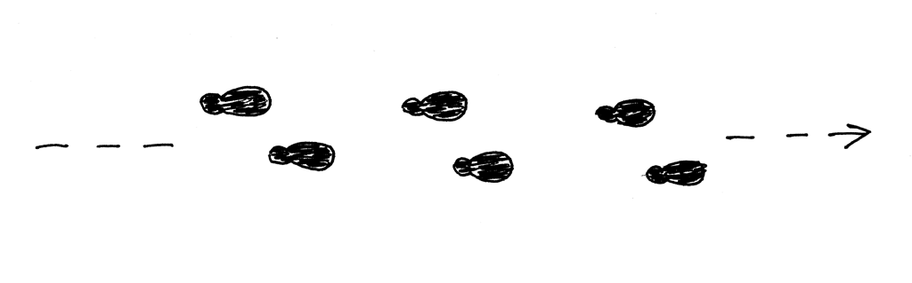
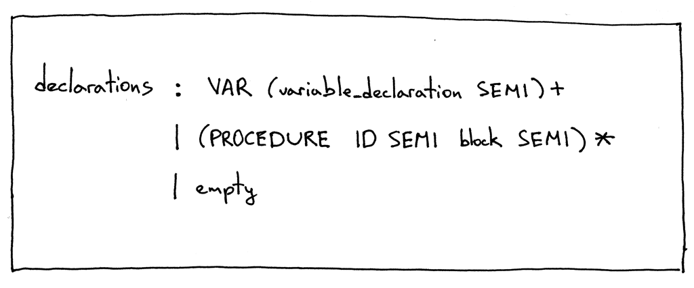
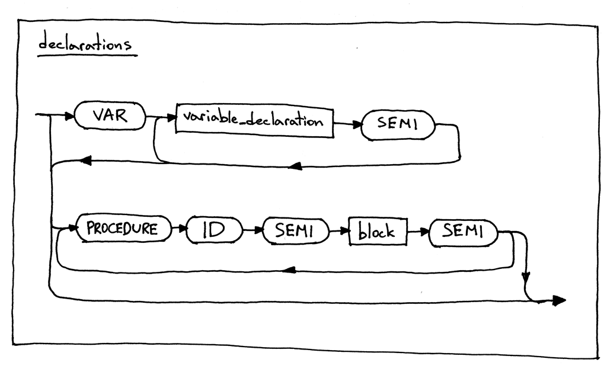
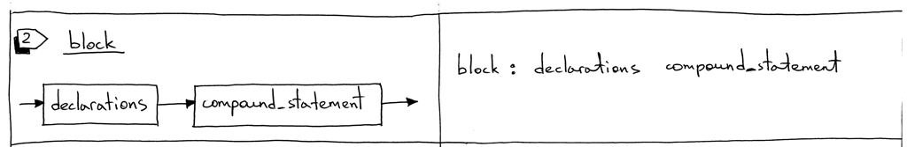
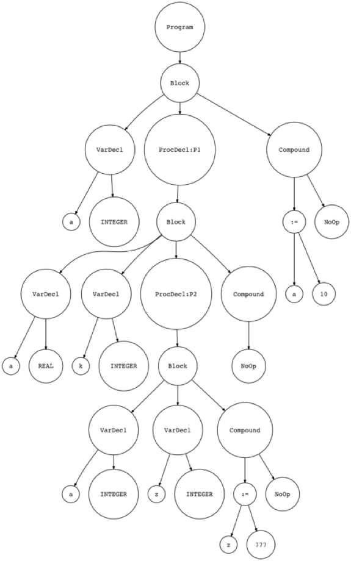

12_过程声明    

📅 2016-12-01  

> “不怕慢，只怕站”  ——中国俗语  

Hello，欢迎回来~。今天我们只学一点点过程声明（Procedure Declaration）的知识，为后面的知识点打基础。  
  

什么是**过程声明**呢？过程声明就是一个语法结构：定义一个标识符（过程名），并且将它与某个Pascal 代码块相关联。在深入学习之前，先简单看一下Pascal 过程的（不完全）定义：  
- Pascal 过程没有返回值，在到达代码块的结尾后自动退出；  
- Pascal 过程可以互相嵌套；  
- 简单起见，本文中的Pascal 过程不接受任何参数。后面的文章才会涉及。  

下面是我们今天的测试用例：  
```pascal
PROGRAM Part12;
VAR
   a : INTEGER;

PROCEDURE P1;
VAR
   a : REAL;
   k : INTEGER;

   PROCEDURE P2;
   VAR
      a, z : INTEGER;
   BEGIN {P2}
      z := 777;
   END;  {P2}

BEGIN {P1}

END;  {P1}

BEGIN {Part12}
   a := 10;
END.  {Part12}

{疑问：过程会在什么时候被调用，退出时又做了哪些工作呢？}
```

如上面代码所示，我们定义了两个Pascal 过程P1 和P2，并且P2 是嵌套在P1 内部的。在上文中，我们通过注释说明过程体代码属于哪个过程。  

今天我们的目标也很简单：学习如何解析上面的Pascal 代码。  

首先，我们需要增加一条语法规则。说干就干，下面是我们更新后的`declarations` 语法：  
  

> 译注：过程的声明在VAR 变量声明之后，在程序体开始之前，似乎~  

Pascal 过程的声明由保留字`PROCEDURE` 开始，后面依次跟着过程名标识符、分号、过程体代码块、分号。听起来很复杂，通过语法图看起来就简单明了了：  


从语法和语法图中可以看出，我们可以在同一层级定义好多Pascal 过程。例如，在下面的代码中，我们可以声明两个过程：P1 和P1A：  
```pascal
PROGRAM Test;
VAR
   a : INTEGER;

PROCEDURE P1;
BEGIN {P1}

END;  {P1}

PROCEDURE P1A;
BEGIN {P1A}

END;  {P1A}

BEGIN {Test}
   a := 10;
END.  {Test}
```

同样从语法和语法图中可以看出，过程的声明可以嵌套，因为过程声明是以`block` 作为子规则的，而`block` 又包含了`declarations` 规则。如果记不清了，这里展示一下我们在第10 章的语法图部分：   


OK，现在我们把注意力放到解释器组件的更新上来。  

## 词法分析器  
词法分析器中需要新增一个关键字`PROCEDURE`：
```python
PROCEDURE = 'PROCEDURE'
```

将关键字添加到保留字列表中，如下所示：  
```python
RESERVED_KEYWORDS = {
    'PROGRAM': Token('PROGRAM', 'PROGRAM'),
    'VAR': Token('VAR', 'VAR'),
    'DIV': Token('INTEGER_DIV', 'DIV'),
    'INTEGER': Token('INTEGER', 'INTEGER'),
    'REAL': Token('REAL', 'REAL'),
    'BEGIN': Token('BEGIN', 'BEGIN'),
    'END': Token('END', 'END'),
    'PROCEDURE': Token('PROCEDURE', 'PROCEDURE'),
}
```  

## 语法分析器  
语法分析器需要更新两处：  
1. 新增`ProcedureDecl` 抽象语法树节点；  
2. 更新`declarations` 方法。  

以下是详细内容：  
1. `ProcedureDecl` 节点表示过程声明。其构造函数接受两个参数：过程名`proc_name` 和过程体`block_node`  
    ```python
    class ProcedureDecl(AST):
        def __init__(self, proc_name, block_node):
            self.proc_name = proc_name
            self.block_node = block_node
    ```
2. 下面是更新后的`declaratons` 方法：   
    ```python
    def declarations(self):
        """declarations : VAR (variable_declaration SEMI)+
                        | (PROCEDURE ID SEMI block SEMI)*
                        | empty
        """
        declarations = []  # 声明语句可以多条并存，所以用数组

        if self.current_token.type == VAR:
            self.eat(VAR)
            while self.current_token.type == ID:
                var_decl = self.variable_declaration()
                declarations.extend(var_decl)
                self.eat(SEMI)

        while self.current_token.type == PROCEDURE:
            self.eat(PROCEDURE)
            proc_name = self.current_token.value
            self.eat(ID)
            self.eat(SEMI)
            block_node = self.block()
            proc_decl = ProcedureDecl(proc_name, block_node)
            declarations.append(proc_decl)
            self.eat(SEMI)

        return declarations
    ```

希望上面的代码不用过多的解释。它只是前面语法和语法图的简单翻译。   

## 构造符号表

因为我们还没有计划区处理嵌套过程的作用域，所以这一步先直接跳过，下篇文章再补充：   
```python
def visit_ProcedureDecl(self, node):
    pass
```  

## 解释器  
同样的，我们也留空`visit_ProcedureDecl` 方法，直接忽略掉过程声明部分的解释。目前来说，还不错。  

以上就是所有变动，下面就看一看更新后的抽象语法树长什么样吧，同样是以最开始的Pascal 代码做测试，你也可以从Github 上[下载](https://github.com/rspivak/lsbasi/blob/master/part12/python/part12.pas)。  
```pascal
PROGRAM Part12;
VAR
   a : INTEGER;

PROCEDURE P1;
VAR
   a : REAL;
   k : INTEGER;

   PROCEDURE P2;
   VAR
      a, z : INTEGER;
   BEGIN {P2}
      z := 777;
   END;  {P2}

BEGIN {P1}

END;  {P1}

BEGIN {Part12}
   a := 10;
END.  {Part12}
```

通过[genastdot.py](https://github.com/rspivak/lsbasi/blob/master/part12/python/genastdot.py) 工具可以生成可视化的抽象语法树：  
```shell-session
$ python genastdot.py part12.pas > ast.dot && dot -Tpng -o ast.png ast.dot
```
  

上图中，我们可以看到两个`ProcedureDecl` 节点：P1 和P2。任务结束:)  

今天最后一项内容：检查一下我们的程序还能不能跑呢？下载[解释器代码](https://github.com/rspivak/lsbasi/blob/master/part12/python/spi.py)和[Pascal 程序](https://github.com/rspivak/lsbasi/blob/master/part12/python/part12.pas)尝试运行：   
```shell-session
$ python spi.py part12.pas
Define: INTEGER
Define: REAL
Lookup: INTEGER
Define: <a:INTEGER>
Lookup: a

Symbol Table contents:
Symbols: [INTEGER, REAL, <a:INTEGER>]

Run-time GLOBAL_MEMORY contents:
a = 10
```

OK，掌握了以上所有的知识，我们就可以着手处理嵌套作用域了，这是我们在分析嵌套过程调用和函数调用所必须掌握、理解的。我们将会在下一章中重点分析它，但是也要做好心理准备（下一篇文章巨长！）。再见咯~  

-----  
2022-06-27 21:11