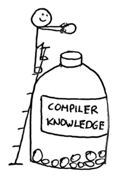
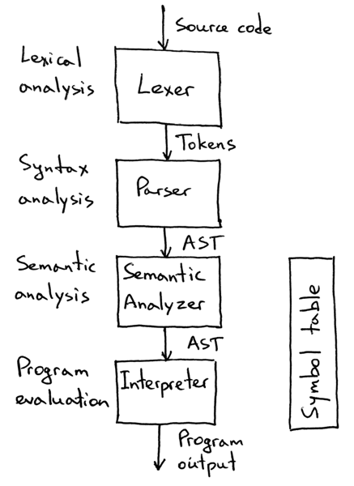
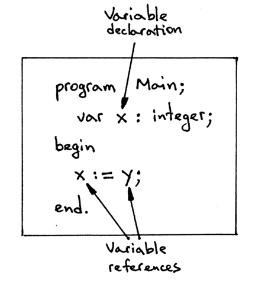
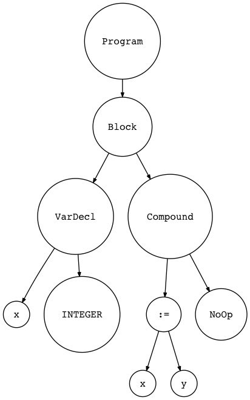
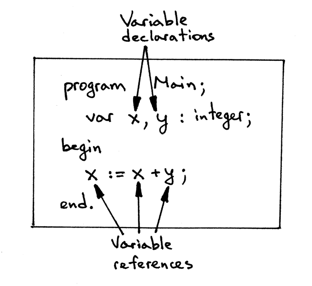
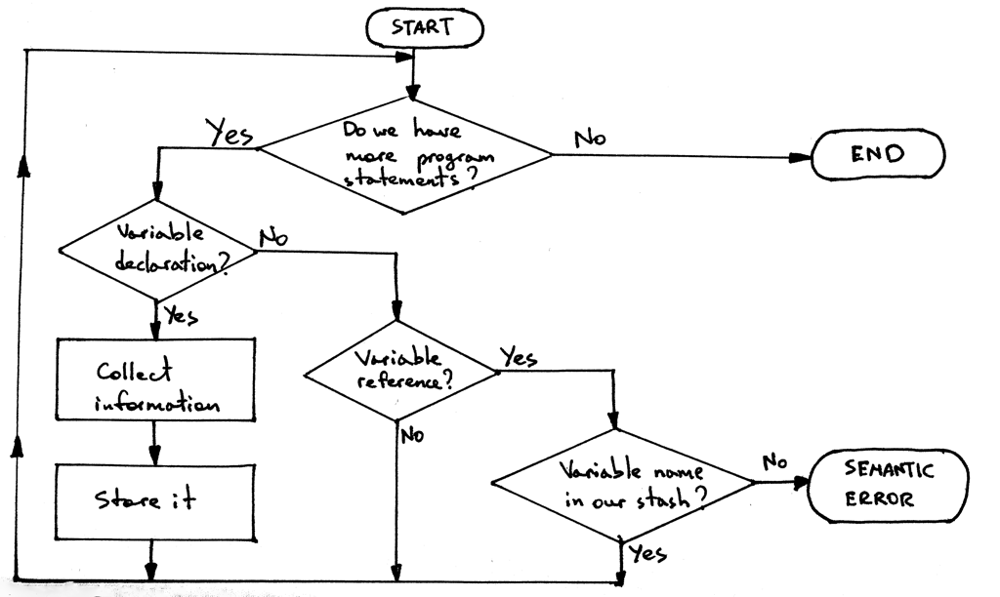
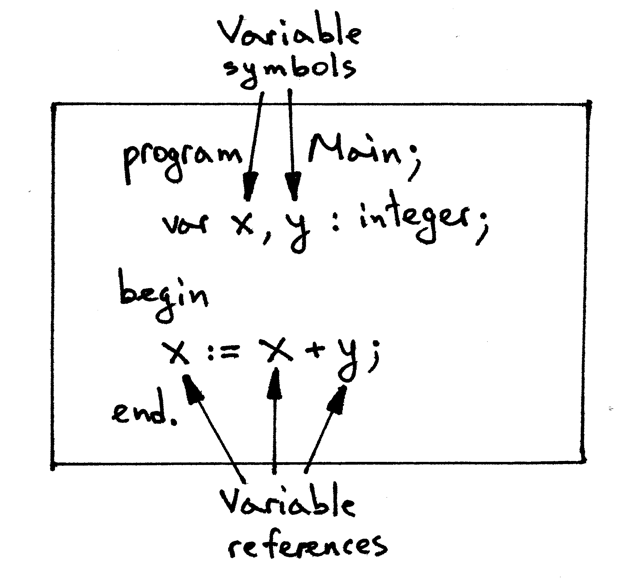
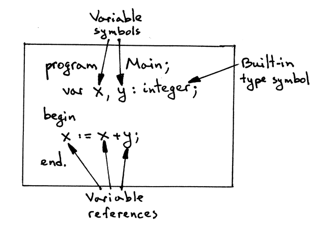
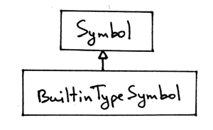
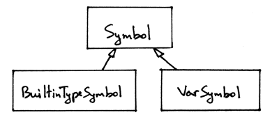

13_语义分析     

📅 2017-04-27  

> 任何值得做的事情，都值得做到极致。  

在我们深入探讨作用域（scope）的话题之前，我想更详细、更系统地回顾一下符号、符号表、和语义分析的知识。正如“任何值得做的事情，都值得做到极致”，我希望在学习作用域时，你会感觉到我们在这里看似绕了远路，其实是打下了更加坚实的基础。今天我们的目标依然是写编译器和解释器，相比于第11 章中第一次涉及符号和符号表时，你会发现本文中的材料有些部分被极大地扩充了。  
  

Ok, 说干就干！  

## 关于语义分析  
> 译注：想一想语法分析时为什么我们会用到上下文无关语法的概念，上下文是什么？为什么要上下文无关？什么是上下文相关？  
> 想一想：小明早上吃了一棵苹果树。这句话在主谓宾定状补的语法下有错误吗？那么在语义上呢？  

尽管我们的Pascal 程序在语法上没有错误，并且可以被语法分析器所识别、成功构建抽象语法树AST，但是程序仍然可能包含着严重的错误。为了提前捕获这些错误，我们就需要用到抽象语法树和符号表的信息。  

为什么我们不在语法分析的时候就去尝试捕获这些错误？为什么我们需要构建抽象语法树和符号表去做这些事情呢？  

> 译注：软件设计中有一个很重要的原则，叫做单一职责原则。就是一个方法再牛，也不要让它同时处理很多事情。因为这会让程序越来越难以维护。  

简而言之，就是处于便利性和程序解耦的考量。通过将这些工作提取到单独的环节，我们可以让语法分析器和解释器只专注于本职工作。当程序通过语法分析器后，我们就知道程序在语法上是完全没有问题的。下一步就是根据程序上下文和其他信息去检查语法分析器覆盖范围之外的错误了。我们以下面赋值语句来具体说明一下：  
```pascal
x := x + y;
```

上面这条语句可以通过语法分析器，因为它符合我们`变量 赋值运算符 表达式;` 的语法规则。但是由于Pascal 语言的变量需要先声明才能被使用，并且参与运算的数据类型也要保持一致，所以到这里我们的故事远未结束。如何让语法分析器知道变量`x,y` 已经被正确地声明了呢？  
事实上，我们上下文无关的语法分析器并不知道，于是我们需要专门的语义分析环节去处理诸如：变量声明检查、变量类型检查的问题。  

什么是“语义分析”，简单来说语义分析（semantic analysis）就是一个处理过程，用于检查我们的代码在某个语言环境中是否有意义（make sense）。那什么是有意义呢？这需要根据语言的要求和定义具体说明，例如：苹果树一般来说是不能被人吃的:(  

Pascal 语言，尤其是Free Pascal 编译器，对我们的代码有一些要求，即使语法是正确的，但在仍不能通过语义分析：  
- 使用未经声明的变量；  
- 算术运算中使用了类型不一致的变量（类型检查，后面会有专题讲解）；  
- 变量、过程符号的重复声明；  
- 过程名必须指向已经被定义的过程；
- 过程调用时必须保证参数的数量和类型都满足要求。  

> 译注：想想为什么有些语言会有变量提升的概念？为什么C 语言多在.c 文件中实现了函数，却还要在.h 文件中声明一下。这与AST 的遍历顺序有关吗？  

在我们有足够的程序上下文信息时，很容易执行上述的要求。上下文即抽象语法树AST 的一种中间表示和符号表中关于不通实体的信息，如变量、过程和函数。  

在实现了语义分析环节之后，我们的解释器结构应如下图所示：  
  

从上图中我们可以看到，词法分析器Lexer 将源码分解成一些列的词素Token；语法分析器Parser 通过读取Token 匹配相应的语法规则后生成抽象语法树AST；语义分析器Semantic Analyser 通过遍历AST 检查程序是否合情合理。在通过了语义检查后，解释器Interpreter 会遍历AST 解释执行。  

下面开始讲一下语义分析的细节：  

## 符号和符号表  
本节我们将讨论符号表的实现和语义检查的实现：如何对我们的Pascal 代码运用语义分析。尽管这些概念听起来很深奥，但是只要保持用心，它们也只是在创建AST 之后的一个环节而已。只不过负责处理一些语法分析器无法知道的上下文相关的错误罢了。  

今天我们主要聚焦于静态语义分析：  
1. 使用未经声明的变量；  
2. 变量被重复声明。  

> 注：  
> 静态语义检查是在程序执行前的完成的。通过遍历AST 和符号表信息就能实现；  
> 动态语义检查是在程序运行时进行的，例如除数为0 的检查和数组的越界访问等。  

首先，我们学习检查是否存在使用未经声明的变量的行为。看下面的Pascal 代码，它在语法上是没有问题的，但是无法通过语义分析：  
```Pascal
program Main;
   var x : integer;

begin
    x := y;
end.
```

如下图所示，程序声明了一个变量，却引用了两个变量：  


我们实操检查一下程序能否通过语法分析器。下载[spi.py](https://github.com/rspivak/lsbasi/blob/master/part13/spi.py)。并在Python Shell 中执行：  
```shel-session
>>> from spi import Lexer, Parser
>>> text = """
program Main;
   var x : integer;

begin
    x := y;
end.
"""
>>>
>>> lexer = Lexer(text)
>>> parser = Parser(lexer)
>>> tree = parser.parse()
>>>
```

看吧，没错耶。我们甚至可以通过[gendotast.py](https://github.com/rspivak/lsbasi/blob/master/part13/genastdot.py) 生成抽象语法树：将上边代码保存为`semanticerror01.pas` 并运行以下命令：  
```shell-session
$ python genastdot.py semanticerror01.pas > semanticerror01.dot
$ dot -Tpng -o ast.png semanticerror01.dot
```

下面是抽象语法树的结构图：  


所以，上面的程序语法上是没问题的，但是程序却没有意义。因为我们不知道变量`y` 在哪里，更别提赋值语句是否存在意义了。如果变量是字符串，那么怎么能讲字符串赋值给整数变量呢？至少在Pascal 中这样做是不被允许的。  

下面在看一个没有错误的例子：  
```Pascal
program Main;
   var x, y : integer;

begin
    x := x + y;
end.
```
- 声明了两个变量`x` 和`y`  
- 在赋值语句中引用了三次变量：`x`，`x` 和`y`  



上面这段代码可以通过语法分析也可以通过语义分析，我们可以看到将两个整数相加赋值给另一个整数变量也是有意义的。但是如何让代码能够检查变量`x,y` 在使用前已经被正确地声明了呢？我们可以通过下面的算法来实现：  
1. 过一遍所有的变量声明的部分  
2. 遇到变量声明语句，就收集必要的信息  
3. 存储收集到的信息，可以通过变量名做Key 进行查找  
4. 当遇到引用变量时，就去检查一下该变量是否已经存在了。如果是，则证明变量已被声明；否则，就是一个语义上的错误。

也许通过流程图看得会更清晰一些：  


在实现上述算法之前，我们要回答三个关键问题：  
- A. 我们需要收集哪些变量信息  
- B. 我们该如何存储这些信息  
- C. 如何去过一遍所有的变量声明

而我们下一步的计划也很简单：  
1. 回答三个问题；
2. 对照答案去实现第一个静态语义检查：检查变量是否未经声明就被使用  

### 需要收集的变量信息  
所以我们需要收集哪些信息呢？下面是比较重要的部分：  
- 变量名，用于检索变量  
- 类别，用于表明标识符是变量、还是类型、抑或是过程等  
- 类型，用于类型检查  

符号Symbol 本身包含以上这些信息。符号就是一个程序实体，例如变量、子程序、类型等。下面的程序中，我们将通过变量声明创建两个符号`x` 和`y`：  
  

代码中，我们使用`Symbol` 类来表示符号：   
```python
class Symbol(object):
    def __init__(self, name, type=None):
        self.name = name
        self.type = type
```

可以看到，构造函数接收`name` 作为参数，还有可选的参数`type`，因为并不是所有的符号都需要指定类型。那么类别呢？我们通过类名表示符号的类别，当然也可以选择通过构造函数传入：  
```python
class Symbol(object):
    def __init__(self, name, type=None, category):
        self.name = name
        self.type = type
        self.category = category
```

然而，以Symbol 类名作为符号类别，将会使类class 的层级关系更明确。  

到目前为止，我已经绕过了一个话题，那就是内置类型。如果你再看一下我们的示例程序：  
```pascal
program Main;
   var x, y : integer;

begin
    x := x + y;
end.
```  

可以看到变量`x,y` 被声明为整数类型。什么是整数类型？这是一种内置的类型符号，之所以称为内置，是因为它不需要声明就可以使用。或者说它是由我们的编译器提前声明的：   
  

我们通过构建一个专门的类来表示内置类型，`BuiltinTypeSymbol`：  
```python
class BuiltinTypeSymbol(Symbol):
    def __init__(self, name):
        super().__init__(name)

    def __str__(self):
        return self.name

    def __repr__(self):
        return "<{class_name}(name='{name}')>".format(
            class_name=self.__class__.__name__,
            name=self.name,
        )
```

该类继承自`Symbol`，其构造函数只需要`name` 参数用于表示符号类型，如：整数integer、实数real。可以看到类别通过类名`self.__class__.__name__`表示。类型留空为`None`。  

> 注：  
> 双下划线的方法：`__str__` 和`__repr__` 只是为了让打印更美观而已  

顺便一提，内置类型就是为什么Symbol 类的构造函数中type 参数是可选参数的原因。  

以下是符号类的层级关系：  
  

下载[spi.py](https://github.com/rspivak/lsbasi/blob/master/part13/spi.py) 并在Python Shell 中执行，可以验证定义内置类型：
```shell-session
$ python
>>> from spi import BuiltinTypeSymbol
>>> int_type = BuiltinTypeSymbol('integer')
>>> int_type
<BuiltinTypeSymbol(name='integer')>
>>>
>>> real_type = BuiltinTypeSymbol('real')
>>> real_type
<BuiltinTypeSymbol(name='real')>
```  

以上是目前为止所有内置类型相关的知识，现在回到变量符号。在代码中如何表示变量符号？我们需要创建一个新的类`VarSymbol`：  
```python
class VarSymbol(Symbol):
    def __init__(self, name, type):
        super().__init__(name, type)

    def __str__(self):
        return "<{class_name}(name='{name}', type='{type}')>".format(
            class_name=self.__class__.__name__,
            name=self.name,
            type=self.type,
        )

    __repr__ = __str__
```

在`VarSymbol` 类中，构造函数需要接收类型名name 和类型type（目前为止只有两种内置类型的实例对象才可以）作为参数。

回到Python Shell，手动构造变量符号：  
```shell-session
$ python
>>> from spi import BuiltinTypeSymbol, VarSymbol
>>> int_type = BuiltinTypeSymbol('integer')
>>> real_type = BuiltinTypeSymbol('real')
>>>
>>> var_x_symbol = VarSymbol('x', int_type)
>>> var_x_symbol
<VarSymbol(name='x', type='integer')>
>>>
>>> var_y_symbol = VarSymbol('y', real_type)
>>> var_y_symbol
<VarSymbol(name='y', type='real')>
>>>
```

可以看到，我们创建了内置类型的实例对象，并作为参数传入变量符号的构造函数。如`var x:integer`，变量符号必须同时具备变量名和相关的数据类型方可。下图是目前所有符号的层级关系：  


### 存储符号信息
现在我们已经有了变量声明时的符号信息，那应该如何存储可以让我们在遇到变量引用时能够根据符号名检索呢？  
答案我们已经知道了，就是使用符号表。符号表示一种用于追踪多种符号的抽象数据结构。可以想象为一个字典，Key 是符号名，value 就是符号对象实例。为了表示符号表，我们需要使用一个类`SymbolTable` 类，该类的实例对象可以通过`insert` 方法添加符号到内部的有序字典`_symbols`。  
```python
class SymbolTable(object):
    def __init__(self):
        self._symbols = {}

    def __str__(self):
        symtab_header = 'Symbol table contents'
        lines = ['\n', symtab_header, '_' * len(symtab_header)]
        lines.extend(
            ('%7s: %r' % (key, value))
            for key, value in self._symbols.items()
        )
        lines.append('\n')
        s = '\n'.join(lines)
        return s

    __repr__ = __str__

    def insert(self, symbol):
        print('Insert: %s' % symbol.name)
        self._symbols[symbol.name] = symbol
```

通过下面例程，我们手动生成符号表。因为目前还没有定义检索的方法，所以代码中只有变量的声明：  
```pascal
program SymTab1;
   var x, y : integer;

begin

end.
```

下载[symtab01.py](https://github.com/rspivak/lsbasi/blob/master/part13/symtab01.py) 并运行，可以看到它的输出如下：  
```shell-session
$ python symtab01.py
Insert: INTEGER
Insert: x
Insert: y


Symbol table contents
_____________________
INTEGER: <BuiltinTypeSymbol(name='INTEGER')>
      x: <VarSymbol(name='x', type='INTEGER')>
      y: <VarSymbol(name='y', type='INTEGER')>
```  

我们也可以在Python Shell 中手工构造符号表：  
```shell-session
$ python
>>> from symtab01 import SymbolTable, BuiltinTypeSymbol, VarSymbol
>>> symtab = SymbolTable()
>>> int_type = BuiltinTypeSymbol('INTEGER')
>>> # now let's store the built-in type symbol in the symbol table
...
>>> symtab.insert(int_type)
Insert: INTEGER
>>>
>>> symtab


Symbol table contents
_____________________
INTEGER: <BuiltinTypeSymbol(name='INTEGER')>


>>> var_x_symbol = VarSymbol('x', int_type)
>>> symtab.insert(var_x_symbol)
Insert: x
>>> symtab


Symbol table contents
_____________________
INTEGER: <BuiltinTypeSymbol(name='INTEGER')>
      x: <VarSymbol(name='x', type='INTEGER')>


>>> var_y_symbol = VarSymbol('y', int_type)
>>> symtab.insert(var_y_symbol)
Insert: y
>>> symtab


Symbol table contents
_____________________
INTEGER: <BuiltinTypeSymbol(name='INTEGER')>
      x: <VarSymbol(name='x', type='INTEGER')>
      y: <VarSymbol(name='y', type='INTEGER')>


>>>
```

到这里我们已经回答了两个问题：  
- A. 我们需要收集变量的那些信息？变量名、类别以及变量的类型  
- B. 如何存储这些信息？存到符号表中  

### 如何遍历变量的声明  
因为我们已经有了AST，所以这一步比较简单。只需要创建新的AST visitor 类负责遍历就好了，遇到`VarDecl` 节点就采取措施。所以第三个问题的答案是：  
- C. 如何遍历变量声明？通过构造性的AST visitor 类，遇到`VarDecl` 就存储变量

于是我们创建`SemanticAnalyzer` 类来遍历AST，以下面程序为例：  
```pascal
program SymTab2;
   var x, y : integer;

begin

end.
```

为了分析上面程序代码，我们并不需要实现全部的`visit_xxx` 方法。下面的代码骨架中包含了我们所需的所有visit 方法：  
```python
class SemanticAnalyzer(NodeVisitor):
    def __init__(self):
        self.symtab = SymbolTable()

    def visit_Block(self, node):
        for declaration in node.declarations:
            self.visit(declaration)
        self.visit(node.compound_statement)

    def visit_Program(self, node):
        self.visit(node.block)

    def visit_Compound(self, node):
        for child in node.children:
            self.visit(child)

    def visit_NoOp(self, node):
        pass

    def visit_VarDecl(self, node):
        #  Actions go here
        pass
```

现在我们有了第一个静态语义检查的所有步骤，它将会在变量被使用前检查该变量是否已经被声明。下面重复一下算法的逻辑：  
1. 过一遍所有的变量声明的部分  
2. 遇到变量声明语句，就收集必要的信息  
3. 存储收集到的信息，可以通过变量名做Key 进行查找  
4. 当遇到引用变量时，就去检查一下该变量是否已经存在了。如果是，则证明变量已被声明；否则，就是一个语义上的错误。

下面去实现这些步骤，实际上只需要向`visit_VarDecl` 方法填充新的内容就好了：  
```python
def visit_VarDecl(self, node):
    # For now, manually create a symbol for the INTEGER built-in type
    # and insert the type symbol in the symbol table.
    type_symbol = BuiltinTypeSymbol('INTEGER')
    self.symtab.insert(type_symbol)

    # We have all the information we need to create a variable symbol.
    # Create the symbol and insert it into the symbol table.
    var_name = node.var_node.value
    var_symbol = VarSymbol(var_name, type_symbol)
    self.symtab.insert(var_symbol)
```

仔细观察该方法，你会发现它实际已经包含了前三个步骤：  
1. 该方法会在每个变量声明中被调用。  
2. 对于每一个变量调用，该方法都会收集变量名、变量类型等信息。  
3. 该方法会将变量信息存入符号表中，以变量名为Key。  

可以通过下载[symtab02.py](https://github.com/rspivak/lsbasi/blob/master/part13/symtab02.py)，并在命令行中运行，进一步观察其工作步骤：  
```shell-session
$ python symtab02.py
Insert: INTEGER
Insert: x
Insert: INTEGER
Insert: y


Symbol table contents
_____________________
INTEGER: <BuiltinTypeSymbol(name='INTEGER')>
      x: <VarSymbol(name='x', type='INTEGER')>
      y: <VarSymbol(name='y', type='INTEGER')>
```

也许你已注意到上面有两行输出`Insert: INTEGER`。我们将会在本节讨论步骤4 的时候修复它。  

步骤4：当遇到引用变量时，就去检查一下该变量是否已经存在了。如果是，则证明变量已被声明；否则，就是一个语义上的错误。为了实现这些功能，我们需要更新符号表和语义分析器：  
1. 符号表应当支持符号检索的功能；  
2. 语义分析器应当在每次遇到符号引用时都能去检索符号表看符号是否已经声明。  

首先，我们升级符号表，添加支持检索功能的方法`lookup`。换而言之，`lookup` 方法负责根据符号名检索符号的声明情况。这个过程一般被称为符号名称解析：  
```python
def lookup(self, name):
    print('Lookup: %s' % name)
    symbol = self._symbols.get(name)
    # 'symbol' is either an instance of the Symbol class or None
    return symbol
```

该方法以符号名为参数，如果符号表中有相关信息，则返回该符号，否则返回None。  

接下来升级符号表类，添加`_init_builtins` 方法，并且在构造函数中调用。这样就能提前声明所有内置类型的符号，并将它们添加到符号表中，以下是完整代码：  
```python
class SymbolTable(object):
    def __init__(self):
        self._symbols = {}
        self._init_builtins()

    def _init_builtins(self):
        self.insert(BuiltinTypeSymbol('INTEGER'))
        self.insert(BuiltinTypeSymbol('REAL'))

    def __str__(self):
        symtab_header = 'Symbol table contents'
        lines = ['\n', symtab_header, '_' * len(symtab_header)]
        lines.extend(
            ('%7s: %r' % (key, value))
            for key, value in self._symbols.items()
        )
        lines.append('\n')
        s = '\n'.join(lines)
        return s

    __repr__ = __str__

    def insert(self, symbol):
        print('Insert: %s' % symbol.name)
        self._symbols[symbol.name] = symbol

    def lookup(self, name):
        print('Lookup: %s' % name)
        symbol = self._symbols.get(name)
        # 'symbol' is either an instance of the Symbol class or None
        return symbol
```

现在我们有了内置变量类型和检索符号表的方法，接下来就可以更新语义分析器的`visit_VarDecl` 方法替换掉手工创建符号表的代码。于是上例中多余的打印操作将会被修正，以下是变更：  
```python
# 最初版本的visit_VarDecl：  
def visit_VarDecl(self, node):
    # For now, manually create a symbol for the INTEGER built-in type
    # and insert the type symbol in the symbol table.
    type_symbol = BuiltinTypeSymbol('INTEGER')
    self.symtab.insert(type_symbol)

    # We have all the information we need to create a variable symbol.
    # Create the symbol and insert it into the symbol table.
    var_name = node.var_node.value
    var_symbol = VarSymbol(var_name, type_symbol)
    self.symtab.insert(var_symbol)

# 更新后的visit_VarDecl：  
def visit_VarDecl(self, node):
    type_name = node.type_node.value
    type_symbol = self.symtab.lookup(type_name)

    # We have all the information we need to create a variable symbol.
    # Create the symbol and insert it into the symbol table.
    var_name = node.var_node.value
    var_symbol = VarSymbol(var_name, type_symbol)
    self.symtab.insert(var_symbol)
```

将上述改变应用至Pascal 程序：  
```pascal
program SymTab3;
   var x, y : integer;

begin

end.
```

下载[Symtab03.py](https://github.com/rspivak/lsbasi/blob/master/part13/symtab03.py) 并运行，你会发现多余的（内置变量声明）打印操作已经不复存在了：
```shel-session
$ python symtab03.py
Insert: INTEGER
Insert: REAL
Lookup: INTEGER
Insert: x
Lookup: INTEGER
Insert: y


Symbol table contents
_____________________
INTEGER: <BuiltinTypeSymbol(name='INTEGER')>
   REAL: <BuiltinTypeSymbol(name='REAL')>
      x: <VarSymbol(name='x', type='INTEGER')>
      y: <VarSymbol(name='y', type='INTEGER')>
```

并且可以看到我们的语义分析器查找了两次`INTEGER` 内置类型：第一次用于声明变量x，第二次用于声明变量y。  

接下来我们继续讨论变量的引用，以及如何解析变量名。以赋值语句`x:=x+y` 为例，这里引用了三次变量：`x,x,y`：  
```pascal
program SymTab4;
    var x, y : integer;

begin
    x := x + y;
end.
```

在符号表中，我们已经实现了`looup` 方法。那么我们应该如何扩展我们的语义分析器呢？不知道你是否还记得在遍历AST 时，哪个方法表示对变量的引用呢？没错，就是`visit_Var`。所以我们只需要在此方法中添加调用`lookup` 的代码就好了：  
```python
def visit_Var(self, node):
    var_name = node.value
    var_symbol = self.symtab.lookup(var_name)
```

因为Symtab04 程序中的赋值语句包含加法操作，它是一个二元运算。所以我们还需要为语义分析器增加赋值操作与二元运算相关的方法：`visit_Assign` 和`visit_BinOp`。并没有新的内容，完全可以照抄之前的：  
```python
def visit_Assign(self, node):
    # right-hand side
    self.visit(node.right)
    # left-hand side
    self.visit(node.left)

def visit_BinOp(self, node):
    self.visit(node.left)
    self.visit(node.right)
```

你可以在[symtab04.py](https://github.com/rspivak/lsbasi/blob/master/part13/symtab04.py) 中发现完整的代码。也可以下载后在本地动手验证：  
```shell-session
$ python symtab04.py
Insert: INTEGER
Insert: REAL
Lookup: INTEGER
Insert: x
Lookup: INTEGER
Insert: y
Lookup: x
Lookup: y
Lookup: x


Symbol table contents
_____________________
INTEGER: <BuiltinTypeSymbol(name='INTEGER')>
   REAL: <BuiltinTypeSymbol(name='REAL')>
      x: <VarSymbol(name='x', type='INTEGER')>
      y: <VarSymbol(name='y', type='INTEGER')>
```

仔细观察一下输出，确保自己理解了为什么程序会按这个顺序输出结果。  
至此，我们已经实现了一个静态语义分析的所有算法步骤，能够检查变量是否在使用前被声明！  

## 语义错误  
目前我们已经能查找程序中的变量是否已经被声明，那如果引用未经声明的变量我们该怎么处理呢？我们需要语义分析器能够报告一个语义错误。以下面程序为例，使用了未经声明的变量`y`：  
```pascal
program SymTab5;
    var x : integer;

begin
    x := y;
end.
```  

为了能产生一个语义分析的错误，我们需要在检索符号表时，如果返回None，就表示符号未定义，应该报告错误：   
```python
def visit_Var(self, node):
    var_name = node.value
    var_symbol = self.symtab.lookup(var_name)
    if var_symbol is None:
        raise Exception(
            "Error: Symbol(identifier) not found '%s'" % var_name
        )
```

下载[symtab05.py](https://github.com/rspivak/lsbasi/blob/master/part13/symtab05.py) 在命令行中运行，看会发生什么事情：  
```shell-session
$ python symtab05.py
Insert: INTEGER
Insert: REAL
Lookup: INTEGER
Insert: x
Lookup: y
Error: Symbol(identifier) not found 'y'


Symbol table contents
_____________________
INTEGER: <BuiltinTypeSymbol(name='INTEGER')>
   REAL: <BuiltinTypeSymbol(name='REAL')>
      x: <VarSymbol(name='x', type='INTEGER')>
```

可以看到错误信息：**Error: Symbol(identifier) not found ‘y’** 和符号表的内容被打印出来。现在我们的语义分析器可以在遇到使用未经声明的变量时主动抛出异常了，可喜可贺:)  

这是一个里程碑式地跨越。喜悦之余，我们可以继续实现第二条静态语义检查：是否存在重复声明变量的问题，如下面例程所示：  
```pascal
program SymTab6;
   var x, y : integer;
   var y : real;
begin
   x := x + y;
end.
```

变量`y` 被声明了两次：一次是整数，紧接着有被声明为实数类型。为了捕获这种错误，我们需要继续更新`visit_VarDecl` 方法，在添加符号之前先去检查符号是否已存在。如果是，则报重复声明的错误：  
```python
def visit_VarDecl(self, node):
    type_name = node.type_node.value
    type_symbol = self.symtab.lookup(type_name)

    # We have all the information we need to create a variable symbol.
    # Create the symbol and insert it into the symbol table.
    var_name = node.var_node.value
    var_symbol = VarSymbol(var_name, type_symbol)

    # Signal an error if the table alrady has a symbol
    # with the same name
    if self.symtab.lookup(var_name) is not None:
        raise Exception(
            "Error: Duplicate identifier '%s' found" % var_name
        )

    self.symtab.insert(var_symbol)
```

可以下载[symtab06.py](https://github.com/rspivak/lsbasi/blob/master/part13/symtab06.py) 并运行以观察这些改变：  
```shell-session
$ python symtab06.py
Insert: INTEGER
Insert: REAL
Lookup: INTEGER
Lookup: x
Insert: x
Lookup: INTEGER
Lookup: y
Insert: y
Lookup: REAL
Lookup: y
Error: Duplicate identifier 'y' found


Symbol table contents
_____________________
INTEGER: <BuiltinTypeSymbol(name='INTEGER')>
   REAL: <BuiltinTypeSymbol(name='REAL')>
      x: <VarSymbol(name='x', type='INTEGER')>
      y: <VarSymbol(name='y', type='INTEGER')>
```  

仔细学习输出和符号表的内容，确保将语义分析的流程了然于胸。  

## 总结  
快速回顾一下今日所学的内容：  
- 学习了更多关于符号、符号表和语义分析的知识  
- 如何从符号表中解析符号的声明  
- 如何通过代码实现语义分析器、遍历AST、构建符号表，以及基本的语义检查  

再提一句，现在我们的解释器结构如下：  
  

以上就是今天的全部内容，至此我们也做好了学习作用域，作用域与符号表的关系，在嵌套作用域下的语义分析等内容的准备工作。这些将是下一节的核心内容。再见！

-----  
2022-07-04 00:43