14_嵌套的作用域与源到源的编译器     

📅 2017-05-08  

> 只有死鱼才会随波逐流。  

正如上次所说，今天我们将深入讨论作用域（scope）的话题：  
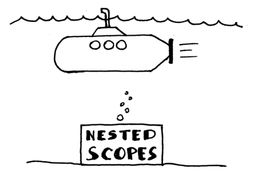  

以下是我们今天将会学习的知识点：  
- 学习作用域。作用域为什么有用，以及如何在代码中通过符号表实现作用域；  
- 学习嵌套的作用域。如何通过链式作用域符号表实现嵌套的作用域；  
- 学习如何解析带形参的过程声明，如何用代码中表示过程的符号；  
- 学习通过扩展语义分析器对嵌套的作用域做语义检查；  
- 学习更多的符号名解析，以及在嵌套的作用域中语义分析器是如何解析符号的声明的；  
- 学习构建作用域树；  
- 学习编写我们自己的源到源（source-to-source, S2S）编译器，稍后会看到它跟我们作用域话题之间的关系。  

所以，现在，开始（下潜）！  

> ## 目录  
> - [作用域与作用域符号表](#作用域与作用域符号表)  
> - [带有形参的过程声明](#带有形参的过程声明)  
> - [过程的符号](#过程的符号)  
> - [嵌套的作用域](#嵌套的作用域)  
> - [作用域树：链式的作用域符号表](#作用域树链式的作用域符号表) 
> - [嵌套的作用域与符号名解析](#嵌套的作用域与符号名解析)  
> - [源到源的编译器](#源到源的编译器)  
> - [总结](#总结)  
> - [练习](#练习)

## 作用域与作用域符号表  
什么是作用域？作用域是一段文本区域，其中可以使用某个符号名，以下面程序代码为例：  
```pascal
program Main;
   var x, y: integer;
begin
   x := x + y;
end.
```

在Pascal 语言中，`PROGRAM` 关键字（大小写不敏感）会引入一个全局作用域`global`，所以上面的程序中有一个global 作用域，作用域中声明了变量x 和变量y。这两个变量在整个程序中都可以访问。在上面的例子中，从`program` 关键字开始，到`end.` 结束的文本区域中，变量x 和变量y 都能被合法使用，所以这两个变量（声明）的作用域就是整个程序：  
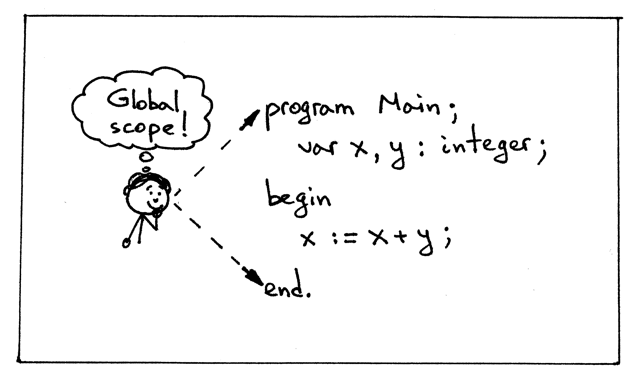  

当你看上面源码，尤其是赋值表达式`x := x+y` 时，能够直观地意识到代码能够顺利通过编译。因为表达式在全局作用域中，变量x、y 都能找到自己的声明。这在主流的编程语言中很常见。  
在我们讨论变量的作用域时，总是在讨论其声明语句的作用范围：  
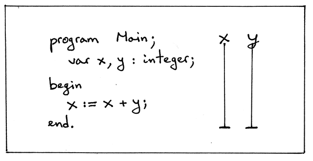  

上图中的竖线代表了变量的作用域，变量x、y 可以被合法使用的文本区域，也就是整个程序。  

Pascal 程序属于词法作用域（也叫静态作用域），因为我们可以仅凭源码，而不需要实际执行程序就能确定声明的符号的作用区域。在Pascal 中，诸如`program` 和`end` 关键字一般用来确定作用域的边界：  
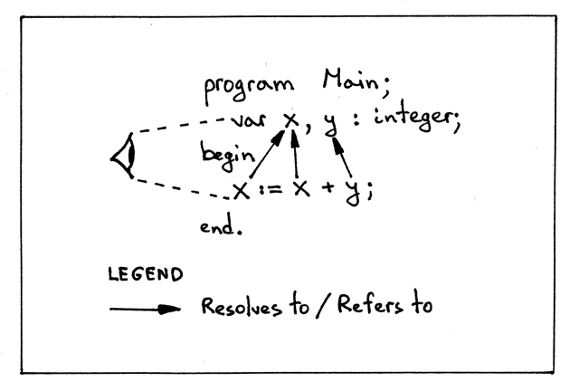  

为什么作用域会有用呢？  
- 每个作用域都会创建一个独立的命名空间，内部声明的变量无法从外部访问到；  
- 在不同的作用域中，可以重用符号名；  
- 在嵌套的作用域中可以重新声明符号，这样会遮蔽掉外部作用域的符号声明。让我们有效地控制对来自不同作用域的变量的访问。  

除了全局作用域global 之外，Pascal 还支持嵌套的过程声明，每个过程都会引入一个作用域，也就是说Pascal 支持嵌套的作用域。  

当我们讨论作用域时，讨论作用于的嵌套深度要比展示它们的嵌套关系更方便。所以我们使用作用域的名字和嵌套深度来讨论嵌套的作用域。  

接下来看一下下面的示例程序，为了清晰起见，每个符号都被打了下标：  
1. 下标表示符号被声明的作用域的嵌套深度；  
2. 变量的引用指向哪个声明、在哪个嵌套深度。  

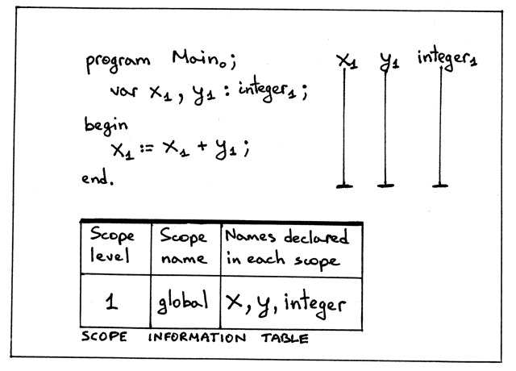

从上图中，我们可以看到：  
- 通过PROGRAM 关键字，我们引入了一个全局作用域global；  
- 全局作用域global 的嵌套深度是1；  
- 变量x、y 声明在lv1，也就是global 作用域中；  
- 内置的整数类型也在lv1 被声明；  
- 程序名Main 的下标是0。你也许会好奇为啥是0？只是为了明确一个概念：程序名不在全局作用域，而是在比全局作用域更外层；  
- 通过竖线可以看到，变量x、y 的作用域是整个程序；  
- 作用域信息表展示了每个作用域的名字、嵌套深度以及内部声明的符号。该表可以直观地展示程序中的各种作用域信息。  

如何在代码中实现这些概念呢？这里我们需要通过作用域符号表（scoped symbol table）实现。我们只需对普通的符号表做少许改变就能实现作用域符号表。  

> 从现在开始，作者使用作用域（scope）表示作用域和作用域符号表的的概念。尽管在代码中scope 表示一个作用域符号表（ScopedSymbolTable）的实例对象，为了方便起见，作者仍然会使用scope 的简称，而不是scope symble table 对象。但是在译文中我会尽量将它们分开的。  

Okay，接下来我们重命名`SymbolTable` 类为`ScopedSymbolTable`，并且添加`scope_level`、`scope_name` 的属性，更新构造函数、`__str__` 方法，下面是我们新版的符号表——作用域符号表的源码：  
```python
class ScopedSymbolTable(object):
    def __init__(self, scope_name, scope_level):
        """
        构造函数接收更多的参数
        """
        self._symbols = OrderedDict()
        self.scope_name = scope_name
        self.scope_level = scope_level
        self._init_builtins()

    def _init_builtins(self):
        self.insert(BuiltinTypeSymbol('INTEGER'))
        self.insert(BuiltinTypeSymbol('REAL'))

    def __str__(self):
        """
        用于打印更多的信息，同时使输出更加美观
        """
        h1 = 'SCOPE (SCOPED SYMBOL TABLE)'
        lines = ['\n', h1, '=' * len(h1)]  # 拼接字符串的风格好好玩：'=' * len(h1)
        for header_name, header_value in (
            ('Scope name', self.scope_name),
            ('Scope level', self.scope_level),
        ):
            lines.append('%-15s: %s' % (header_name, header_value))
        h2 = 'Scope (Scoped symbol table) contents'
        lines.extend([h2, '-' * len(h2)])
        lines.extend(
            ('%7s: %r' % (key, value))
            for key, value in self._symbols.items()
        )
        lines.append('\n')
        s = '\n'.join(lines)
        return s

    __repr__ = __str__

    def insert(self, symbol):
        print('Insert: %s' % symbol.name)
        self._symbols[symbol.name] = symbol

    def lookup(self, name):
        print('Lookup: %s' % name)
        symbol = self._symbols.get(name)
        # 'symbol' is either an instance of the Symbol class or None
        return symbol
```  

同时我们还需要更新我们的语义分析器，使用更新后的ScopedSymbolTable 作用域符号表，并且暂时移除重复变量声明的错误检查以便于调试，后面会再恢复的。  

下面是在语义分析器中初始化ScopedSymbolTable 作用域符号表的部分代码：  
```python
class SemanticAnalyzer(NodeVisitor):
    def __init__(self):
        self.scope = ScopedSymbolTable(scope_name='global', scope_level=1)

    ...
```

你可以在[scope01.py](https://github.com/rspivak/lsbasi/blob/master/part14/scope01.py) 中找到全部源码，也可以下载后在命令行中执行并检查输出：  
```shell-session
$ python scope01.py
Insert: INTEGER
Insert: REAL
Lookup: INTEGER
Insert: x
Lookup: INTEGER
Insert: y
Lookup: x
Lookup: y
Lookup: x


SCOPE (SCOPED SYMBOL TABLE)
===========================
Scope name     : global
Scope level    : 1
Scope (Scoped symbol table) contents
------------------------------------
INTEGER: <BuiltinTypeSymbol(name='INTEGER')>
   REAL: <BuiltinTypeSymbol(name='REAL')>
      x: <VarSymbol(name='x', type='INTEGER')>
      y: <VarSymbol(name='y', type='INTEGER')>
```

看起来很熟悉对不对？现在你知道了作用域的概念，以及怎么通过作用域符号表在代码中实现作用域。下面我们会讨论嵌套的作用域，以及对作用域符号表更多的修改和扩展。


## 带有形参的过程声明  
下面的示例程序[nestedscopes02.pas](https://github.com/rspivak/lsbasi/blob/master/part14/nestedscopes02.pas) 包含一个过程的声明：  
```pascal
program Main;
   var x, y: real;

   procedure Alpha(a : integer);
      var y : integer;
   begin
      x := a + x + y;
   end;

begin { Main }

end.  { Main }
```  

首先可以看到，我们这次声明的过程包含一个参数。在继续讨论作用域之前，我们先学习如何处理/解析带形参的过程的声明。  

> 注：  
> 形参Formal Parameter 表示过程/函数在定义时的参数  
> 实参Argument 表示过程/函数在被调用时传入的变量或表达式  

于是我们需要对我们解释器的代码做出一些改变：  
1. 新增`Param` 节点类型：  
    ```python
    class Param(AST):
        def __init__(self, var_node, type_node):
            self.var_node = var_node
            self.type_node = type_node
    ```  
2. 更新`ProcedureDecl` 结点的构造函数，以接收参数：  
    ```python
    class ProcedureDecl(AST):
        def __init__(self, proc_name, params, block_node):
            self.proc_name = proc_name
            self.params = params  # a list of Param nodes
            self.block_node = block_node
    ```  
3. 更新语法分析器中相应的`declarations` 规则，添加解析参数的部分： 
    ```python
    def declarations(self):
        """declarations : (VAR (variable_declaration SEMI)+)*
                        | (PROCEDURE ID (LPAREN formal_parameter_list RPAREN)? SEMI block SEMI)*
                        | empty
        """
    ```
4. 添加`formal_parameter_list` 规则，因为可能不止一条形参声明语句：  
    ```python
    def formal_parameter_list(self):
        """ formal_parameter_list : formal_parameters
                                | formal_parameters SEMI formal_parameter_list
        """
    ```
5. 添加`formal_parameters` 规则，因为同一种类型的形参可能不止一个：  
    ```python
    def formal_parameters(self):
        """ formal_parameters : ID (COMMA ID)* COLON type_spec """
        param_nodes = []
    ```

通过上面新增的节点和方法，我们的语法分析器可以解析下面的的过程声明了。（简单起见，只写了过程头，而没写过程体）  
```pascal
procedure Foo;

procedure Foo(a : INTEGER);

procedure Foo(a, b : INTEGER);

procedure Foo(a, b : INTEGER; c : REAL);
```

可以通过[genastdot.py](https://github.com/rspivak/lsbasi/blob/master/part14/genastdot.py) 生成抽象语法树的可视化数据结构图：  
```shell-session
$ python genastdot.py nestedscopes02.pas > ast.dot && dot -Tpng -o ast.png ast.dot
```  

结果如下：  
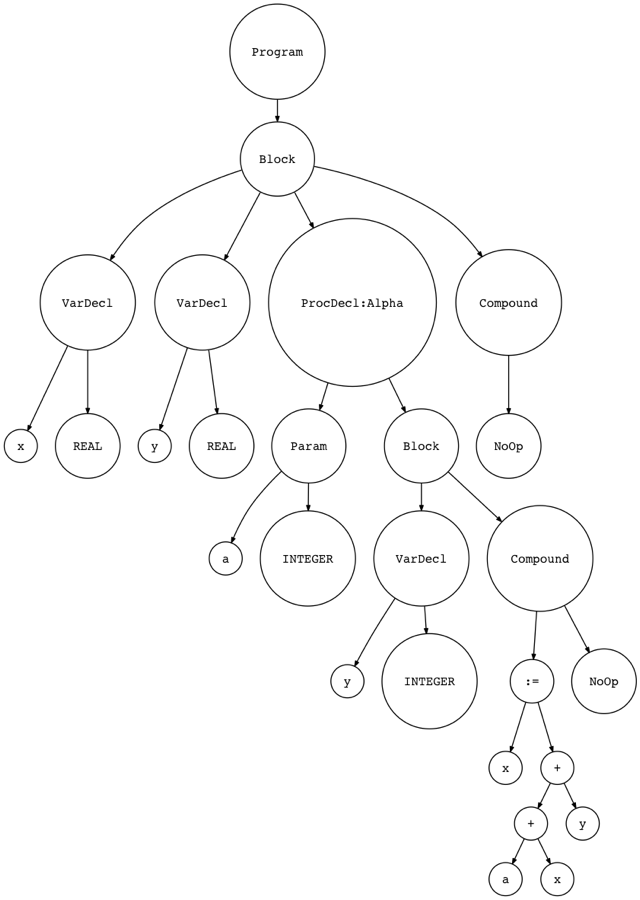  

可以看到，现在我们的ProcedureDecl 节点包含一个Param 子节点。可以在[spi.py](https://github.com/rspivak/lsbasi/blob/master/part14/spi.py) 中找到所有改变。可以仔细研究一下，因为我们之前也做过类似的事情，相信自己动手去实现也不是什么难事。  

## 过程的符号  
既然我们在讨论过程声明，那么也来看一下过程的符号吧。与变量的声明、内置类型的声明一致。我们会创建一个新的Symbol 类：  
```python
class ProcedureSymbol(Symbol):
    def __init__(self, name, params=None):
        super(ProcedureSymbol, self).__init__(name)
        # a list of formal parameters
        self.params = params if params is not None else []

    def __str__(self):
        return '<{class_name}(name={name}, parameters={params})>'.format(
            class_name=self.__class__.__name__,
            name=self.name,
            params=self.params,
        )

    __repr__ = __str__
```

过程符号的类别是procedure，接收过程名作为符号名，类型同样是None。因为我们不需要用到type 属性。过程符号也可以附带更所的信息，例如在上面代码中包含有形参的信息。现在我们的符号层级关心如下：  
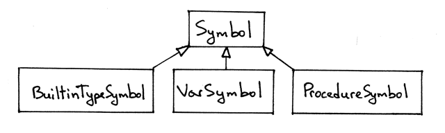  

## 嵌套的作用域  
现在我们回到嵌套的作用域的话题上来：  
```pascal
program Main;
   var x, y: real;

   procedure Alpha(a : integer);
      var y : integer;
   begin
      x := a + x + y;
   end;

begin { Main }

end.  { Main }
```  

事情到这里就有意思起来了。通过声明过程，我们引入了一个作用域。这个作用于被嵌套在global 作用域内部。而global 是由PROGRAM 关键字引入的。  

过程（所引入的）作用域是整个过程体，从`procedure` 关键字开始，到最近的、匹配的`end;` 关键字结束。如下图我们可以给程序中的符号名打上下标：   
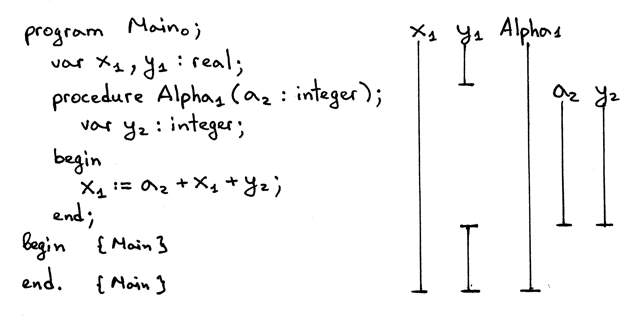  
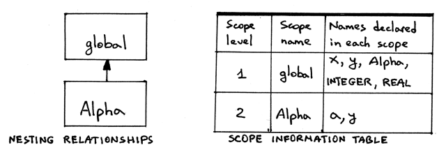  

从上图中，可以看到：  
- 这段程序有两个作用域：lv1 和lv2；  
- 嵌套关系如图所示：作用域Alpha 的深度是lv2，嵌套在深度为lv1 的global 作用域中；  
- 过程名的下标比其内部的变量的下标少1。即Alpha 所在的深度为lv2，a 的深度确实lv2；  
- Alpha 作用域内部声明的变量y 遮蔽了外部的y 变量。在图中看就是y2 替换了y1 的某一部分；  
- 作用域信号表包括了作用域的名字、深度和内部变量等信息；  
- 在图中，你可能意识到我忽略的内置类型的符号，其实它们是在lv1 也就是global 作用域的。因为总是在全局作用域，所以我们就不写了，但是你能在global 作用域中看到它们。  

接下来是实现的细节。首先我们看变量和过程的声明，然后我们讨论存在嵌套作用域时变量引用和符号名解析的实现。  

由于暂时用不到变量的引用，所以我们以简化的Pascal 源码为例：  
```pascal
program Main;
   var x, y: real;

   procedure Alpha(a : integer);
      var y : integer;
   begin

   end;

begin { Main }

end.  { Main }
```

我们已经知道可以在代码中使用作用域符号表表示一个作用域，现在我们有两个作用域：global 和alpha。于是我们需要两个作用域符号表。该怎么实现呢？我们需要扩展语义分析器，在每个作用域遮蔽global 作用于的时候就创建一个作用域符号表。一般来说，这个过程会在遍历AST 时进行。  

首先，我们需要确定在什么地方创建作用域符号表。回想一下PROGRAM 和PROCEDURE 关键字会引入新的作用域。所以我们需要在visit_Program 和visit_Procedure 方法中创建作用域符号表。以visit_Program 方法为例：  
```python
def visit_Program(self, node):
    print('ENTER scope: global')
    global_scope = ScopedSymbolTable(
        scope_name='global',
        scope_level=1,
    )
    self.current_scope = global_scope

    # visit subtree
    self.visit(node.block)

    print(global_scope)
    print('LEAVE scope: global')
```  

方法的改动不多：  
1. 当访问Program 节点时，打印进入global 作用域的信息  
2. 创建一个单独的global 作用域符号表，名字和深度都是固定的  
3. 将新创建的作用域符号表设置为当前符号表  
4. 继续遍历子节点
5. 打印global 作用域符号表的内容  
6. 在退出该方法之前打印退出global 作用域的信息  

> 译注：这里缺少了恢复当前作用域的步骤，最后面文章会补上。  

下面是完整的visit_Procedure 方法的代码：  
```python
def visit_ProcedureDecl(self, node):
    proc_name = node.proc_name
    proc_symbol = ProcedureSymbol(proc_name)
    self.current_scope.insert(proc_symbol)

    print('ENTER scope: %s' %  proc_name)
    # Scope for parameters and local variables
    procedure_scope = ScopedSymbolTable(
        scope_name=proc_name,
        scope_level=2,
    )
    self.current_scope = procedure_scope

    # Insert parameters into the procedure scope
    for param in node.params:
        param_type = self.current_scope.lookup(param.type_node.value)
        param_name = param.var_node.value
        var_symbol = VarSymbol(param_name, param_type)
        self.current_scope.insert(var_symbol)
        proc_symbol.params.append(var_symbol)

    self.visit(node.block_node)

    print(procedure_scope)
    print('LEAVE scope: %s' %  proc_name)
```  

逐步分析该方法：  
1. 在进入方法时会创建作用域符号，并将其插入到当前作用域符号表（此例中是global）  
2. 打印进入作用域的信息  
3. 创建新的作用域符号表  
4. 将新创建的作用于符号表设置为当前符号表  
5. 依次向符号表中添加形参符号  
6. 继续遍历子节点  
7. 最终退出前打印新创建的作用域符号表的内容和退出信息  

> 译注：这里同样缺少了退出前恢复当前符号表的操作   

现在我们需要更新语义分析器，使用`self.current_scope` 作用域符号表插入和检索符号了：  
```python
def visit_VarDecl(self, node):
    type_name = node.type_node.value
    type_symbol = self.current_scope.lookup(type_name)

    # We have all the information we need to create a variable symbol.
    # Create the symbol and insert it into the symbol table.
    var_name = node.var_node.value
    var_symbol = VarSymbol(var_name, type_symbol)

    self.current_scope.insert(var_symbol)

def visit_Var(self, node):
    var_name = node.value
    var_symbol = self.current_scope.lookup(var_name)
    if var_symbol is None:
        raise Exception(
            "Error: Symbol(identifier) not found '%s'" % var_name
        )
```

上面两个方法都会在当前作用域符号表中检索符号的定义或者插入符号。在我们的示例程序中，当前作用域符号表指向global 或Alpha 其中的一个。在语义分析器的构造函数中，我们将`current_scope` 当前作用域符号表设为None：  
```python
class SemanticAnalyzer(NodeVisitor):
    def __init__(self):
        self.current_scope = None
```

克隆本文的[代码仓库](https://github.com/rspivak/lsbasi)，运行[scope02.py](https://github.com/rspivak/lsbasi/blob/master/part14/scope02.py)，检查输出是否符合预期：   
```hell-session
$ python scope02.py
ENTER scope: global
Insert: INTEGER     # 内置类型
Insert: REAL        # 内置类型
Lookup: REAL
Insert: x
Lookup: REAL
Insert: y
Insert: Alpha
ENTER scope: Alpha
Insert: INTEGER     # 内置类型被重复添加
Insert: REAL        # 内置类型被重复添加  
Lookup: INTEGER
Insert: a
Lookup: INTEGER
Insert: y


SCOPE (SCOPED SYMBOL TABLE)
===========================
Scope name     : Alpha
Scope level    : 2
Scope (Scoped symbol table) contents
------------------------------------
INTEGER: <BuiltinTypeSymbol(name='INTEGER')>
   REAL: <BuiltinTypeSymbol(name='REAL')>
      a: <VarSymbol(name='a', type='INTEGER')>
      y: <VarSymbol(name='y', type='INTEGER')>


LEAVE scope: Alpha


SCOPE (SCOPED SYMBOL TABLE)
===========================
Scope name     : global
Scope level    : 1
Scope (Scoped symbol table) contents
------------------------------------
INTEGER: <BuiltinTypeSymbol(name='INTEGER')>
   REAL: <BuiltinTypeSymbol(name='REAL')>
      x: <VarSymbol(name='x', type='REAL')>
      y: <VarSymbol(name='y', type='REAL')>
  Alpha: <ProcedureSymbol(name=Alpha, parameters=[<VarSymbol(name='a', type='INTEGER')>])>


LEAVE scope: global
```  

关于上面的输出，有些地方值得着重强调一下：  
1. 我们可以看到两条记录：` Insert: INTEGER` 和`nsert: REAL` 重复出现，这是因为它们在global 和Alpha 作用域符号表被创建时都被创建并添加进当前符号表。后面我们会修复它，并且学习如何在链式嵌套的符号表中表示。  
2. `Insert: Alpha` 比`ENTER scope: Alpha` 更早执行，是为了说明符号表的符号会先被添加到上一级的符号表中。  
3. 作用域符号表的打印内容中包含它们内部声明的变量（包括形参）。  
4. 全局符号表中的Alpha 符号还包含有其参数信息。  

程序运行后，我们的作用域符号表在内存中大概会是这个样子：  
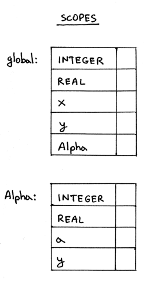


## 作用域树：链式的作用域符号表    

Okay，现在我们对于每个作用域都创建了单独的作用域符号表。那么我们应该如何表示global 作用域和Alpha 作用域间的嵌套关系呢？换句话说，我们在代码中应该怎么将Alpha 作用域嵌套进global 作用域呢？答案就是将它们链接到一起。想象一下链表的链。  

我们将会通过创建链接（link）来连接不同的作用域符号表。在某种意义上来说，最终的形式会像一棵树，只不过是从子节点指向根节点。下面就是作用域符号表树（scope tree）的图示：  
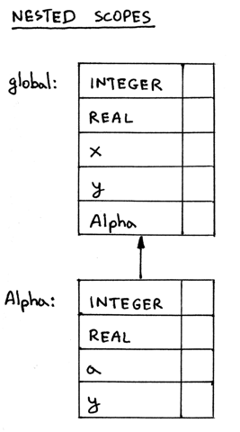  

我们该如何实现作用域符号表的链接呢？主要有两步：  
1. 我们需要更新`ScopedSymbolTable` 类，添加一个外部作用域的字段`enclosing_scope` 用于指向更外层的作用域。通过该字段，就能将不同的作用域（符号表）连接起来。  
2. 我们需要更新`visit_Program` 和`visit_Procedure` 方法去将符号表的`enclosing_scope` 真正地指向外部作用域。  

下面就开始更新`ScopedSymbolTable` 类，同时也更新`__init__` 构造方法接收外部的作用域信息，默认是None；以及`__str__` 方法来打印完整的调试信息：  
```python
class ScopedSymbolTable(object):
    def __init__(self, scope_name, scope_level, enclosing_scope=None):
        self._symbols = OrderedDict()
        self.scope_name = scope_name
        self.scope_level = scope_level
        self.enclosing_scope = enclosing_scope
        self._init_builtins()

    def _init_builtins(self):
        self.insert(BuiltinTypeSymbol('INTEGER'))
        self.insert(BuiltinTypeSymbol('REAL'))

    def __str__(self):
        h1 = 'SCOPE (SCOPED SYMBOL TABLE)'
        lines = ['\n', h1, '=' * len(h1)]
        for header_name, header_value in (
            ('Scope name', self.scope_name),
            ('Scope level', self.scope_level),
            ('Enclosing scope',
             self.enclosing_scope.scope_name if self.enclosing_scope else None
            )
            # 看这里，类似于三目运算符'?:' 的运算
            # var = sth IF condition ELSE other
        ):
            lines.append('%-15s: %s' % (header_name, header_value))
        h2 = 'Scope (Scoped symbol table) contents'
        lines.extend([h2, '-' * len(h2)])
        lines.extend(
            ('%7s: %r' % (key, value))
            for key, value in self._symbols.items()
        )
        lines.append('\n')
        s = '\n'.join(lines)
        return s

    __repr__ = __str__

    def insert(self, symbol):
        print('Insert: %s' % symbol.name)
        self._symbols[symbol.name] = symbol

    def lookup(self, name):
        print('Lookup: %s' % name)
        symbol = self._symbols.get(name)
        # 'symbol' is either an instance of the Symbol class or None
        return symbol
```  

接下来进行第二步，修改`visit_Program` 方法：  
```python
def visit_Program(self, node):
    print('ENTER scope: global')
    global_scope = ScopedSymbolTable(
        scope_name='global',
        scope_level=1,
        enclosing_scope=self.current_scope, # None
    )
    self.current_scope = global_scope

    # visit subtree
    self.visit(node.block)

    print(global_scope)

    self.current_scope = self.current_scope.enclosing_scope
    # 注意这里恢复了当前的作用域指向  
    print('LEAVE scope: global')
```  

以下几点需要尤其注意：  
1. 在刚进入方法时，语义分析器的`self.current_scope` 仍然指向外部的作用域；  
2. 随后我们创建新的作用域并赋值给当前作用域`self.current_scope`；  
3. 在离开该方法之前，我们需要恢复`self.current_scope` 重新指向外部作用域。否则我们的作用域树的结构将会被破坏（在多与两个作用域存在的情况），稍后就会看到。  

最后，更新下`visit_Procedure` 方法：  
```python
def visit_ProcedureDecl(self, node):
    proc_name = node.proc_name
    proc_symbol = ProcedureSymbol(proc_name)
    self.current_scope.insert(proc_symbol)

    print('ENTER scope: %s' %  proc_name)
    # Scope for parameters and local variables
    procedure_scope = ScopedSymbolTable(
        scope_name=proc_name,
        scope_level=self.current_scope.scope_level + 1,
        enclosing_scope=self.current_scope
    )
    self.current_scope = procedure_scope

    # Insert parameters into the procedure scope
    for param in node.params:
        param_type = self.current_scope.lookup(param.type_node.value)
        param_name = param.var_node.value
        var_symbol = VarSymbol(param_name, param_type)
        self.current_scope.insert(var_symbol)
        proc_symbol.params.append(var_symbol)

    self.visit(node.block_node)

    print(procedure_scope)

    self.current_scope = self.current_scope.enclosing_scope
    print('LEAVE scope: %s' %  proc_name)
```  

再次说明，对比于[scope02.py](https://github.com/rspivak/lsbasi/blob/master/part14/scope02.py) 我们的python 代码主要有以下改动：  
1. 在创建作用域时，语义分析器的`self.current_scope` 仍然指向外部的作用域；  
2. 我们不再硬编码作用域的嵌套深度，而是让其根据外层作用域的深度自增；  
3. 在离开`visit_Procedure` 方法之前，我们需要恢复`self.current_scope` 的指向。  

Okay，下面我们通过[scope03a.py](https://github.com/rspivak/lsbasi/blob/master/part14/scope03a.py) 运行下面Pascal 程序，你可以看到符号表中的内容：  
```pascal
program Main;
   var x, y: real;

   procedure Alpha(a : integer);
      var y : integer;
   begin

   end;

begin { Main }

end.  { Main }
```  

检查输出是否符合预期：  
```shell-session
$ python scope03a.py
ENTER scope: global
Insert: INTEGER
Insert: REAL
Lookup: REAL
Insert: x
Lookup: REAL
Insert: y
Insert: Alpha
ENTER scope: Alpha
Insert: INTEGER
Insert: REAL
Lookup: INTEGER
Insert: a
Lookup: INTEGER
Insert: y


SCOPE (SCOPED SYMBOL TABLE)
===========================
Scope name     : Alpha
Scope level    : 2
Enclosing scope: global
Scope (Scoped symbol table) contents
------------------------------------
INTEGER: <BuiltinTypeSymbol(name='INTEGER')>
   REAL: <BuiltinTypeSymbol(name='REAL')>
      a: <VarSymbol(name='a', type='INTEGER')>
      y: <VarSymbol(name='y', type='INTEGER')>


LEAVE scope: Alpha


SCOPE (SCOPED SYMBOL TABLE)
===========================
Scope name     : global
Scope level    : 1
Enclosing scope: None
Scope (Scoped symbol table) contents
------------------------------------
INTEGER: <BuiltinTypeSymbol(name='INTEGER')>
   REAL: <BuiltinTypeSymbol(name='REAL')>
      x: <VarSymbol(name='x', type='REAL')>
      y: <VarSymbol(name='y', type='REAL')>
  Alpha: <ProcedureSymbol(name=Alpha, parameters=[<VarSymbol(name='a', type='INTEGER')>])>


LEAVE scope: global
```  

可以看到global 作用域没有更外层的作用域，而Alpha 作用域外面是global，也是我们预期的样子。现在看，为什么需要在离开`visit_Program` 和`visit_Procedure` 前要恢复语义分析器`self.current_scope` 的指向吧：  
```pascal
program Main;
   var x, y : real;

   procedure AlphaA(a : integer);
      var y : integer;
   begin { AlphaA }

   end;  { AlphaA }

   procedure AlphaB(a : integer);
      var b : integer;
   begin { AlphaB }

   end;  { AlphaB }

begin { Main }

end.  { Main }
```

在上面代码中，作用域的嵌套关系如下图所示：  
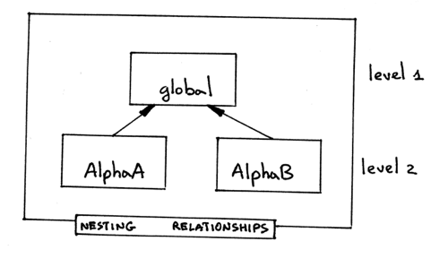  

语法分析器生成的抽象语法树（只保留了节点信息）应如下图所示：  
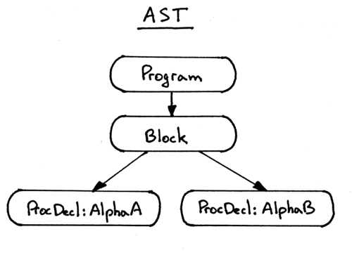  

如果在离开上述两个方法之前没有恢复`self.current_scope` 的指向会发生什么情况呢？  

首先明确一点，我们的语义分析器在遍历AST 抽象语法树时采用的是从左至右、深度优先的策略，所以它会首先便利AlphaA，进而遍历AlphaB 节点。问题在于，如果我们在退出AlphaA 之前如果不讲current_scope 恢复至外层作用域global，那么语义分析器将会把AlphaB 的作用域嵌套进AlphaA 的，形成三层的结构，但我们需要的是AlphaA 与AlphaB 在相同的深度。所以这样是不对的。  

我们也可以通过禁用了恢复当前作用域的[scope03b.py](https://github.com/rspivak/lsbasi/blob/master/part14/scope03b.py) 来看一下语义分析器的行为：  
```shell-session
$ python scope03b.py
ENTER scope: global
Insert: INTEGER
Insert: REAL
Lookup: REAL
Insert: x
Lookup: REAL
Insert: y
Insert: AlphaA
ENTER scope: AlphaA
Insert: INTEGER
Insert: REAL
Lookup: INTEGER
Insert: a
Lookup: INTEGER
Insert: y


SCOPE (SCOPED SYMBOL TABLE)
===========================
Scope name     : AlphaA
Scope level    : 2
Enclosing scope: global
Scope (Scoped symbol table) contents
------------------------------------
INTEGER: <BuiltinTypeSymbol(name='INTEGER')>
   REAL: <BuiltinTypeSymbol(name='REAL')>
      a: <VarSymbol(name='a', type='INTEGER')>
      y: <VarSymbol(name='y', type='INTEGER')>


LEAVE scope: AlphaA
Insert: AlphaB
ENTER scope: AlphaB
Insert: INTEGER
Insert: REAL
Lookup: INTEGER
Insert: a
Lookup: INTEGER
Insert: b


SCOPE (SCOPED SYMBOL TABLE)
===========================
Scope name     : AlphaB
Scope level    : 3
Enclosing scope: AlphaA
Scope (Scoped symbol table) contents
------------------------------------
INTEGER: <BuiltinTypeSymbol(name='INTEGER')>
   REAL: <BuiltinTypeSymbol(name='REAL')>
      a: <VarSymbol(name='a', type='INTEGER')>
      b: <VarSymbol(name='b', type='INTEGER')>


LEAVE scope: AlphaB


SCOPE (SCOPED SYMBOL TABLE)
===========================
Scope name     : global
Scope level    : 1
Enclosing scope: None
Scope (Scoped symbol table) contents
------------------------------------
INTEGER: <BuiltinTypeSymbol(name='INTEGER')>
   REAL: <BuiltinTypeSymbol(name='REAL')>
      x: <VarSymbol(name='x', type='REAL')>
      y: <VarSymbol(name='y', type='REAL')>
 AlphaA: <ProcedureSymbol(name=AlphaA, parameters=[<VarSymbol(name='a', type='INTEGER')>])>


LEAVE scope: global
```  

可以看到，在出现两个以上的作用域时，作用域树的结构完全被破环掉了：  
> 译注：更确切地说，是出现并列的作用域时，如果不恢复current_scope 到外部作用域，就会破坏作用域的并列关系。  

1. 我们现在有三层深度的嵌套关系，而不是两层；  
2. Global 作用域内部只包含AlphaA 而没有AlphaB。  

为了正确地构造作用域树，我们需要在遍历过程声明时：  
1. 进入方法时创建作用域，并赋值给当前作用域`self.current_scope`  
2. 在退出方法之前，恢复`self.curren_scope` 指向原先的作用域。  

看到这里有没有想到计算机里面的一种常用数据结构：栈：  
1. 遍历Program 和ProcedureDecl 节点时，将`self.current_scope` 压栈，并创建新的作用域赋值给它；  
2. 在离开节点时，弹出最近的作用域并重新赋值给`self.current_scope`。  

通过运行[scope03c.py](https://github.com/rspivak/lsbasi/blob/master/part14/scope03c.py) 可以看到语义分析器正确的行为：  
```shel-session
$ python scope03c.py
ENTER scope: global
Insert: INTEGER
Insert: REAL
Lookup: REAL
Insert: x
Lookup: REAL
Insert: y
Insert: AlphaA
ENTER scope: AlphaA
Insert: INTEGER
Insert: REAL
Lookup: INTEGER
Insert: a
Lookup: INTEGER
Insert: y


SCOPE (SCOPED SYMBOL TABLE)
===========================
Scope name     : AlphaA
Scope level    : 2
Enclosing scope: global
Scope (Scoped symbol table) contents
------------------------------------
INTEGER: <BuiltinTypeSymbol(name='INTEGER')>
   REAL: <BuiltinTypeSymbol(name='REAL')>
      a: <VarSymbol(name='a', type='INTEGER')>
      y: <VarSymbol(name='y', type='INTEGER')>


LEAVE scope: AlphaA
Insert: AlphaB
ENTER scope: AlphaB
Insert: INTEGER
Insert: REAL
Lookup: INTEGER
Insert: a
Lookup: INTEGER
Insert: b


SCOPE (SCOPED SYMBOL TABLE)
===========================
Scope name     : AlphaB
Scope level    : 2
Enclosing scope: global
Scope (Scoped symbol table) contents
------------------------------------
INTEGER: <BuiltinTypeSymbol(name='INTEGER')>
   REAL: <BuiltinTypeSymbol(name='REAL')>
      a: <VarSymbol(name='a', type='INTEGER')>
      b: <VarSymbol(name='b', type='INTEGER')>


LEAVE scope: AlphaB


SCOPE (SCOPED SYMBOL TABLE)
===========================
Scope name     : global
Scope level    : 1
Enclosing scope: None
Scope (Scoped symbol table) contents
------------------------------------
INTEGER: <BuiltinTypeSymbol(name='INTEGER')>
   REAL: <BuiltinTypeSymbol(name='REAL')>
      x: <VarSymbol(name='x', type='REAL')>
      y: <VarSymbol(name='y', type='REAL')>
 AlphaA: <ProcedureSymbol(name=AlphaA, parameters=[<VarSymbol(name='a', type='INTEGER')>])>
 AlphaB: <ProcedureSymbol(name=AlphaB, parameters=[<VarSymbol(name='a', type='INTEGER')>])>


LEAVE scope: global
```

在运行脚本后，正确的作用域的结构应如下图所示：  
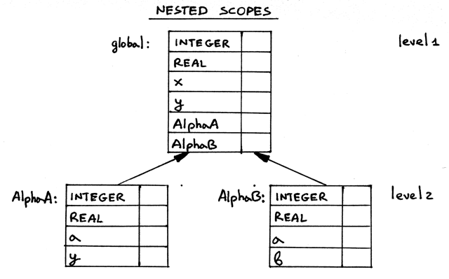  

就是，可以把当前作用域的切换过程类比为栈操作。下面继续看嵌套的作用域与其中符号名的解析部分。

## 嵌套的作用域与符号名解析  
在此之前，我们一直关注变量和过程的声明，现在我们一并讨论变量的引用。以下面程序为例：  
```pascall
program Main;
   var x, y: real;

   procedure Alpha(a : integer);
      var y : integer;
   begin
      x := a + x + y;
   end;

begin { Main }

end.  { Main }
```  

直观的，作用域相关信息如下图所示：  
  
  

重点关注赋值表达式`x:=a+x+y;`，下图中有带下标标注：  
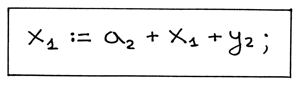  

我们可以看到，x 被声明的作用域的深度是lv1，而a 和y 被声明的作用域的深度是lv2。该如何解析呢？  

词法作用域（也叫静态作用域）在解析符号时遵循就近原则：如果在当前作用域没发现符号的声明，就会去上一层作用域寻找，直到找到了定义或者到达最外层的作用域。下面请看具体是如何操作的：  
1. 语义分析器首先会遍历赋值语句的右边表达式`a+x+y`。首先在最近的Alpha 作用域寻找a 的定义。由于a 是形参，在Alpha 中有声明，所以自然能找得到。结束。  
    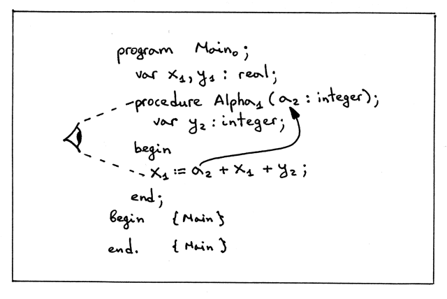
2. 继续寻找x。因为x 是在Program 中定义的，在当前Alpha 作用域中找不到定义，就会向上寻找global 作用域。最终在global 作用域成功找到。结束。  
    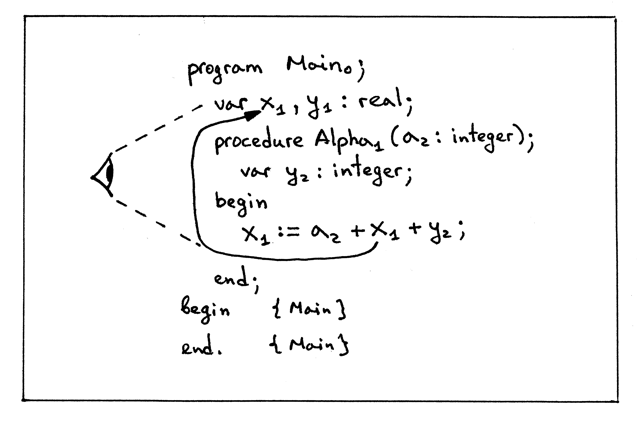
3. 接下来是y。因为y 属于Alpha 中声明的变量，所以可以找到定义，所在的作用域同a 一样是Alpha，深度是2。  
    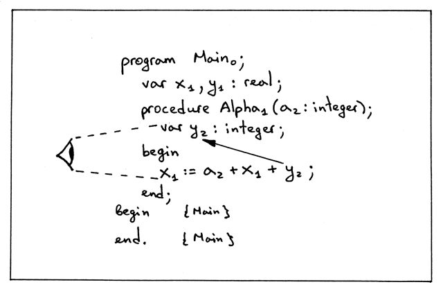
4. 最后，解析赋值表达式左边的变量x。同步骤2 一样，最后我们在global 作用域中找到了它的声明。  
    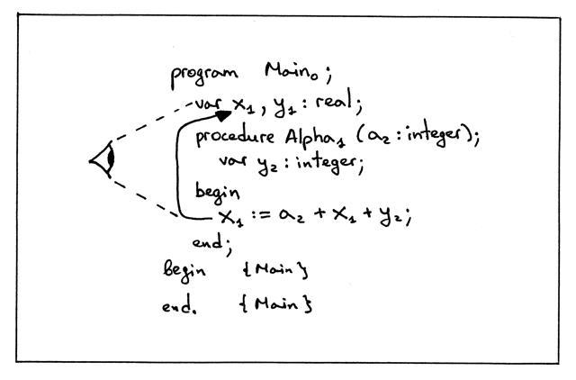

我们该如何实现这种递归式地向上查找？只需要在lookup 方法中做一些改动，让它在查找不到记录时返回外层作用域查找的德国就好了。  
```python
def lookup(self, name):
    print('Lookup: %s. (Scope name: %s)' % (name, self.scope_name))
    # 'symbol' is either an instance of the Symbol class or None
    symbol = self._symbols.get(name)

    if symbol is not None:
        return symbol

    # recursively go up the chain and lookup the name
    if self.enclosing_scope is not None:
        return self.enclosing_scope.lookup(name)

    # 严格来说最后还应该return None 的
```  

lookup 方法工作的机制：  
1. 在当前作用域查找符号，能找到就返回；  
2. 否则，调用外层作用域的lookup 方法进行查询。虽然没有明确写，但这确是递归地查询，知道遇到对应的定义或者知道作用域的树顶也无法找到定义；  
3. lookup 方法会打印当前作用域的名字，来清晰地显示当前它查找到那个作用域了。  


下载并运行[scope04a.py](https://github.com/rspivak/lsbasi/blob/master/part14/scope04a.py)，查看修改后的lookup 方法是如何运行的：  
```shell-session
$ python scope04a.py
ENTER scope: global
Insert: INTEGER
Insert: REAL
Lookup: REAL. (Scope name: global)
Insert: x
Lookup: REAL. (Scope name: global)
Insert: y
Insert: Alpha
ENTER scope: Alpha
Lookup: INTEGER. (Scope name: Alpha)
Lookup: INTEGER. (Scope name: global)
Insert: a
Lookup: INTEGER. (Scope name: Alpha)
Lookup: INTEGER. (Scope name: global)
Insert: y
Lookup: a. (Scope name: Alpha)
Lookup: x. (Scope name: Alpha)
Lookup: x. (Scope name: global)
Lookup: y. (Scope name: Alpha)
Lookup: x. (Scope name: Alpha)
Lookup: x. (Scope name: global)


SCOPE (SCOPED SYMBOL TABLE)
===========================
Scope name     : Alpha
Scope level    : 2
Enclosing scope: global
Scope (Scoped symbol table) contents
------------------------------------
      a: <VarSymbol(name='a', type='INTEGER')>
      y: <VarSymbol(name='y', type='INTEGER')>


LEAVE scope: Alpha


SCOPE (SCOPED SYMBOL TABLE)
===========================
Scope name     : global
Scope level    : 1
Enclosing scope: None
Scope (Scoped symbol table) contents
------------------------------------
INTEGER: <BuiltinTypeSymbol(name='INTEGER')>
   REAL: <BuiltinTypeSymbol(name='REAL')>
      x: <VarSymbol(name='x', type='REAL')>
      y: <VarSymbol(name='y', type='REAL')>
  Alpha: <ProcedureSymbol(name=Alpha, parameters=[<VarSymbol(name='a', type='INTEGER')>])>


LEAVE scope: global
```

检查上面的输出，并重点关注一下`ENTER` 和`Lookup` 的消息：  
1. 注意语义分析器是如何查找内置类型`INTEGER` 的。因为作者已经悄悄地将内置类型的生命转移到global 作用域了。  
    ```shell-session
    ENTER scope: Alpha
    Lookup: INTEGER. (Scope name: Alpha)
    Lookup: INTEGER. (Scope name: global)
    Insert: a
    ```
2. 注意解析赋值语句`x:=a+x+y;` 时的顺序：  
    ```shell-session
    Lookup: a. (Scope name: Alpha)
    Lookup: x. (Scope name: Alpha)
    Lookup: x. (Scope name: global)
    Lookup: y. (Scope name: Alpha)
    Lookup: x. (Scope name: Alpha)
    Lookup: x. (Scope name: global)
    ```  
    语义分析器重视从当前作用域开始检索，一直到global 为止（或者提前找到定义）。  

如果Pascal 代码中引用了未定义的变量，则语义分析器不能解析该变量：  
```pascal
program Main;
   var x, y: real;

   procedure Alpha(a : integer);
      var y : integer;
   begin
      x := b + x + y; { ERROR here! }
   end;

begin { Main }

end.  { Main }
```  

下载[scope04b.py](https://github.com/rspivak/lsbasi/blob/master/part14/scope04b.py) 并运行，我们可以看到如下信息：  
```shell-session
$ python scope04b.py
ENTER scope: global
Insert: INTEGER
Insert: REAL
Lookup: REAL. (Scope name: global)
Insert: x
Lookup: REAL. (Scope name: global)
Insert: y
Insert: Alpha
ENTER scope: Alpha
Lookup: INTEGER. (Scope name: Alpha)
Lookup: INTEGER. (Scope name: global)
Insert: a
Lookup: INTEGER. (Scope name: Alpha)
Lookup: INTEGER. (Scope name: global)
Insert: y
Lookup: b. (Scope name: Alpha)
Lookup: b. (Scope name: global)
Error: Symbol(identifier) not found 'b'
```  

可以看到，语义分析器试图在Alpha 作用域中检索变量b，失败后进入global 作用域继续检索，最终没有找到，于是抛出一个语义错误。

Great，现在我们已经掌握了如何让语义分析器分析嵌套作用域中的语义错误了！  


## 源到源的编译器  
下面来点新东西，写一个源到源的编译器！我们不是在讲嵌套作用域吗？怎么突然开始写编译器了？是的，但是现在开始写S2S 编译器是有好处的。

首先我们看什么是S2S 编译器。它是一种可以将一种语言的源代码翻译成另一种语言的源代码的工具。所以如果一个工具它能将Pascal 代码翻译成一种更加规范的形式，那它也是一种源到源的编译器。  

对于我们来说，目前只要能做到将Pascal 语言源码翻译成类Pascal 风格就好了。例如：给变量符号加上作用域的下标，在引用变量时注明变量的类型。以下面Pascal 源码为例：  
```pascal
program Main;
   var x, y: real;

   procedure Alpha(a : integer);
      var y : integer;
   begin
      x := a + x + y;
   end;

begin { Main }

end.  { Main }
```  
可以被翻译为：  
```pascal
program Main0;
   var x1 : REAL;
   var y1 : REAL;
   procedure Alpha1(a2 : INTEGER);
      var y2 : INTEGER;

   begin
      <x1:REAL> := <a2:INTEGER> + <x1:REAL> + <y2:INTEGER>;
   end; {END OF Alpha}

begin

end. {END OF Main}
```  

下面是我们的S2S 编译器将要对Pascal 源代码做的修改：  
1. 每一个变量的声明都被拆成一行。如果一条声明语句声明了多个变量，那么它将会被拆分为多条声明语句；  
2. 每一个符号都会被打上当前作用域的下标；  
3. 每一个变量的引用都会在后面注明变量的类型；  
4. 编译器还会在代码块结束时，添加注释，表明过程的边界。  

从上面的输出可以看出，我们的S2S 编译器可以帮助我们理解符号解析的过程，尤其是存在嵌套作用域的情况下，因为我们通过变量名的下标就可以看到变量在哪个作用域声明的。  

如何实现一个S2S 的编译器呢？其实我们已经学过所有必要的组件了，接下来就是扩展我们的语义分析器来生成这样一个输出。我们我们可以下载全部的[源码](https://github.com/rspivak/lsbasi/blob/master/part14/src2srccompiler.py)，通过AST 节点生成并以字符串的形式返回输出代码。  

下载[src2srccompiler.py](https://github.com/rspivak/lsbasi/blob/master/part14/src2srccompiler.py)，学习并尝试翻译不同的Pascal 源码。以下面代码为例：  
```pascal
program Main;
   var x, y : real;
   var z : integer;

   procedure AlphaA(a : integer);
      var y : integer;
   begin { AlphaA }
      x := a + x + y;
   end;  { AlphaA }

   procedure AlphaB(a : integer);
      var b : integer;
   begin { AlphaB }
   end;  { AlphaB }

begin { Main }
end.  { Main }
```  

我们的编译器将会产生如下的输出：  
```shell-session
$ python src2srccompiler.py nestedscopes03.pas
program Main0;
   var x1 : REAL;
   var y1 : REAL;
   var z1 : INTEGER;
   procedure AlphaA1(a2 : INTEGER);
      var y2 : INTEGER;

   begin
      <x1:REAL> := <a2:INTEGER> + <x1:REAL> + <y2:INTEGER>;
   end; {END OF AlphaA}
   procedure AlphaB1(a2 : INTEGER);
      var b2 : INTEGER;

   begin

   end; {END OF AlphaB}

begin

end. {END OF Main}
```  

恭喜你，现在我们已经写出了一个基本的S2S 编译器了。通过它可以加深对嵌套作用域、符号解析的理解，以及利用AST 和符号表信息我们可以做哪些事情。  

既然有了工具，那我们可以用一个稍微复杂点的程序[nextedscopes04.pas](https://github.com/rspivak/lsbasi/blob/master/part14/nestedscopes04.pas) 来做下测试：  
```pascal
program Main;
   var b, x, y : real;
   var z : integer;

   procedure AlphaA(a : integer);
      var b : integer;

      procedure Beta(c : integer);
         var y : integer;

         procedure Gamma(c : integer);
            var x : integer;
         begin { Gamma }
            x := a + b + c + x + y + z;
         end;  { Gamma }

      begin { Beta }

      end;  { Beta }

   begin { AlphaA }

   end;  { AlphaA }

   procedure AlphaB(a : integer);
      var c : real;
   begin { AlphaB }
      c := a + b;
   end;  { AlphaB }

begin { Main }
end.  { Main }
```

下面可以看到声明的作用域以及他们嵌套的关系图：  
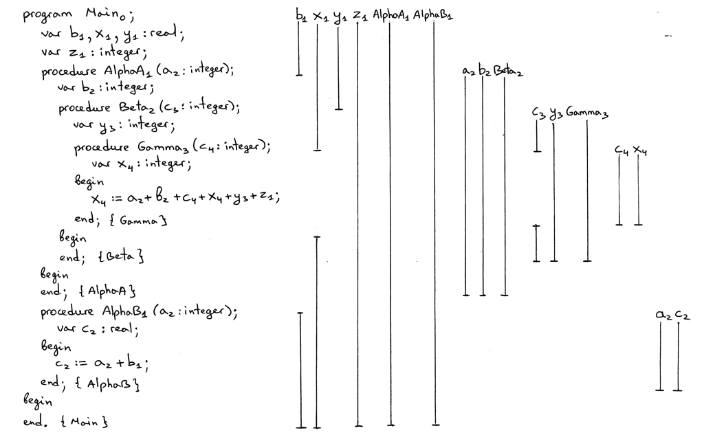
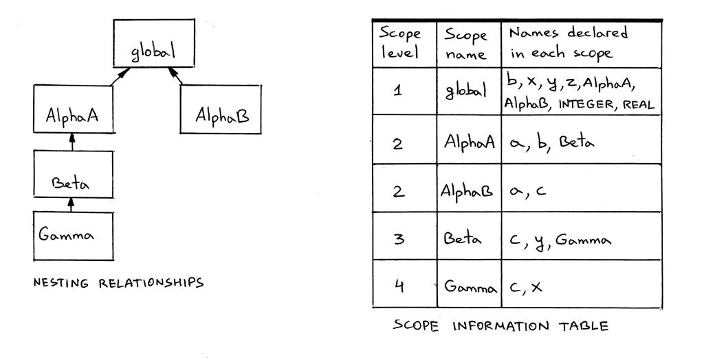  

通过我们的S2S 编译器编译代码，可以检查输出是否如预期一致：  
```shell-session
$ python src2srccompiler.py nestedscopes04.pas
```
```pascal
program Main0;
   var b1 : REAL;
   var x1 : REAL;
   var y1 : REAL;
   var z1 : INTEGER;
   procedure AlphaA1(a2 : INTEGER);
      var b2 : INTEGER;
      procedure Beta2(c3 : INTEGER);
         var y3 : INTEGER;
         procedure Gamma3(c4 : INTEGER);
            var x4 : INTEGER;

         begin
            <x4:INTEGER> := <a2:INTEGER> + <b2:INTEGER> + <c4:INTEGER> + <x4:INTEGER> + <y3:INTEGER> + <z1:INTEGER>;
         end; {END OF Gamma}

      begin

      end; {END OF Beta}

   begin

   end; {END OF AlphaA}
   procedure AlphaB1(a2 : INTEGER);
      var c2 : REAL;

   begin
      <c2:REAL> := <a2:INTEGER> + <b1:REAL>;
   end; {END OF AlphaB}

begin

end. {END OF Main}
```

仔细看以下上面的图片和输出，确保自己理解了以下知识点：  
- 图片中右边的竖线表示作用域范围；  
- 竖线如果中断，则表明这段作用域被同名的变量所遮蔽；  
- AlphaA 和AlphaB 并列存在于global 全局作用域中；  
- AlphaA 和AlphaB 分别引入了新的作用域；  
- 作用域之间应该如何嵌套以及它们的嵌套关系；  
- 为什么不同的符号名会被打上不通的下标。lookup 方法是如何检索符号的。  

也可以运行[下面程序](https://github.com/rspivak/lsbasi/blob/master/part14/scope05.py)  
```shell-session
$ python scope05.py nestedscopes04.pas
```  

检查作用域符号表中的内容，并与上面作用域信息表的内容比较。不要忘记使用[genastdot.py](https://github.com/rspivak/lsbasi/blob/master/part14/genastdot.py) 生成可视化的抽象语法树，看我们的过程声明是如何嵌套的。  

在结束今天的话题之前，我们还要再处理一下刚开始禁用掉的重复声明的语义检查。现在我们需要再lookup 方法中将它重新启用，需要给方法新增一个参数以确定是否需要只在当前作用域中查找：  
```python
def lookup(self, name, current_scope_only=False):
    print('Lookup: %s. (Scope name: %s)' % (name, self.scope_name))
    # 'symbol' is either an instance of the Symbol class or None
    symbol = self._symbols.get(name)

    if symbol is not None:
        return symbol

    if current_scope_only:
        return None

    # recursively go up the chain and lookup the name
    if self.enclosing_scope is not None:
        return self.enclosing_scope.lookup(name)
```

然后就是需要修改`visit_VarDecl` 方法，在创建符号前先检查符号是否在当前作用域已经存在：  
```python
def visit_VarDecl(self, node):
    type_name = node.type_node.value
    type_symbol = self.current_scope.lookup(type_name)

    # We have all the information we need to create a variable symbol.
    # Create the symbol and insert it into the symbol table.
    var_name = node.var_node.value
    var_symbol = VarSymbol(var_name, type_symbol)

    # Signal an error if the table alrady has a symbol
    # with the same name
    if self.current_scope.lookup(var_name, current_scope_only=True):
        raise Exception(
            "Error: Duplicate identifier '%s' found" % var_name
        )

    self.current_scope.insert(var_symbol)
```  

如果我们不限制只在当前作用域查找，那么我们的lookup 如果在外围的作用域查找到同名的符号也会报错。这样是不行的。  

通过运行[scope05.py](https://github.com/rspivak/lsbasi/blob/master/part14/scope05.py) 检查没有重复声明的Pascal 语言源码能够得到什么输出：
```shell-session
$ python scope05.py nestedscopes02.pas
ENTER scope: global
Insert: INTEGER
Insert: REAL
Lookup: REAL. (Scope name: global)
Lookup: x. (Scope name: global)
Insert: x
Lookup: REAL. (Scope name: global)
Lookup: y. (Scope name: global)
Insert: y
Insert: Alpha
ENTER scope: Alpha
Lookup: INTEGER. (Scope name: Alpha)
Lookup: INTEGER. (Scope name: global)
Insert: a
Lookup: INTEGER. (Scope name: Alpha)
Lookup: INTEGER. (Scope name: global)
Lookup: y. (Scope name: Alpha)
Insert: y
Lookup: a. (Scope name: Alpha)
Lookup: x. (Scope name: Alpha)
Lookup: x. (Scope name: global)
Lookup: y. (Scope name: Alpha)
Lookup: x. (Scope name: Alpha)
Lookup: x. (Scope name: global)


SCOPE (SCOPED SYMBOL TABLE)
===========================
Scope name     : Alpha
Scope level    : 2
Enclosing scope: global
Scope (Scoped symbol table) contents
------------------------------------
      a: <VarSymbol(name='a', type='INTEGER')>
      y: <VarSymbol(name='y', type='INTEGER')>


LEAVE scope: Alpha


SCOPE (SCOPED SYMBOL TABLE)
===========================
Scope name     : global
Scope level    : 1
Enclosing scope: None
Scope (Scoped symbol table) contents
------------------------------------
INTEGER: <BuiltinTypeSymbol(name='INTEGER')>
   REAL: <BuiltinTypeSymbol(name='REAL')>
      x: <VarSymbol(name='x', type='REAL')>
      y: <VarSymbol(name='y', type='REAL')>
  Alpha: <ProcedureSymbol(name=Alpha, parameters=[<VarSymbol(name='a', type='INTEGER')>])>


LEAVE scope: global
```

进一步，可以再测试一下具有重复声明错误的Pascal 程序[dupiderror.pas](https://github.com/rspivak/lsbasi/blob/master/part14/dupiderror.pas)，检查下输出：  
```pascal
program Main;
   var x, y: real;

   procedure Alpha(a : integer);
      var y : integer;
      var a : real;  { ERROR here! }
   begin
      x := a + x + y;
   end;

begin { Main }

end.  { Main }
```

下面是程序的输出：  
```shell-session
$ python scope05.py dupiderror.pas
ENTER scope: global
Insert: INTEGER
Insert: REAL
Lookup: REAL. (Scope name: global)
Lookup: x. (Scope name: global)
Insert: x
Lookup: REAL. (Scope name: global)
Lookup: y. (Scope name: global)
Insert: y
Insert: Alpha
ENTER scope: Alpha
Lookup: INTEGER. (Scope name: Alpha)
Lookup: INTEGER. (Scope name: global)
Insert: a
Lookup: INTEGER. (Scope name: Alpha)
Lookup: INTEGER. (Scope name: global)
Lookup: y. (Scope name: Alpha)
Insert: y
Lookup: REAL. (Scope name: Alpha)
Lookup: REAL. (Scope name: global)
Lookup: a. (Scope name: Alpha)
Error: Duplicate identifier 'a' found
```  

成功捕获到错误！今天的新内容就到此结束了，下面总结一下今天学到的内容。  

## 总结  
今天我们学到了很多，快速回忆一下：  
- 学习了作用域，以及为啥作用域会有用如何在代码中实现；  
- 学习了如何使用作用域符号表去实现嵌套的作用域；  
- 如何利用语义分析器构建链式的作用域符号表；  
- 如何递归地在不同作用域中解析符号名；  
- 如何以类似栈操作的形式修改和恢复当前的作用域；  
- 如何编写源到源的编译器，用于帮助我们学习作用域嵌套相关的知识。

## 练习
课后活动时间，oh yeah！  
  

1. 文章中的`Main` 符号的下标都是0，我们也曾提到过程序名不在globa 作用域内，而是在最最外层lv0 的作用域中。请扩展[spi.py](https://github.com/rspivak/lsbasi/blob/master/part14/spi.py)创建一个内置作用域`builtin`，深度为0。并且将内置类型和程序名移到其中。  
2. 对Pascal 代码[nestedscopes04.pas](https://github.com/rspivak/lsbasi/blob/master/part14/nestedscopes04.pas) 做如下修改：  
   1. 把Pascal 源码写在纸上  
   2. 给其中所有的符号打上下标  
   3. 画出代表作用域范围的竖线，别忘了变量被遮蔽时竖线应该有缺口  
   4. 编写一个源到源的翻译器  
   5. 用[src2srccompiler.py](https://github.com/rspivak/lsbasi/blob/master/part14/src2srccompiler.py) 检查你的编译器和上面的其他操作是否正确  
3. 修改源到源的编译器，使其可以给内置类型打上作用域的下标  
4. 取消[spi.py](https://github.com/rspivak/lsbasi/blob/master/part14/spi.py) 中下面的注释：
    ```python
    # interpreter = Interpreter(tree)
    # result = interpreter.interpret()
    # print('')
    # print('Run-time GLOBAL_MEMORY contents:')
    # for k, v in sorted(interpreter.GLOBAL_MEMORY.items()):
    #     print('%s = %s' % (k, v))
    ```
    
    然后让它执行[part10.pas](https://github.com/rspivak/lsbasi/blob/master/part10/python/part10.pas)： 
    ```shell-session
    $ python spi.py part10.pas
    ```  
    
    发现问题，并在语义分析器中补全缺失的方法。  

以上就是今天的全部内容。后续我们将会学习运行时（runtime），调用栈，过程调用的概念，并且会编写我们的第一个求阶乘的方法。敬请关注，再见！  

## 参考资料  
有兴趣的话可以阅读以下书籍，文中有多处对它们的引用与参考：  
1. [Language Implementation Patterns: Create Your Own Domain-Specific and General Programming Languages (Pragmatic Programmers)](http://www.amazon.com/gp/product/193435645X/ref=as_li_tl?ie=UTF8&camp=1789&creative=9325&creativeASIN=193435645X&linkCode=as2&tag=russblo0b-20&linkId=MP4DCXDV6DJMEJBL)  
2. [Engineering a Compiler, Second Edition](https://www.amazon.com/gp/product/012088478X/ref=as_li_tl?ie=UTF8&camp=1789&creative=9325&creativeASIN=012088478X&linkCode=as2&tag=russblo0b-20&linkId=74578959d7d04bee4050c7bff1b7d02e)  
3. [Programming Language Pragmatics, Fourth Edition](https://www.amazon.com/gp/product/0124104096/ref=as_li_tl?ie=UTF8&camp=1789&creative=9325&creativeASIN=0124104096&linkCode=as2&tag=russblo0b-20&linkId=8db1da254b12fe6da1379957dda717fc)  
4. [Compilers: Principles, Techniques, and Tools (2nd Edition)](http://www.amazon.com/gp/product/0321486811/ref=as_li_tl?ie=UTF8&camp=1789&creative=9325&creativeASIN=0321486811&linkCode=as2&tag=russblo0b-20&linkId=GOEGDQG4HIHU56FQ)   
5. [Writing Compilers and Interpreters: A Software Engineering Approach](https://www.amazon.com/gp/product/0470177071/ref=as_li_tl?ie=UTF8&camp=1789&creative=9325&creativeASIN=0470177071&linkCode=as2&tag=russblo0b-20&linkId=542d1267e34a529e0f69027af20e27f3)  


-----  
2022-07-07 21:01