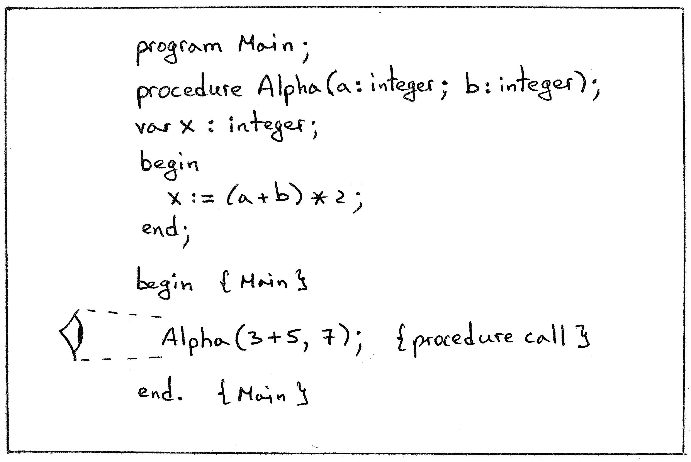
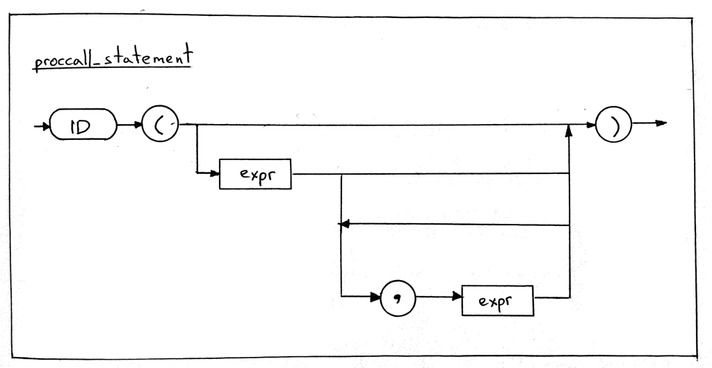
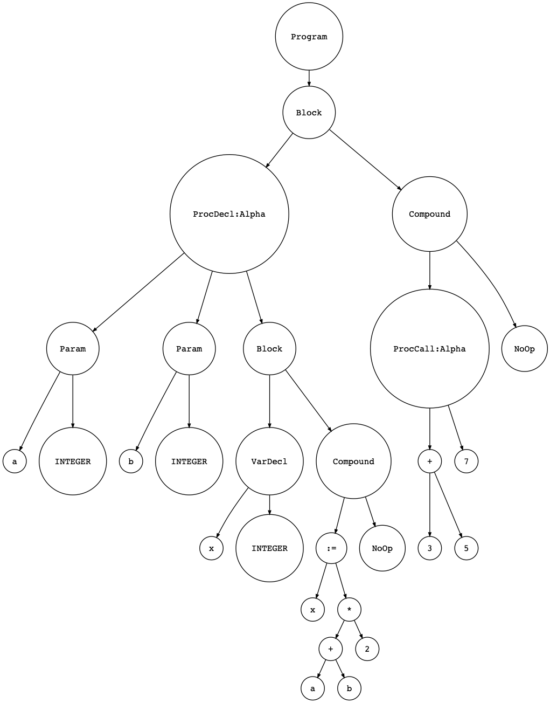

16_识别过程调用   

📅 2019-07-23  

> “学如逆水行舟，不进则退” —— 中国谚语    

今天我们将要扩展我们的解释器来识别过程调用（Procedure Call）。我希望你已经通过前面的文章大显身手，并且准备好更进一步了。学习识别/解析过程调用是执行过程调用前的关键一步，关于如何执行过程调用，在后面的文章中我们会详细展开说明。  

今天我们的目标就是让我们的解释器能够正确识别过程调用语句、构造新的抽象语法树节点、生成正确的抽象语法树、并且顺利地完成语义分析。  

以下面Pascal 代码为例，其中包含了一条过程调用语句`Alpha(3+5,7);`：  
  

我们的目标就是让解释器能正确的解析类似于上面这种程序的Pascal 代码。  

一般我们引入新的特性时，都会带来许多相关组件的改动，下面就让我们一一实现。  

## 语法分析器  
> 译注：因为过程调用没有引入新的Token，所以词法分析部分不需要变动  

首先，我们需要改动语法分析器。下面是需要变动的清单：  
1. 增加新的AST 节点表示过程调用；  
2. 增加新的过程调用的语法规则，并通过代码实现；  
3. 改进`statement` 语法规则，使其包含过程调用的子规则。  

首先是为过程调用创建单独的AST 节点类`ProcedureCall`：  
```python
class ProcedureCall(AST):
    def __init__(self, proc_name, actual_params, token):
        self.proc_name = proc_name
        self.actual_params = actual_params  # a list of AST nodes
        self.token = token
```  
该类的构造函数接受三个参数：过程名、实参、和`Token`。以上包含某个过程调用所需的足够的信息。  

其次是添加新的语法规则`proccall_statement`：  
```  
proccall_statement : ID LPAREN (expr (COMMA expr)*)? RPAREN
```  
下面是对应的语法图：  
  

从上图中可以看到，过程调用是过程名后面跟着一对括号，括号中包含零个或多个实参。例如：  
```pascal  
Alpha();
Alpha(1);
Alpha(3 + 5, 7);
```  

界限来我们通过添加`proccall_statement` 方法来实现：  
```python
def proccall_statement(self):
    """proccall_statement : ID LPAREN (expr (COMMA expr)*)? RPAREN"""
    token = self.current_token

    proc_name = self.current_token.value
    self.eat(TokenType.ID)
    self.eat(TokenType.LPAREN)
    actual_params = []
    if self.current_token.type != TokenType.RPAREN:
        node = self.expr()
        actual_params.append(node)

    while self.current_token.type == TokenType.COMMA:
        self.eat(TokenType.COMMA)
        node = self.expr()
        actual_params.append(node)

    self.eat(TokenType.RPAREN)

    node = ProcedureCall(
        proc_name=proc_name,
        actual_params=actual_params,
        token=token,
    )
    return node
```  
简单明了，该方法解析一个过程调用，并返回一个`ProcedureCall` 节点。  

最后，我们需要改进`statement` 语法规则，已包含`proccall_statement` 子规则，下面是改进后的规则：  
```
statement : compound_statement
          | proccall_statement
          | assignment_statement
          | empty
```  

现在我们的面前有一个难题：`proccall_statement` 和`assignment_statement` 都是以`Token<ID>` 开头的，该如何区分它们呢？  
```
proccall_statement : ID LPAREN (expr (COMMA expr)*)? RPAREN

assignment_statement : variable ASSIGN expr
variable: ID
```  

例如在下面两句代码中，大家都是以`foo` 开头：  
```pascal
foo();     { procedure call }
foo := 5;  { assignment }
```

我们的语法分析器应该将`foo();` 识别为过程调用，而将`foo := 5;` 识别为赋值语句。我们应该做些什么以实现这个功能呢？看过程调用的语法规则，过程名后面紧跟着的是左括号`(`，而赋值语句则是`:`，而这恰恰就是我们用于区分二者的依据：  
```python  
if (self.current_token.type == TokenType.ID and
    self.lexer.current_char == '('  
    # 这里调用了词法分析器，后面会有更好的办法吗？
):
    node = self.proccall_statement()
elif self.current_token.type == TokenType.ID:
    node = self.assignment_statement()
```  

从上面的代码看出，如果当前`Token` 是`ID`，语法分析器将会检查下一个字符是不是`(`，如果是则是过程调用，否则就是赋值语句。下面是完整代码：  
```python  
def statement(self):
    """
    statement : compound_statement
              | proccall_statement
              | assignment_statement
              | empty
    """
    if self.current_token.type == TokenType.BEGIN:
        node = self.compound_statement()
    elif (self.current_token.type == TokenType.ID and
          self.lexer.current_char == '('
    ):
        node = self.proccall_statement()
    elif self.current_token.type == TokenType.ID:
        node = self.assignment_statement()
    else:
        node = self.empty()
    return node
```  

So far so good，我们的语法分析器可以解析过程调用了。需要提一下的是，我们的Pascal 过程目前还没有返回值，所以不能用在下面这种表达式中：  
```pascal  
x := 10 * Alpha(3 + 5, 7);
```  

这也是为什么我们只在`statements` 规则中加入`proccall_statement` 的原因，在后面系列，我们学习Pascal 函数的时候，我们会在表达式和赋值语句中引入返回值的概念。  
以上就是所有语法分析器的变动，接下来我们修改语义分析器。  

## 语义分析器  
对于语义分析器，我们只需要新增一个`visit_ProcedureCall` 的方法：  
```python
def visit_ProcedureCall(self, node):
    for param_node in node.actual_params:
        self.visit(param_node)
```  
该方法会遍历实参的集合，递归地。因为实参可以是一个AST 子树。以上。  

## 解释器  
解释器的规则更加简单，因为目前我们并不打算执行过程调用：  
```python
def visit_ProcedureCall(self, node):
    pass
```  

通过以上改动，我们的解释器可以正确识别过程调用，并创建对应的抽象语法树了。我们可以用下面代码做测试：   
```pascal  
program Main;

procedure Alpha(a : integer; b : integer);
var x : integer;
begin
   x := (a + b ) * 2;
end;

begin { Main }

   Alpha(3 + 5, 7);  { procedure call }

end.  { Main }
```  

从[GitHub](https://github.com/rspivak/lsbasi/tree/master/part16) 下载`part16.pas` 和`spi.py` 在命令行运行：  
```shell-session
$ python spi.py part16.pas
$ 
```  

没有报错，但是强迫症表示看起来不舒服。于是我们可以通过[genastdot.py](https://github.com/rspivak/lsbasi/tree/master/part16/genastdot.py) 将生成的抽象语法树可视化：  
```shell-session  
$ python genastdot.py part16.pas > ast.dot && dot -Tpng -o ast.png ast.dot
```  
  

舒坦！可以看到我们的抽象语法树包含有一个`ProcCall:Alpha` 的过程调用节点，该节点又包含有两个实参子节点：左边的是表达式`3+5`，右边是整数`7`。  

至此今天的目标就完成了：当我们的解释器遇到过程调用语句时，就会将它解析为`ProcCall` 节点，并构建抽象语法树，语义分析器也会按部就班地检查、没有异常抛出。  

## 练习  
  

上面的语义检查部分缺少了实参的类型与数量的检查。抛开类型检查不谈，Pascal 的过程调用只接受与形参数量相等的实参，以下面过程定义为例：  
```pascal
procedure Alpha(a : integer; b : integer);
var x : integer;
begin
   x := (a + b ) * 2;
end;
```  
该过程只接受两个参数，试图传入其他数量的参数时均会出错：  
```pascal
Alpha();          { 0 arguments —> ERROR }
Alpha(1);         { 1 argument  —> ERROR }
Alpha(1, 2, 3);   { 3 arguments —> ERROR }
```  

你可以在[solution.txt](https://github.com/rspivak/lsbasi/tree/master/part16) 中找到解决方案，但在此之前，最好亲自动手解决一下。  

以上就是今天的全部内容。下一章我们将会学习如何解释执行过程调用，中间会用到调用栈（Call Stack）和活动记录（Activation Record）的概念，会很刺激的。敬请期待，再见！:)  

## 参考资料  
筹划本文时的参考资料：  
1. [Language Implementation Patterns: Create Your Own Domain-Specific and General Programming Languages (Pragmatic Programmers)](http://www.amazon.com/gp/product/193435645X/ref=as_li_tl?ie=UTF8&camp=1789&creative=9325&creativeASIN=193435645X&linkCode=as2&tag=russblo0b-20&linkId=MP4DCXDV6DJMEJBL)     
2. [Writing Compilers and Interpreters: A Software Engineering Approach](https://www.amazon.com/gp/product/0470177071/ref=as_li_tl?ie=UTF8&camp=1789&creative=9325&creativeASIN=0470177071&linkCode=as2&tag=russblo0b-20&linkId=542d1267e34a529e0f69027af20e27f3)    
3. [Free Pascal Reference guide](https://www.freepascal.org/docs-html/current/ref/ref.html)

-----  
2022-07-12 23:57