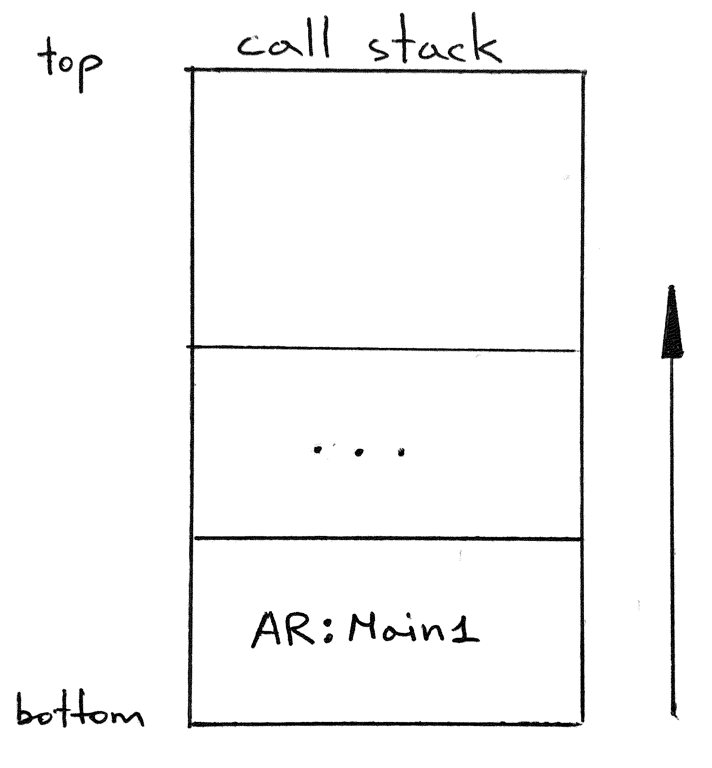
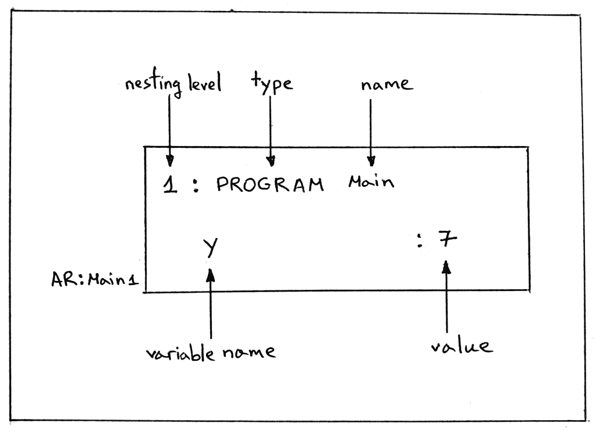

17_调用栈与活动记录（栈帧）  

📅 2019-08-28  

> “你也许需要战斗很多次才能取得胜利” —— 玛格丽特·撒切尔  

1968 年墨西哥奥运会马拉松项目，坦桑尼亚运动员约翰·史蒂芬·阿赫瓦里（John Stephen Akhwari）在比赛时，因其他运动员争抢位置不慎跌倒导致膝盖受伤脱臼。在接受包扎治疗后他却没有选择中间退场，而是继续坚持比赛。最后比赛的冠军是来自埃塞俄比亚的选手Mamo Wolde，用时2:20:26，而阿赫瓦里却用了3:25:27 才跑完全程。夕阳下阿赫瓦里步履蹒跚、腿上血迹斑斑、绷带在风中晃动，以最后一名（完成比赛的选手）的成绩跑完了全程。  
当人们看到阿赫瓦里时，发出来不可思议的欢呼，赛后记者问他为什么受伤之后却依然坚持完成了比赛。他的回答被写进了奥运会的历史：“我的国家从5000 英里外送我来是为了完成比赛，不是为了开始比赛”。  

一直以来，这则故事激励了很多运动员或其他人。你也会想：“这个故事很励志，然而和我有什么关系呢？”。我想说的是，接下来将会有一段漫长且艰难的旅程，有些知识也许会让人望而生畏，但是无论如何我们都要保持前进，因为我们已经在接近本系列中一个重要的里程碑了。  


Okay，现在开始！以下是我们今天的目标：  
1. 实现一个新的内存管理系统，用于支持程序、过程调用和函数调用  
2. 用新的内存管理系统替换掉现有的`GLOBAL_MEMORY` 字典  

让我们从以下四个问题入手：  
1. 什么是内存管理系统  
2. 为什么需要新的内存管理系统  
3. 新的内存管理系统长什么样子  
4. 为什么我们要替换掉`GLOBAL_MEMORY`  

## 什么是内存管理系统  
简单来说，就是控制程序在内存中存储和访问数据的系统。在硬件层面，就是我们的RAM 存储器，其中的数据是根据物理地址存放的；而在解释器的层面，我们不会直接读写物理地址，而是用字典这一数据结构来表示内存。下面是一个简单的例子，我们通过变量名`y` 保存了一个整数`7`，随后又从字典中读取了它：   
```shell-session  
>>> GLOBAL_MEMORY = {}
>>>
>>> GLOBAL_MEMORY['y'] = 7   # store value by name
>>>
>>> GLOBAL_MEMORY['y']       # access value by name
7
>>>
```  

一直以来，我们都是用字典表示全局内存的。我们通过`GLOBAL_MEMORY` 字典实现程序全局层面的变量储存和读取。下面是解释器有关内存中变量的创建、赋值、和读取的部分：  
```python  
class Interpreter(NodeVisitor):
    def __init__(self, tree):
        self.tree = tree
        self.GLOBAL_MEMORY = {}

    def visit_Assign(self, node):
        var_name = node.left.value
        var_value = self.visit(node.right)
        self.GLOBAL_MEMORY[var_name] = var_value

    def visit_Var(self, node):
        var_name = node.value
        var_value = self.GLOBAL_MEMORY.get(var_name)
        return var_value
```  
这就是我们当前表示程序内存的方法，继续下一个问题。  

## 为什么需要新的内存管理系统  
事实证明，仅靠一个全局字典，不足以支持过程调用、函数调用。为了支持嵌套的调用，尤其是递归调用。我们需要对每个过程或者函数的调用都创建一个字典。并且将它们以某种特殊的方式组织起来。这就是我们为什么需要一个新的内存管理系统的原因，这也是我们后面执行过程调用前的一块垫脚石。  

## 新的内存管理系统架构  
核心概念：新的内存管理系统通过栈的方式保存类似于字典的对象作为元素。这个栈被称为“调用栈”（Call Stack），因为它总是记录当前过程、函数被调用时所需的信息。调用栈也会被称为运行时栈、执行栈等。而调用栈中类似于字典的元素则被称为活动记录（Activation Record），在国内常被叫做栈帧（Stack Frame）。后面的译文中也将称呼为栈帧、或者帧。  

继续看调用栈和栈帧的细节部分。  
什么是栈？栈是一种数据结构，遵循后入先出（LIFO）的规则。与之相对的叫队列，遵循先入先出（FIFO）的规则。可以把栈想象成一摞盘子，每次放盘子（push，压数据入栈）总是放在最上面，取盘子（pop，弹数据出栈）的时候也是从最上面取：  
  

通常来说，我们的栈需要实现以下方法：  
- `push`  
- `pop`  
- `peek`：在不弹出元素的情况下访问栈顶帧（调用栈顶端的栈帧）  

按照惯例，我们的栈是向上增长的：  
> 译注：而物理栈一般是向下增长的  



如何在代码中实现栈呢？基本上我们可以基于一个数组来封装成一个栈的样子：  
```python
class Stack:
    def __init__(self):
        self.items = []

    def push(self, item):
        self.items.append(item)

    def pop(self):
        return self.items.pop()

    def peek(self):  # peek 方法不会改变数组中的元素个数
        return self.items[-1]
```  
这差不多也是调用栈的实现。我们只需要修改一下`push` 方法接受的参数名，用于明显表示压入的是栈帧（活动记录，`Activation Record`），并且增加`__str__()` 方法打印栈的内容：  
```python  
class CallStack:
    def __init__(self):
        self._records = []

    def push(self, ar):
        self._records.append(ar)

    def pop(self):
        return self._records.pop()

    def peek(self):
        return self._records[-1]

    def __str__(self):
        s = '\n'.join(repr(ar) for ar in reversed(self._records))
        s = f'CALL STACK\n{s}\n'
        return s

    def __repr__(self):
        return self.__str__()
```  

`__str()__` 方法会逆序遍历栈帧，将所有栈帧的内容重新拼接为调用栈的内容返回。通过该方法可以看出栈的增长方向。  

然后什么是栈帧呢？对于我们而言，栈帧就是一个类似于字典的对象，其维护着当前被调用的过程或函数，抑或是程序本身所需要的各种信息，如形参、局部变量等。请看在代码中的实现：  
```python
class ARType(Enum):
    PROGRAM   = 'PROGRAM'


class ActivationRecord:
    def __init__(self, name, type, nesting_level):
        self.name = name
        self.type = type
        self.nesting_level = nesting_level
        self.members = {}

    def __setitem__(self, key, value):
        self.members[key] = value

    def __getitem__(self, key):
        return self.members[key]

    def get(self, key):
        return self.members.get(key)

    def __str__(self):
        lines = [
            '{level}: {type} {name}'.format(
                level=self.nesting_level,
                type=self.type.value,
                name=self.name,
            )
        ]
        for name, val in self.members.items():
            lines.append(f'   {name:<20}: {val}')

        s = '\n'.join(lines)
        return s

    def __repr__(self):
        return self.__str__()
```  

有些事情需要注意一下：  
1. 栈帧类的构造函数接受3 个参数：  
   - `name`：栈帧名，也是被调用的过程、函数或者程序名  
   - `type`：栈帧类型，枚举类型，本文只用到了`PROGRAM`  
   - `nesting_level`：嵌套深度，总是比相应的过程、函数的声明深度大1  
2. 字典的成员用于存储过程、函数调用时的信息，在下一章中将会详细介绍  
3. 栈帧类实现了`__setitem__()` 和`__getitem__()` 方法，让我们可以像使用字典一样使用栈帧对象，例如`ar['x'] = 7` 或者`ar['x']`  
4. `get()` 方法可以在找不到成员时返回`None`，而不是抛异常  
5. `__str()__` 方法用于打印当前栈帧的内容  

下面我们手工在Python shell 中构建调用栈和栈帧：  
```shell-session  
>>> from spi import CallStack, ActivationRecord, ARType
>>> stack = CallStack()
>>> stack
CALL STACK


>>> ar = ActivationRecord(name='Main', type=ARType.PROGRAM, nesting_level=1)
>>>
>>> ar
1: PROGRAM Main
>>>
>>> ar['y'] = 7
>>>
>>> ar
1: PROGRAM Main
   y                   : 7
>>>
>>> stack
CALL STACK


>>> stack.push(ar)
>>>
>>> stack
CALL STACK
1: PROGRAM Main
   y                   : 7

>>>
```  
下面图片中，你可以看到栈帧各部分的详细表述：  
  
`AR:Main1` 表示嵌套深度为1 的，名称为`Main` 的程序的栈帧。  

下面继续下一个问题。  

## 为什么要用调用栈替换GLOBAL_MEMORY  

原因是为了简化我们的解释器实现，并且为访问全局、或者局部变量提供一个统一的入口。下一章中我们将会看到这些是如何结合在一起的。现在我们需要看一下怎么利用栈帧和调用栈改造我们的解释器。  

## 改进解释器  
对于解释器的改动主要有5 处：  
1. 使用调用栈替换`GLOBAL_MEMORY`  
2. 更新`visit_Program` 方法在调用栈中压入/弹出全局栈帧  
3. 更新`visit_Assign` 方法用于向栈帧中添加变量  
4. 更新`visit_Var` 方法用于从栈帧中获取变量  
5. 增加`log` 方法，并在`visit_Program` 方法中调用以打印调试信息  

首先从替换`GLOBAL_MEMORY` 字典开始，下面是我们以前的代码：  
```python
class Interpreter(NodeVisitor):
    def __init__(self, tree):
        self.tree = tree
        self.GLOBAL_MEMORY = {}
```  

需要替换为：  
```python  
class Interpreter(NodeVisitor):
    def __init__(self, tree):
        self.tree = tree
        self.call_stack = CallStack()
```  

接下来是更新`visit_Program` 方法在调用栈中压入/弹出全局栈帧。之前的代码：  
```python  
def visit_Program(self, node):
    self.visit(node.block)
``` 
需要更新为：  
```python  
def visit_Program(self, node):
    program_name = node.name

    # 首先，创建一个PROGRAM 类型，深度为1 的栈帧  
    ar = ActivationRecord(
        name=program_name,
        type=ARType.PROGRAM,
        nesting_level=1,
    )
    # 然后，将栈帧压入调用栈，解释器可以使用栈顶帧来访问全局变量
    self.call_stack.push(ar)

    # 执行程序体。解释器可以使用栈顶帧访问全局变量
    self.visit(node.block)
    
    # 在离开方法之前，该栈帧的数据都没有用了，需要及时清理掉  
    self.call_stack.pop()

    # 译注：
    # 忽然想到函数的返回值应该是作为外部函数的一个局部变量存在的吧（请忽略
```

接着是更新`visit_Assign` 方法用于向栈帧中添加变量。以前的代码如下：  
```python
def visit_Assign(self, node):
    var_name = node.left.value
    var_value = self.visit(node.right)
    self.GLOBAL_MEMORY[var_name] = var_value
```  
新的代码：  
```python  
def visit_Assign(self, node):
    var_name = node.left.value
    var_value = self.visit(node.right)

    # 可以看到我们这里用peek 方法，并不会从调用栈中移除该栈帧  
    # 因为我们只需要栈顶帧的引用即可  
    ar = self.call_stack.peek()
    ar[var_name] = var_value
```
继续，我们将更新`visit_Var` 方法用于从栈帧中获取变量。以下是原先的代码：  
```python  
def visit_Var(self, node):
    var_name = node.value
    var_value = self.GLOBAL_MEMORY.get(var_name)
    return var_value
```  
改动后的代码：  
```python
def visit_Var(self, node):
    var_name = node.value

    # 同样，这里也是使用了peek 方法，而不是pop
    ar = self.call_stack.peek()
    var_value = ar.get(var_name)

    return var_value
```
最后增加`log` 方法，并在`visit_Program` 方法中调用以打印调试信息：  
```python
def log(self, msg):
    if _SHOULD_LOG_STACK:
        print(msg)

def visit_Program(self, node):
    program_name = node.name
    self.log(f'ENTER: PROGRAM {program_name}')

    ar = ActivationRecord(
        name=program_name,
        type=ARType.PROGRAM,
        nesting_level=1,
    )
    self.call_stack.push(ar)

    self.log(str(self.call_stack))

    self.visit(node.block)

    self.log(f'LEAVE: PROGRAM {program_name}')
    self.log(str(self.call_stack))

    self.call_stack.pop()
```  

与上一章相似，这里我们也是通过命令行参数`--stack`，来控制全局变量`_SHOULD_LOG_STACK`，进一步控制日志打印的开关的。所以我们首先还需要解析命令行参数：  
```python
def main():
    parser = argparse.ArgumentParser(
        description='SPI - Simple Pascal Interpreter'
    )
    parser.add_argument('inputfile', help='Pascal source file')
    parser.add_argument(
        '--scope',
        help='Print scope information',
        action='store_true',
    )
    parser.add_argument(
        '--stack',
        help='Print call stack',
        action='store_true',
    )
    args = parser.parse_args()

    global _SHOULD_LOG_SCOPE, _SHOULD_LOG_STACK

    _SHOULD_LOG_SCOPE, _SHOULD_LOG_STACK = args.scope, args.stack
```  

现在我们可以测试一下我们的代码了。可以从[GitHub](https://github.com/rspivak/lsbasi/tree/master/part17) 下载最新的解释器源码，通过`-h` 命令可以获取使用帮助：  
```shell-session
$ python spi.py -h
usage: spi.py [-h] [--scope] [--stack] inputfile

SPI - Simple Pascal Interpreter

positional arguments:
  inputfile   Pascal source file

optional arguments:
  -h, --help  show this help message and exit
  --scope     Print scope information
  --stack     Print call stack
```  

在仓库中，也可以看到测试用的Pascal 代码part17.pas：  
```pascal
program Main;
var x, y : integer;
begin { Main }
   y := 7;
   x := (y + 3) * 3;
end.  { Main }
```  

可以打开`--stack` 开关，运行一下并查看程序的输出：  
```shell-session
$ python spi.py part17.pas --stack
ENTER: PROGRAM Main
CALL STACK
1: PROGRAM Main


LEAVE: PROGRAM Main
CALL STACK
1: PROGRAM Main
   y                   : 7
   x                   : 30
```  

任务完成！我们实现了一个支持程序、过程、函数调用的新的内存管理系统，调用栈。并用它替换掉了老旧的`GLOBAL_MEMORY` 全局字典。  

以上就是今天的全部内容。下一章我们将会扩展我们的解释器去执行过程调用。对我们来说将会是一个巨大的里程碑。尽情期待，再见！  

## 参考资料  
有兴趣的话可以阅读以下书籍，文中有多处对它们的引用与参考：  
1. [Language Implementation Patterns: Create Your Own Domain-Specific and General Programming Languages (Pragmatic Programmers)](http://www.amazon.com/gp/product/193435645X/ref=as_li_tl?ie=UTF8&camp=1789&creative=9325&creativeASIN=193435645X&linkCode=as2&tag=russblo0b-20&linkId=MP4DCXDV6DJMEJBL)  
2. [Writing Compilers and Interpreters: A Software Engineering Approach](https://www.amazon.com/gp/product/0470177071/ref=as_li_tl?ie=UTF8&camp=1789&creative=9325&creativeASIN=0470177071&linkCode=as2&tag=russblo0b-20&linkId=542d1267e34a529e0f69027af20e27f3)  
3. [Programming Language Pragmatics, Fourth Edition](https://www.amazon.com/gp/product/0124104096/ref=as_li_tl?ie=UTF8&camp=1789&creative=9325&creativeASIN=0124104096&linkCode=as2&tag=russblo0b-20&linkId=8db1da254b12fe6da1379957dda717fc)   
4. [Lead with a Story](https://www.amazon.com/gp/product/0814420303/ref=as_li_tl?ie=UTF8&camp=1789&creative=9325&creativeASIN=0814420303&linkCode=as2&tag=russblo0b-20&linkId=bee8bb0ac4fa2fb1ce587e093b6cfe6c)  
5. [A Wikipedia article on John Stephen Akhwari](https://en.wikipedia.org/wiki/John_Stephen_Akhwari)   


-----  
2022-07-13 22:29