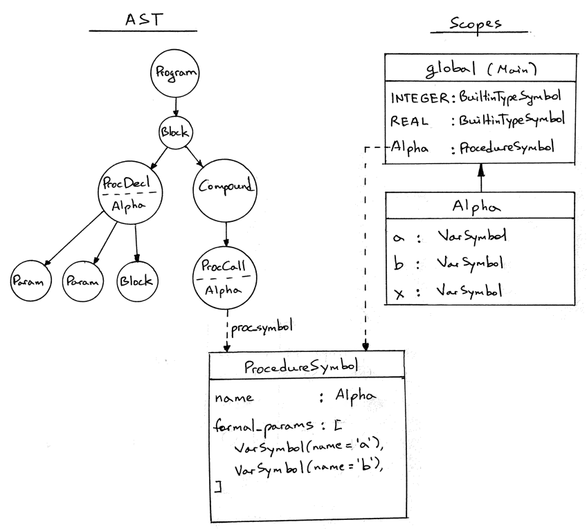
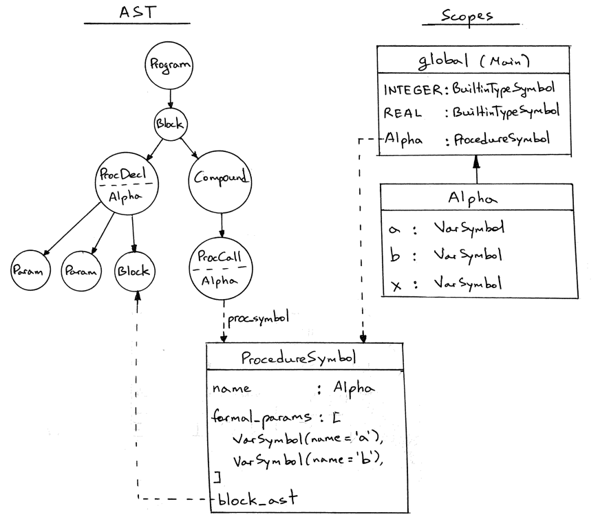
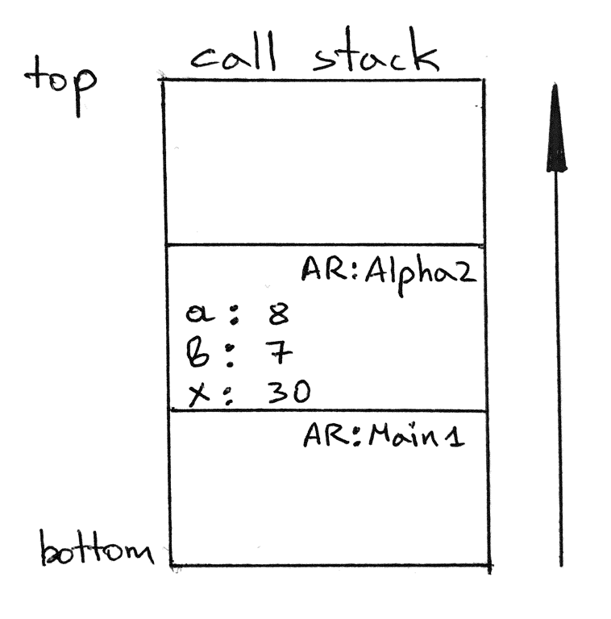

18_执行过程调用  

📅 2020-02-20  

> “尽己所能做得最好。 然后，当你懂得更好的方法时，再做得更好。” —— 马娅·安杰卢  

今天我们将迎来一个巨大的里程碑：执行过程调用。如果这都不让人心动，我就不知道这世界上还有什么会让人心动了。  
  

准备好继续前进了吗？本文中，我们将以下面代码为例：  
```pascal
program Main;

procedure Alpha(a : integer; b : integer);
var x : integer;
begin
   x := (a + b ) * 2;
end;

begin { Main }

   Alpha(3 + 5, 7);  { procedure call }

end.  { Main }
```  

上面代码包含一处函数声明和一处函数调用。今天我们只关注过程调用中的参数和局部变量。后面两章我们将讨论嵌套的过程调用和非局部变量。  

让我们来看一下为了调用`Alpha(3+5, 7)` 所需要的算法。一步一步来：  
1. 创建一个栈帧  
2. 保存实参到栈帧  
3. 将栈帧压入调用栈  
4. 执行过程体  
5. 弹出栈帧  

在解释器中，过程的调用由`visit_Procedure` 方法进行处理。目前该方法还是空的：  
```python  
class Interpreter(NodeVisitor):
    ...

    def visit_ProcedureCall(self, node):
        pass
```  

我们通过上面的步骤，一点点完善代码，直到可以执行过程调用。  

## 创建栈帧  
我们上一章提到过，栈帧是一个类似于字典的对象，负责维护当前调用的过程或函数，抑或程序所需的信息。以过程调用为例，栈帧包含了形参和局部变量的值。所以为了存储过程的参数和局部变量等信息，我们需要首先创建栈帧。回顾栈帧的构造函数，它需要三个参数：  
- `name`：过程名，也是栈帧的名字  
- `type`：栈帧的类型，`PROGRAM`，或`PROCEDURE`  
- `nesting_level`：嵌套深度，过程的嵌套深度为2，因为程序的栈帧深度是1  

在我们扩展`visit_ProcedureCall` 方法前，我们需要先增设`PROCEDURE` 栈帧类型：  
```python  
class ARType(Enum):
    PROGRAM   = 'PROGRAM'
    PROCEDURE = 'PROCEDURE'
```

下面，我们在进入`visit_ProcedureCall` 时创建栈帧：  
```python
def visit_ProcedureCall(self, node):
    proc_name = node.proc_name

    ar = ActivationRecord(
        name=proc_name,
        type=ARType.PROCEDURE,
        nesting_level=2,
    )
```  

只要我们知道了构造函数的参数的意义，创建栈帧的代码很简单。  

## 保存参数  
> 注：  
> 形参是在过程定义时、以及过程体内部会用到的参数  
> 实参是在调用过程时，需要传入的参数、或表达式  

为了在栈帧中保存数据，我们需要以下步骤：  
- 获取过程的形参列表  
- 获取过程的实参列表  
- 对于每一个形参，找出对应的实参，在计算出结果之后，将数值存储到栈帧响应的位置  

以下面栈帧的定义和调用为例：  
```pascal
procedure Alpha(a : integer; b : integer);

Alpha(3 + 5, 7);
```  

在执行完上述代码后（离开Alpha 过程之前），栈帧的内容应该如下所示：  
```  
2: PROCEDURE Alpha
   a                   : 8
   b                   : 7
```

下面是实现上述步骤的代码：  
```python  
proc_symbol = node.proc_symbol

formal_params = proc_symbol.formal_params
actual_params = node.actual_params

for param_symbol, argument_node in zip(formal_params, actual_params):
    ar[param_symbol.name] = self.visit(argument_node)
```
我们需要仔细研究一下上面的代码！  

### 获取形参列表  
我们在执行过程调用时需要用到形参列表，但是应该从哪里获得呢？AST 节点中只有过程定义时才有形参。而我们在语义分析，创建`ProcedureSymbol` 过程符号表时，则能收集到形参列表的信息：  
```python
class Symbol:
    def __init__(self, name, type=None):
        self.name = name
        self.type = type


class ProcedureSymbol(Symbol):
    def __init__(self, name, formal_params=None):
        super().__init__(name)
        # a list of VarSymbol objects
        self.formal_params = [] if formal_params is None else formal_params
```

语义分析时，嵌套作用域符号表的内容如下：  
```
SCOPE (SCOPED SYMBOL TABLE)
===========================
Scope name     : global
Scope level    : 1
Enclosing scope: None
Scope (Scoped symbol table) contents
------------------------------------
INTEGER: <BuiltinTypeSymbol(name='INTEGER')>
   REAL: <BuiltinTypeSymbol(name='REAL')>
  Alpha: <ProcedureSymbol(name=Alpha, parameters=[<VarSymbol(name='a', type='INTEGER')>, <VarSymbol(name='b', type='INTEGER')>])>
```  

既然知道了形参列表应该从语义分析时获取，那我们应该怎么从抽象语法树上得到呢？因为解释器只接触AST。先看一下我们现有的代码：  
```python
def visit_ProcedureCall(self, node):
    proc_name = node.proc_name

    ar = ActivationRecord(
        name=proc_name,
        type=ARType.PROCEDURE,
        nesting_level=2,
    )
```
在最开始的代码中，我们通过`proc_symbol = node.proc_symbol` 获取过程的符号表，但是我们在`ProcedureCall` 类型中还没有`proc_symbol` 的属性：  
```python
class ProcedureCall(AST):
    def __init__(self, proc_name, actual_params, token):
        self.proc_name = proc_name
        self.actual_params = actual_params  # a list of AST nodes
        self.token = token
```  

所以我们首先在抽象语法树节点`ProcedureCall` 中添加`proc_symbol` 属性：  
```python
class ProcedureCall(AST):
    def __init__(self, proc_name, actual_params, token):
        self.proc_name = proc_name
        self.actual_params = actual_params  # a list of AST nodes
        self.token = token
        # a reference to procedure declaration symbol
        self.proc_symbol = None
```  

到这里还很容易理解。但怎么能让`proc_symbol` 属性指向正确的符号表呢？我们需要在语义分析中，遍历`ProcedureCall` 时，将产生的符号表挂载到该节点下面。下面是我们以前的代码：  
```python
class SemanticAnalyzer(NodeVisitor):
    ...

    def visit_ProcedureCall(self, node):
        for param_node in node.actual_params:
            self.visit(param_node)
```

因为我们在语义分析遍历AST 时，可以访问当前作用域，于是就可以通过过程名查找过程符号表并挂载到当前`ProcedureCall` 节点下面：  
```python
class SemanticAnalyzer(NodeVisitor):
    ...

    def visit_ProcedureCall(self, node):
        for param_node in node.actual_params:
            self.visit(param_node)

        proc_symbol = self.current_scope.lookup(node.proc_name)
        # accessed by the interpreter when executing procedure call
        node.proc_symbol = proc_symbol
```

在上面代码中，我们通过符号名解析到了对应的作用域符号表，并将其挂载到抽象语法树节点下面。对于我们的示例代码而言，语义分析之后，我们的抽象语法树与全局作用域符号表的关系如下：  
  

从上面的图片可以看出，有了这些操作，我们就可以在`visit_ProcedureCall` 方法中访问作用域符号表，从而获取形参`formal_params` 字段了：  
```python
proc_symbol = node.proc_symbol

proc_symbol.formal_params  # aka parameters
```  

### 获取实参列表  
实参列表已经在`ProcedureCall` 节点中存在了，所以容易获取：  
```python
node.actual_params  # aka arguments
```  

### 给形参赋值  
有了形参列表和实参列表，我们只需要按顺序将实参计算出来的值赋给栈帧中的形参就好了。可以通过Python 的[zip()](https://docs.python.org/3/library/functions.html#zip) 函数来从两个数组生成键值对：  
```python
proc_symbol = node.proc_symbol

formal_params = proc_symbol.formal_params
actual_params = node.actual_params

for param_symbol, argument_node in zip(formal_params, actual_params):
    ar[param_symbol.name] = self.visit(argument_node)
```  

一旦理解了`zip()` 方法是如何工作的，那么代码中的`for` 循环就容易理解了。下面的例子也许能帮助你理解：  
```python
>>> formal_params = ['a', 'b', 'c']
>>> actual_params = [1, 2, 3]
>>>
>>> zipped = zip(formal_params, actual_params)
>>>
>>> list(zipped)
[('a', 1), ('b', 2), ('c', 3)]
```

给形参赋值就更简单了：  
```python
ar[param_symbol.name] = self.visit(argument_node)
```

栈帧中以形参的`name` 为`key`，然后以实参计算后的值为`value`，作为最终的参数传递给过程的调用。目前我们已经完成了这么多：  
```python
class Interpreter(NodeVisitor):
    ...

    def visit_ProcedureCall(self, node):
        proc_name = node.proc_name

        ar = ActivationRecord(
            name=proc_name,
            type=ARType.PROCEDURE,
            nesting_level=2,
        )

        proc_symbol = node.proc_symbol

        formal_params = proc_symbol.formal_params
        actual_params = node.actual_params

        for param_symbol, argument_node in zip(formal_params, actual_params):
            ar[param_symbol.name] = self.visit(argument_node)
```  

## 将栈帧压入调用栈  
在我们成功创建栈帧后，需要将栈帧压入调用栈，其实很简单：  
```python
self.call_stack.push(ar)
```

需要记住的是：当前执行的过程的栈帧总是在调用栈的栈顶。这样设计的原因是为了从过程调用中更容易访问到参数和局部变量。下面是更新后的`visit_ProcedureCall` 方法：  
```python
def visit_ProcedureCall(self, node):
    proc_name = node.proc_name

    ar = ActivationRecord(
        name=proc_name,
        type=ARType.PROCEDURE,
        nesting_level=2,
    )

    proc_symbol = node.proc_symbol

    formal_params = proc_symbol.formal_params
    actual_params = node.actual_params

    for param_symbol, argument_node in zip(formal_params, actual_params):
        ar[param_symbol.name] = self.visit(argument_node)

    self.call_stack.push(ar)
```  

## 执行过程体  
万事俱备，现在可以执行过程体了。  
等等，我们应该从哪里获取过程体呢？我们在遍历`ProcedureCall` 的时候只能直接看到实参，所以过程体还是得从过程定义时的抽象语法树节点中获取。  

在执行过程调用时该如何访问过程体呢？换句话说，在遍历`ProcedureCall` 时需要从对应的过程声明`ProcedureDecl` 中获取到`bloc_node` 节点。该节点指向过程体的子抽象语法树。想想该怎么实现呢？  

我们已经访问过过程符号表了，其中包含了过程声明的信息。我们或许也可以从符号表中获取其过程提相关的信息。于是我们有需要改动语义分析器，在`visit_ProcedureDecl` 方法中，我们能获取到过程符号和过程体`block_node`。我们可以将`block_node` 挂载为过程符号的`block_ast` 属性：  
```python
class SemanticAnalyzer(NodeVisitor):

    def visit_ProcedureDecl(self, node):
        proc_name = node.proc_name
        proc_symbol = ProcedureSymbol(proc_name)
        ...
        self.log(f'LEAVE scope: {proc_name}')

        # accessed by the interpreter when executing procedure call
        proc_symbol.block_ast = node.block_node
```

更明确点，我们可以扩展`ProcedureSymbol` 类的构造函数：  
```python
class ProcedureSymbol(Symbol):
    def __init__(self, name, formal_params=None):
        ...
        # a reference to procedure's body (AST sub-tree)
        self.block_ast = None
```  

下图中，可以看出过程符号与抽象语法树之间的关系：  
  

于是，我们在`visit_ProcedureCall` 方法中访问过程体就像在访问过程声明时一样简单了：  
```python  
self.visit(proc_symbol.block_ast)
```  

以下是`visit_ProcedureCall` 方法的完整代码：  
```python
def visit_ProcedureCall(self, node):
    proc_name = node.proc_name

    ar = ActivationRecord(
        name=proc_name,
        type=ARType.PROCEDURE,
        nesting_level=2,
    )

    proc_symbol = node.proc_symbol

    formal_params = proc_symbol.formal_params
    actual_params = node.actual_params

    for param_symbol, argument_node in zip(formal_params, actual_params):
        ar[param_symbol.name] = self.visit(argument_node)

    self.call_stack.push(ar)

    # evaluate procedure body
    self.visit(proc_symbol.block_ast)
```

不知你是否对我们上一章在栈帧中中存取变量的方法还有没有印象：  
```python
def visit_Assign(self, node):
    var_name = node.left.value
    var_value = self.visit(node.right)

    ar = self.call_stack.peek()
    ar[var_name] = var_value

def visit_Var(self, node):
    var_name = node.value

    ar = self.call_stack.peek()
    var_value = ar.get(var_name)

    return var_value
```  

这两个方法并没有变动。当解释到过程体的时候，这两个方法将从栈顶帧中存取数据。我们很快就会看到这一切是如何配合和运作的。

## 弹出栈帧  
在我们执行完过程体后，栈帧中的数据就不会再被用到了，所以我们在离开`visit_ProcedureCall` 之前，需要清理调用栈。即弹出一开始被压入的栈帧：  
```python
def visit_ProcedureCall(self, node):
    proc_name = node.proc_name

    ar = ActivationRecord(
        name=proc_name,
        type=ARType.PROCEDURE,
        nesting_level=2,
    )

    proc_symbol = node.proc_symbol

    formal_params = proc_symbol.formal_params
    actual_params = node.actual_params

    for param_symbol, argument_node in zip(formal_params, actual_params):
        ar[param_symbol.name] = self.visit(argument_node)

    self.call_stack.push(ar)

    self.log(f'ENTER: PROCEDURE {proc_name}')
    self.log(str(self.call_stack))

    # evaluate procedure body
    self.visit(proc_symbol.block_ast)

    self.log(f'LEAVE: PROCEDURE {proc_name}')
    self.log(str(self.call_stack))

    self.call_stack.pop()
```  

通过从[GitHub](https://github.com/rspivak/lsbasi/tree/master/part18) 下载下面代码[part18.pas](https://github.com/rspivak/lsbasi/blob/master/part18/part18.pas)，可以看到过程调用是如何执行的：  
```pascal  
program Main;

procedure Alpha(a : integer; b : integer);
var x : integer;
begin
   x := (a + b ) * 2;
end;

begin { Main }

   Alpha(3 + 5, 7);  { procedure call }

end.  { Main }
```  

同样，下载[spi.py](https://github.com/rspivak/lsbasi/blob/master/part18/spi.py) 并在命令行中执行：  
```shell-session
$ python spi.py part18.pas --stack
ENTER: PROGRAM Main
CALL STACK
1: PROGRAM Main


ENTER: PROCEDURE Alpha
CALL STACK
2: PROCEDURE Alpha
   a                   : 8
   b                   : 7
1: PROGRAM Main


LEAVE: PROCEDURE Alpha
CALL STACK
2: PROCEDURE Alpha
   a                   : 8
   b                   : 7
   x                   : 30
1: PROGRAM Main


LEAVE: PROGRAM Main
CALL STACK
1: PROGRAM Main
```  

看起来一切正常。下面仔细分析一下调用流程。  
1. 第一块打印日志  
```
ENTER: PROGRAM Main
CALL STACK
1: PROGRAM Main
```  
程序首先会遍历`Program` 节点。这时会创建调用栈和第一个栈帧（存储全局变量），这里全局栈帧为空，因为没有全局变量。  
2. 第二块打印日志  
```
ENTER: PROCEDURE Alpha
CALL STACK
2: PROCEDURE Alpha
   a                   : 8
   b                   : 7
1: PROGRAM Main
```  
程序遍历到`Alpha(3+5,7);` 的过程调用，但是还没有执行到过程体，所以只创建了`Alpha` 栈帧与两个参数。而过程体中声明的局部变量并不存在于当前栈帧。  
3. 第三块打印日志 
```
LEAVE: PROCEDURE Alpha
CALL STACK
2: PROCEDURE Alpha
   a                   : 8
   b                   : 7
   x                   : 30
1: PROGRAM Main
```  
在执行完过程体之后，程序准备退出过程调用。在此之前，栈帧中发现了局部变量`x`，最后`Alpha` 栈帧从调用栈中弹出。  

从上面可以看出，我们的程序除了过程参数外，还能够将局部变量`x` 赋予正确的计算结果。这里我们的调用栈看起来是下面的样子：   

4. 最后的打印日志  
```
LEAVE: PROGRAM Main
CALL STACK
1: PROGRAM Main
```
程序离开`Program` 节点，表示着程序的结束，这是保存全局变量的栈帧也会被弹出。  

于是我们的程序成功执行了过程调用。如果你看到了这里，那么恭喜咯！  
  

这对于我们来说是一个巨大的里程碑，感谢你的耐心等待。以上就是今天的全部内容，下一章我们将讨论执行嵌套的过程调用。敬请期待，再见！  

## 参考资料  
有兴趣的话可以阅读以下书籍，文中有多处对它们的引用与参考：  
1. [Language Implementation Patterns: Create Your Own Domain-Specific and General Programming Languages (Pragmatic Programmers)](http://www.amazon.com/gp/product/193435645X/ref=as_li_tl?ie=UTF8&camp=1789&creative=9325&creativeASIN=193435645X&linkCode=as2&tag=russblo0b-20&linkId=MP4DCXDV6DJMEJBL)  
2. [Writing Compilers and Interpreters: A Software Engineering Approach](https://www.amazon.com/gp/product/0470177071/ref=as_li_tl?ie=UTF8&camp=1789&creative=9325&creativeASIN=0470177071&linkCode=as2&tag=russblo0b-20&linkId=542d1267e34a529e0f69027af20e27f3)  
3. [Programming Language Pragmatics, Fourth Edition](https://www.amazon.com/gp/product/0124104096/ref=as_li_tl?ie=UTF8&camp=1789&creative=9325&creativeASIN=0124104096&linkCode=as2&tag=russblo0b-20&linkId=8db1da254b12fe6da1379957dda717fc)   


-----  
2022-07-15 01:18