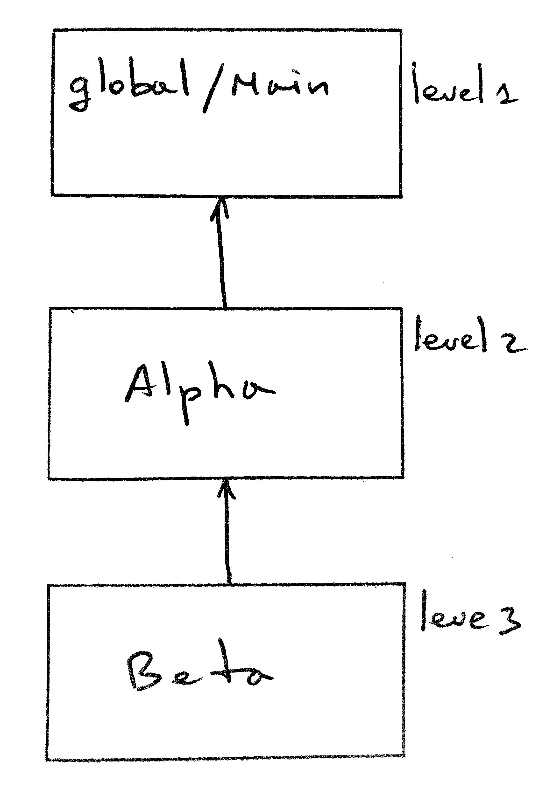
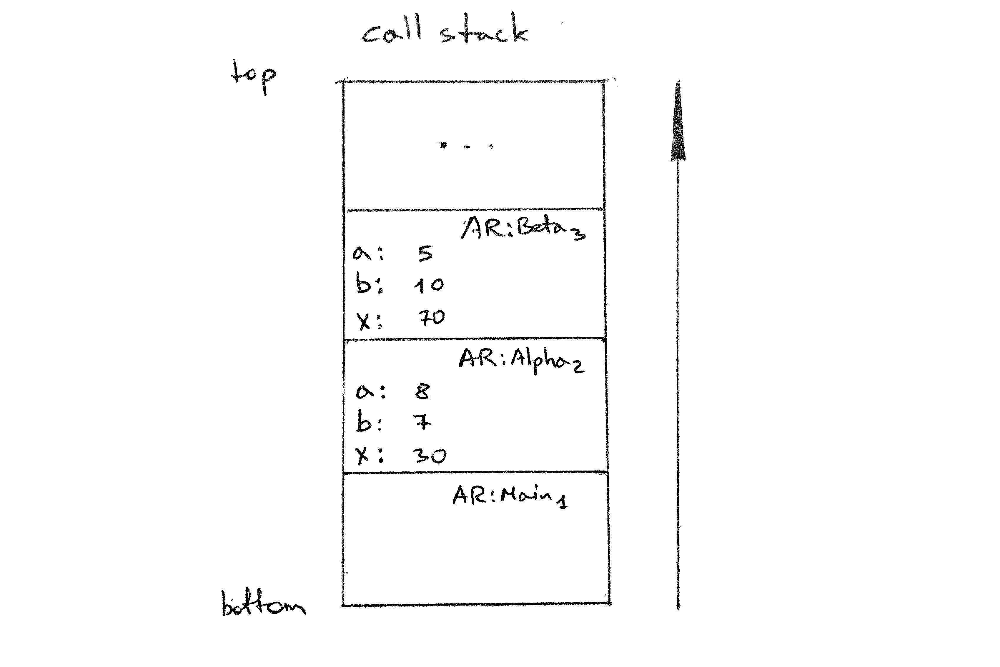
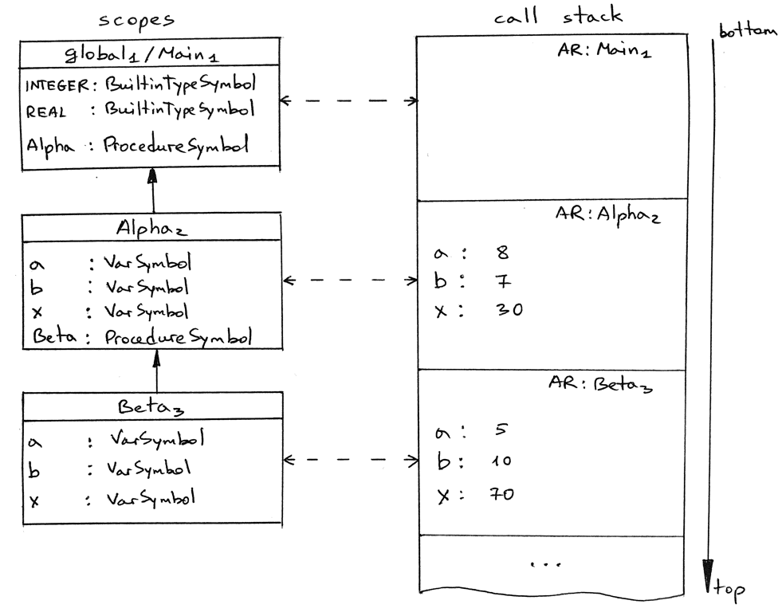

19_嵌套的过程调用   

📅 2020-03-19  

> “任何我不能创造的事物，我都无法理解” —— 理查德·费曼  

继续我们上次的话题，今天我们将会继续扩展上一章的解释器代码，用以执行嵌套的过程调用。今天我们仍然限制只能访问过程的参数和局部变量。下一章我们将讨论访问非局部变量的问题。下面是我们今天测试用的Pascal 程序：  
```pascal
program Main;

procedure Alpha(a : integer; b : integer);
var x : integer;

   procedure Beta(a : integer; b : integer);
   var x : integer;
   begin
      x := a * 10 + b * 2;
   end;

begin
   x := (a + b ) * 2;

   Beta(5, 10);      { procedure call }
end;

begin { Main }

   Alpha(3 + 5, 7);  { procedure call }

end.  { Main }
```  

程序中过程的嵌套关系如下：  
  

简单记以下几点：  
- 程序中声明了两个过程，`Alpha` 和`Beta`  
- `Alpha` 声明在主程序，也就是全局作用域中  
- `Beta` 过程声明在`Alpha` 的过程中  
- `Alpha` 和`Beta` 有着相同名称的形参`a,b` 和局部变量`x`  
- `Beta` 过程的调用嵌套在过程`Alpha` 中，同时`Alpha` 在主程序中被调用  

现在我们可以通过上一章的[spi.py](https://github.com/rspivak/lsbasi/blob/master/part18/spi.py) 尝试执行一下测试代码[part19.pas](https://github.com/rspivak/lsbasi/blob/master/part19/part19.pas)。看一下在执行嵌套的过程调用时会发生什么：  
```shell-session  
$ python spi.py part19.pas --stack

ENTER: PROGRAM Main
CALL STACK
1: PROGRAM Main


...


ENTER: PROCEDURE Beta
CALL STACK
2: PROCEDURE Beta
   a                   : 5
   b                   : 10
2: PROCEDURE Alpha
   a                   : 8
   b                   : 7
   x                   : 30
1: PROGRAM Main


LEAVE: PROCEDURE Beta
CALL STACK
2: PROCEDURE Beta
   a                   : 5
   b                   : 10
   x                   : 70
2: PROCEDURE Alpha
   a                   : 8
   b                   : 7
   x                   : 30
1: PROGRAM Main


...


LEAVE: PROGRAM Main
CALL STACK
1: PROGRAM Main  
```  

> 译注：  
> 因为语义分析中挂载到节点的是嵌套作用域符号表，所以过程的嵌套信息自然也一并被戴上了。  

代码能正常工作，并且没有错误和异常！如果仔细看调用栈的内容，`Alpha` 和`Beta` 中的各种参数和变量的值也是正确的！只是还有一点小问题：栈帧的嵌套深度不正确。因为在代码执行到`ENTER: PROCEDURE Beta` 时，过程`Beta` 对应的栈帧的嵌套深度应该是3，但实际上我们在解释器代码中将其硬编码为2：  
```python
def visit_ProcedureCall(self, node):
    proc_name = node.proc_name

    ar = ActivationRecord(
        name=proc_name,
        type=ARType.PROCEDURE,
        nesting_level=2,  # 译注：其实这里可以写成nesting_level = 
                          # self.current_ar.nesting_level + 1 这种类型吧。  
                          # 还是请按作者的思路继续阅读
    )

    proc_symbol = node.proc_symbol
    ...
```

如果移除硬编码，那我们该怎么回去过程调用的嵌套深度呢？在第十四章的时候，我们详细分析过作用域和嵌套深度的问题。在作用域符号表中存储着我们需要的`nesting_level` 数据，在过程符号中。那么如何从作用域符号表中获取到过程符号对象呢？我们先从`ScopedSymbolTable` 类入手：  
```python
class ScopedSymbolTable:
    def __init__(self, scope_name, scope_level, enclosing_scope=None):
        ...
        self.scope_level = scope_level
        ...

    def insert(self, symbol):
        self.log(f'Insert: {symbol.name}')
        self._symbols[symbol.name] = symbol
```  

从上面的代码看，我们可以在向作用域符号表添加符号时，将作用域符号表的深度赋值给其中的符号。这样我们便能在执行`visit_Procedure` 方法时获取到过程符号的深度信息了。为了实现这一想法，我们需要做以下两点改动：  
- 为`Symbol` 类添加`scope_level` 属性，以存储嵌套深度信息：  
   ```python
   class Symbol:
      def __init__(self, name, type=None):
         ...
         self.scope_level = 0  # 默认为0
   ```  
- 在向符号表添加符号时，同时为符号补全嵌套深度信息：  
   ```python
   class ScopedSymbolTable:
      ...
      def insert(self, symbol):
         self.log(f'Insert: {symbol.name}')

         symbol.scope_level = self.scope_level

         self._symbols[symbol.name] = symbol
   ```  

现在，当我们从`visit_Procedure` 方法创建过程调用的栈帧时，就可以通过访问过程富豪的嵌套深度，然后加一赋值给栈帧了：  
```python
class Interpreter(NodeVisitor):
    ...
    def visit_ProcedureCall(self, node):
        proc_name = node.proc_name
        proc_symbol = node.proc_symbol

        ar = ActivationRecord(
            name=proc_name,
            type=ARType.PROCEDURE,
            nesting_level=proc_symbol.scope_level + 1,
        )
```

现在我们再也不用担心硬编码的问题了。还有一点，为什么我们会将栈帧的深度设置为过程符号的深度加一，即`nesting_level = proc_symbol.scope_level + 1` 呢？在我们今天的Pascal 代码中，Alpha 的过程符号，包含有过程声明的信息，是被存储在`global` 作用域的。而全局作用域中的符号的嵌套深度都是1。但是在第14 章中我们也提到过，过程符号名的嵌套深度总是比它内部的参数和变量的深度小1，因为过程符号名是存储在上一层作用域中的。而我们的栈帧里面暂时保存的是过程的形参、局部变量等信息，按道理讲应该是和过程内部的符号名处在同一等级会比较好。  

下面我们通过修改后的[spi.py](https://github.com/rspivak/lsbasi/blob/master/part19/spi.py) 再次执行一下最开始的Pascal 代码：  
```shell-session  
$ python spi.py part19.pas --stack

ENTER: PROGRAM Main
CALL STACK
1: PROGRAM Main


ENTER: PROCEDURE Alpha
CALL STACK
2: PROCEDURE Alpha
   a                   : 8
   b                   : 7
1: PROGRAM Main


ENTER: PROCEDURE Beta
CALL STACK
3: PROCEDURE Beta
   a                   : 5
   b                   : 10
2: PROCEDURE Alpha
   a                   : 8
   b                   : 7
   x                   : 30
1: PROGRAM Main


LEAVE: PROCEDURE Beta
CALL STACK
3: PROCEDURE Beta
   a                   : 5
   b                   : 10
   x                   : 70
2: PROCEDURE Alpha
   a                   : 8
   b                   : 7
   x                   : 30
1: PROGRAM Main


LEAVE: PROCEDURE Alpha
CALL STACK
2: PROCEDURE Alpha
   a                   : 8
   b                   : 7
   x                   : 30
1: PROGRAM Main


LEAVE: PROGRAM Main
CALL STACK
1: PROGRAM Main
```  

现在我们的栈帧都有了正确的嵌套深度：  
- `Main` 程序栈帧：深度为1  
- `Alpha` 过程帧：深度为2  
- `Beta` 过程帧：深度为3   

下面我们看一下，程序在执行完`LEAVE: PROCEDURE Beta`，退出`Beta` 过程之前时，作用域树和调用栈看起来是怎么样的吧。首先是调用栈：  
  

当我们颠倒一下调用栈，就能看到栈帧和作用域树是如何关联起来的了。实际上，我们可以说栈帧在运行时中等价于作用域树。作用域是在语义分析时被创建的，而调用栈是在程序运行时被创建的，二者都是用于关联程序上下文的：  
  

我们无需多少改动就可以正确执行过程调用了。除了确保栈帧嵌套深度正确的三处代码外，其他地方都保持原样。这么少的改动还能让程序正常运行的原因是我们限制了Pascal 代码中只访问形参和局部变量。因为这些值都存储在栈顶帧中，所以我们无需修改`visit_Assignment` 和`visit_Var` 方法就可以获取数据：  
```python  
def visit_Assign(self, node):
    var_name = node.left.value
    var_value = self.visit(node.right)

    ar = self.call_stack.peek()
    ar[var_name] = var_value

def visit_Var(self, node):
    var_name = node.value

    ar = self.call_stack.peek()
    var_value = ar.get(var_name)

    return var_value
```

以上就是我们今天的今天我们成功完成了嵌套的过程调用，离实现递归地过程调用又近了一步。下一章我们将继续讨论运行时访问非局部变量的问题。敬请期待！  

**疫情期间，大家要保持健康，注意保护好自己和身边的人！再见**


## 参考资料  
有兴趣的话可以阅读以下书籍，文中有多处对它们的引用与参考：  
1. [Language Implementation Patterns: Create Your Own Domain-Specific and General Programming Languages (Pragmatic Programmers)](http://www.amazon.com/gp/product/193435645X/ref=as_li_tl?ie=UTF8&camp=1789&creative=9325&creativeASIN=193435645X&linkCode=as2&tag=russblo0b-20&linkId=MP4DCXDV6DJMEJBL)  
2. [Writing Compilers and Interpreters: A Software Engineering Approach](https://www.amazon.com/gp/product/0470177071/ref=as_li_tl?ie=UTF8&camp=1789&creative=9325&creativeASIN=0470177071&linkCode=as2&tag=russblo0b-20&linkId=542d1267e34a529e0f69027af20e27f3)  
3. [Programming Language Pragmatics, Fourth Edition](https://www.amazon.com/gp/product/0124104096/ref=as_li_tl?ie=UTF8&camp=1789&creative=9325&creativeASIN=0124104096&linkCode=as2&tag=russblo0b-20&linkId=8db1da254b12fe6da1379957dda717fc)   


> 译注：  
> 原作更新到这一章就暂停了，评论区也有人给了一些自己的实现，例如：<https://github.com/Irwin1985/lets_build_a_simple_interpreter>。等作者再有更新时，翻译也将继续。  


-----  
2022-07-18 15:03